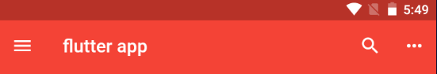
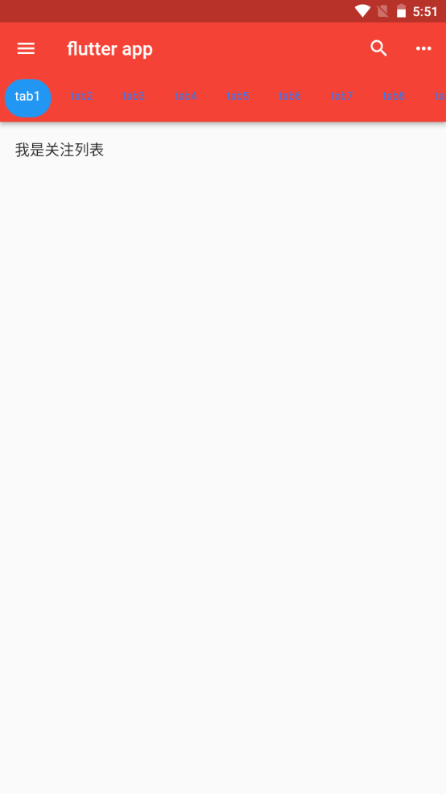
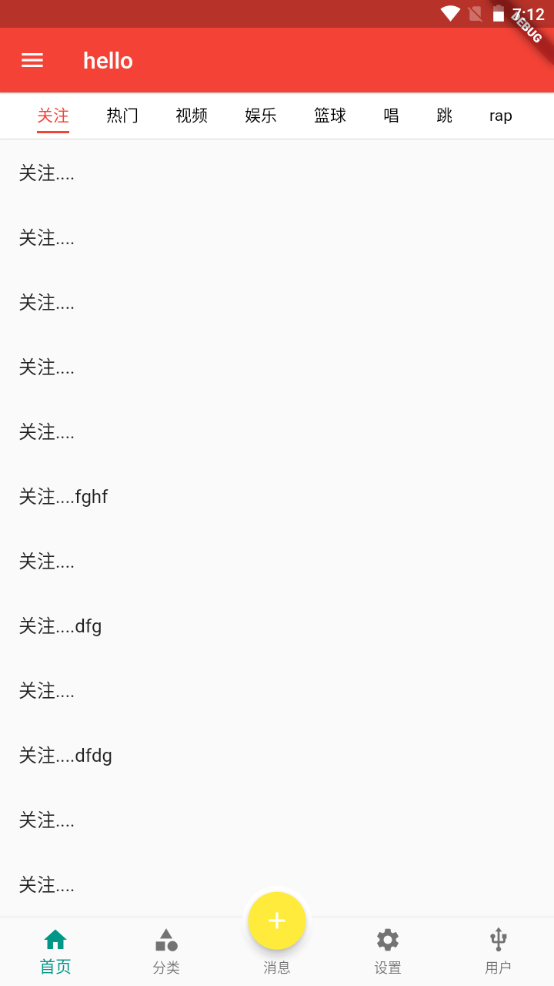

---
# 取二三级标题生成目录
outline: [2,3]
---

## Flutter AppBar TabBar TabBarView

### AppBar自定义顶部按钮图标、颜色

| 属性            | 描述                                                         |
| --------------- | ------------------------------------------------------------ |
| leading         | 在标题前面显示的一个控件，在首页通常显示应用的 logo；在其他界面通 常显示为返回按钮 |
| title           | 标题，通常显示为当前界面的标题文字，可以放组件               |
| actions         | 通常使用 IconButton 来表示，可以放按钮组                     |
| bottom          | 通常放tabBar，标题下面显示一个 Tab 导航栏                    |
| backgroundColor | 导航背景颜色                                                 |
| iconTheme       | 图标样式                                                     |
| centerTitle     | 标题是否居中显示                                             |



```dart
import 'package:flutter/material.dart';

void main() {
  runApp(const MyApp());
}

class MyApp extends StatelessWidget {
  const MyApp({super.key});

  @override
  Widget build(BuildContext context) {
    return MaterialApp(
      theme: ThemeData(primaryColor: Colors.blue),
      debugShowCheckedModeBanner: false,
      home: const MyHomePage(),
    );
  }
}

class MyHomePage extends StatefulWidget {
  const MyHomePage({super.key});

  @override
  State<MyHomePage> createState() => _MyHomePageState();
}

class _MyHomePageState extends State<MyHomePage> {
  @override
  Widget build(BuildContext context) {
    return Scaffold(
      appBar: AppBar(
        leading: IconButton(icon: const Icon(Icons.menu), onPressed: (){
          print('左侧按钮呗点击了');
        }),
        backgroundColor: Colors.red,  //  导航背景颜色
        title: const Text('flutter app'),
        actions: [ // 右侧的按钮图标
          IconButton(icon: const Icon(Icons.search), onPressed: (){
            print('搜索');
          }),
          IconButton(icon: const Icon(Icons.more_horiz), onPressed: (){
            print('more');
          })
        ],
      ),
      body: const Text('hhaa'),
    );
  }
}
```

### Flutter AppBar结合TabBar实现顶部Tab切换



**TabBar常见属性：**

| 属性                 | 描述                                                         |
| -------------------- | ------------------------------------------------------------ |
| tabs                 | 显示的标签内容，一般使用Tab对象,也可以是其他的Widget         |
| controller           | TabController对象                                            |
| isScrollable         | 是否可滚动                                                   |
| indicatorColor       | 指示器颜色                                                   |
| indicatorWeight      | 指示器高度                                                   |
| indicatorPadding     | 底部指示器的Padding                                          |
| indicator            | 指示器decoration，例如边框等                                 |
| indicatorSize        | 指示器大小计算方式，TabBarIndicatorSize.label跟文字等 宽,TabBarIndicatorSize.tab跟每个tab等宽 |
| labelColor           | 选中label颜色                                                |
| labelStyle           | 选中label的Style                                             |
| labelPadding         | 每个label的padding值                                         |
| unselectedLabelColor | 未选中label颜色                                              |
| unselectedLabelStyle | 未选中label的Style                                           |

### Tabbar TabBarView实现类似头条顶部导航

1、混入SingleTickerProviderStateMixin

```dart
class _MyHomePageState extends State<MyHomePage> with SingleTickerProviderStateMixin{}
```

2、定义TabController

```dart
late TabController _tabController;

  // 生命周期函数： 当组件初始化的时候就会触发
  @override
  void initState() {
    super.initState();
    _tabController = TabController(length: 9, vsync: this);
  }
```

```dart
import 'package:flutter/material.dart';

void main() {
  runApp(const MyApp());
}

class MyApp extends StatelessWidget {
  const MyApp({super.key});

  @override
  Widget build(BuildContext context) {
    return MaterialApp(
      theme: ThemeData(primaryColor: Colors.blue),
      debugShowCheckedModeBanner: false,
      home: const MyHomePage(),
    );
  }
}

class MyHomePage extends StatefulWidget {
  const MyHomePage({super.key});

  @override
  State<MyHomePage> createState() => _MyHomePageState();
}

class _MyHomePageState extends State<MyHomePage> with SingleTickerProviderStateMixin {
  late TabController _tabController;
  List<Widget> list = [];

  // 生命周期函数： 当组件初始化的时候就会触发
  @override
  void initState() {
    super.initState();
    _tabController = TabController(length: 9, vsync: this);
  }

  @override
  Widget build(BuildContext context) {
    return Scaffold(
      appBar: AppBar(
        leading: IconButton(icon: const Icon(Icons.menu), onPressed: (){
          print('左侧按钮呗点击了');
        }),
        backgroundColor: Colors.red,  //  导航背景颜色
        title: const Text('flutter app'),
        actions: [ // 右侧的按钮图标
          IconButton(icon: const Icon(Icons.search), onPressed: (){
            print('搜索');
          }),
          IconButton(icon: const Icon(Icons.more_horiz), onPressed: (){
            print('more');
          })
        ],
        bottom: TabBar(
          controller: _tabController, // 注意： 【配置 controller 需要去掉TabBar 的const
          isScrollable: true, // 是否可以滚动
          indicatorColor: Colors.white, // 下面选中条的颜色
          indicatorWeight: 5, // 下面选中条的高度
          indicatorPadding: const EdgeInsets.all(5), // tab padding
          // indicatorSize: TabBarIndicatorSize.label,
          indicator: BoxDecoration( // 每一个tab的样式
            color: Colors.blue,
            borderRadius: BorderRadius.circular(20)
          ),
          labelColor: Colors.white, // 选中颜色
          labelStyle: const TextStyle( // 选中样式
            fontSize: 14
          ),
          unselectedLabelColor: Colors.blueAccent[400], // 未选中颜色
          unselectedLabelStyle: const TextStyle( // 未选中样式
            fontSize: 12
          ),
          tabs: const [
            Tab(child: Text('tab1')),
            Tab(child: Text('tab2')),
            Tab(child: Text('tab3')),
            Tab(child: Text('tab4')),
            Tab(child: Text('tab5')),
            Tab(child: Text('tab6')),
            Tab(child: Text('tab7')),
            Tab(child: Text('tab8')),
            Tab(child: Text('tab9')),
          ]
        ),
      ),
      body: TabBarView(
        controller: _tabController,
        children: [
          ListView(
            children: const [
              ListTile(title: Text('我是关注列表'))
            ],
          ),
          ListView(
            children: const [
              ListTile(title: Text('我是热门列表'))
            ],
          ),
          ListView(
            children: const [
              ListTile(title: Text('我是视频列表'))
            ],
          ),
          ListView(
            children: const [
              ListTile(title: Text('我是关注列表'))
            ],
          ),
          ListView(
            children: const [
              ListTile(title: Text('我是热门列表'))
            ],
          ),
          ListView(
            children: const [
              ListTile(title: Text('我是视频列表'))
            ],
          ),
          ListView(
            children: const [
              ListTile(title: Text('我是关注列表'))
            ],
          ),
          ListView(
            children: const [
              ListTile(title: Text('我是热门列表'))
            ],
          ),
          ListView(
            children: const [
              ListTile(title: Text('我是视频列表'))
            ],
          )
        ]
      ),
    );
  }
}
```

### BottomNavigationBar 的页面中使用Tabbar



> 当前home组件页面被 tabs 组件引用, 可以参考上去设置   《Scaffold属性 FloatingActionButton实现类似闲鱼App底 部导航凸起按钮》的代码

```dart
import 'package:flutter/material.dart';
import '../../tools/keepAliveWrapper.dart';

class Home extends StatefulWidget {
  const Home({super.key});

  @override
  State<Home> createState() => _HomeState();
}

class _HomeState extends State<Home> with SingleTickerProviderStateMixin {
  late TabController _tabController;

  @override
  void initState() {
    super.initState();
    _tabController = TabController(length: 8, vsync: this);
    // 监听 _tabController 的改变事件
    // _tabController.addListener(() {
    //   print(_tabController.index); // 会获取 2次
    // });
    _tabController.addListener(() {
      if(_tabController.animation!.value == _tabController.index){
        print(_tabController.index);
      }
    });
  }

  // 组件销毁触发
  @override
  void dispose() {
    // TODO: implement dispose
    super.dispose();
    _tabController.dispose();
  }

  @override
  Widget build(BuildContext context) {
    return Scaffold(
      appBar: PreferredSize(
        preferredSize: const Size.fromHeight(40),
        child: AppBar(
            elevation: 0.5,
            backgroundColor: Colors.white,
            title: SizedBox(
              height: 30,
              child: TabBar(
                // onTap: (index){
                //   print(index); // 只能监听点击事件，不能监听滑动事件
                // },
                isScrollable: true,
                controller: _tabController,
                indicatorColor: Colors.red,
                labelColor: Colors.red,
                labelStyle: const TextStyle(fontSize: 14),
                unselectedLabelColor: Colors.black,
                indicatorSize: TabBarIndicatorSize.label,
                tabs: const [
                  Tab(child: Text('关注')),
                  Tab(child: Text('热门')),
                  Tab(child: Text('视频')),
                  Tab(child: Text('娱乐')),
                  Tab(child: Text('篮球')),
                  Tab(child: Text('唱')),
                  Tab(child: Text('跳')),
                  Tab(child: Text('rap')),
                ],
              ),
            )),
      ),
      body: TabBarView(controller: _tabController, children: [
        KeepAliveWrapper( // 自定义的缓存组件
          child: ListView(
            children: const [
              ListTile(title: Text('关注....')),
              ListTile(title: Text('关注....')),
              ListTile(title: Text('关注....')),
              ListTile(title: Text('关注....')),
              ListTile(title: Text('关注....')),
              ListTile(title: Text('关注....fghf')),
              ListTile(title: Text('关注....')),
              ListTile(title: Text('关注....dfg')),
              ListTile(title: Text('关注....')),
              ListTile(title: Text('关注....dfdg')),
              ListTile(title: Text('关注....')),
              ListTile(title: Text('关注....')),
              ListTile(title: Text('关注....')),
              ListTile(title: Text('关注....')),
              ListTile(title: Text('关注....')),
              ListTile(title: Text('关注....')),
              ListTile(title: Text('关注....')),
              ListTile(title: Text('关注....111')),
              ListTile(title: Text('关注....222')),
              ListTile(title: Text('关注....')),
              ListTile(title: Text('关注....')),
              ListTile(title: Text('关注....')),
              ListTile(title: Text('关注....dfghdfh')),
              ListTile(title: Text('关注....bottom')),
            ],
        )),
        ListView(
          children: const [ListTile(title: Text('热门....'))],
        ),
        ListView(
          children: const [ListTile(title: Text('视频....'))],
        ),
        ListView(
          children: const [ListTile(title: Text('娱乐....'))],
        ),
        ListView(
          children: const [ListTile(title: Text('篮球....'))],
        ),
        ListView(
          children: const [ListTile(title: Text('唱....'))],
        ),
        ListView(
          children: const [ListTile(title: Text('跳....'))],
        ),
        ListView(
          children: const [ListTile(title: Text('rap....'))],
        )
      ]),
    );
  }
}
```

### 监听TabController改变事件

```dart
@override
  void initState() {
    super.initState();
    _tabController = TabController(length: 8, vsync: this);
    // 监听 _tabController 的改变事件
    // _tabController.addListener(() {
    //   print(_tabController.index); // 会获取 2次
    // });
    _tabController.addListener(() {
      if(_tabController.animation!.value == _tabController.index){
        print(_tabController.index);
      }
    });
  }
```