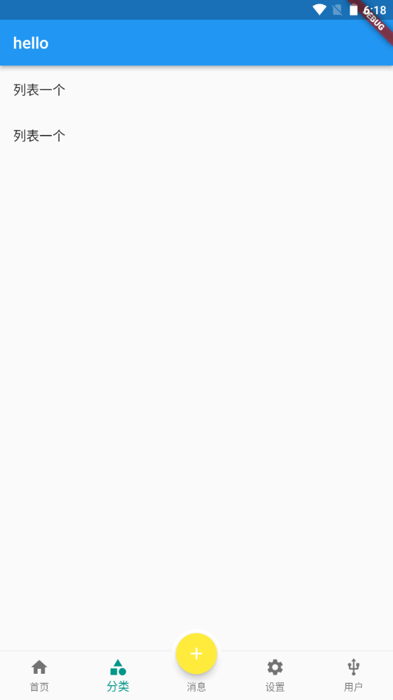

---
# 取二三级标题生成目录
outline: [2,3]
---

## Scaffold属性 BottomNavigationBar 自定义底部导航

### BottomNavigationBar 组件介绍

> BottomNavigationBar 是底部导航条，可以让我们定义底部Tab切换，bottomNavigationBar是 Scaffold组件的参数。

**BottomNavigationBar 常见的属性**

| 属性名       | 说明                                                         |
| ------------ | ------------------------------------------------------------ |
| items        | List 底部导航条按钮集合                                      |
| iconSize     | icon                                                         |
| currentIndex | 默认选中第几个                                               |
| onTap        | 选中变化回调函数                                             |
| fixedColor   | 选中的颜色                                                   |
| type         | BottomNavigationBarType.fixed BottomNavigationBarType.shifting |

### BottomNavigationBar 自定义底部导航、BottomNavigationBar 底部菜单选中、BottomNavigationBar 自定义底部导航实现页面切换


```dart
import 'package:flutter/material.dart';
import './tabs/category.dart';
import './tabs/home.dart';
import './tabs/setting.dart';
import './tabs/user.dart';

class Tabs extends StatefulWidget {
  const Tabs({super.key});

  @override
  State<Tabs> createState() => _TabsState();
}

class _TabsState extends State<Tabs> {
  int _currentIndex= 0;
  final List<Widget> _pages = const [
    Home(),
    Category(),
    Setting(),
    User()
  ];
  @override
  Widget build(BuildContext context) {
    return Scaffold(
      appBar: AppBar(title: const Text('hello')),
      body: _pages[_currentIndex],
      bottomNavigationBar: BottomNavigationBar(
        fixedColor: Colors.teal, // 底部菜单的选择颜色
        iconSize: 20, // 底部菜单大小
        type: BottomNavigationBarType.fixed, // 如果底部有4个或者4个以上的菜单，就需要配置这个
        currentIndex: _currentIndex, 
        onTap: (index){
          print(index);
          setState(() {
            _currentIndex = index;
          });
        },
        items: const [
          BottomNavigationBarItem(icon: Icon(Icons.home),label: '首页'),
          BottomNavigationBarItem(icon: Icon(Icons.category),label: '分类'),
          BottomNavigationBarItem(icon: Icon(Icons.settings),label: '设置'),
          BottomNavigationBarItem(icon: Icon(Icons.usb_outlined),label: '用户')
        ],
      ),
    );
  }
}
```

## Scaffold属性 FloatingActionButton实现类似闲鱼App底 部导航凸起按钮

### FloatingActionButton详解

> FloatingActionButton简称FAB ,可以实现浮动按钮，也可以实现类似闲鱼app的底部凸起导航

| 属性名称           | 属性值                             |
| ------------------ | ---------------------------------- |
| child              | 子视图，一般为Icon，不推荐使用文字 |
| tooltip            | FAB被长按时显示，也是无障碍功能    |
| backgroundColor    | 背景颜色                           |
| elevation          | 未点击的时候的阴影                 |
| hignlightElevation | 点击时阴影值，默认12.0             |
| onPressed          | 点击事件回调                       |
| shape              | 可以定义FAB的形状等                |
| mini               | 是否是mini类型默认false            |

### 实现类似闲鱼App底部导航凸起按钮



```dart
import 'package:flutter/material.dart';
import './tabs/category.dart';
import './tabs/home.dart';
import './tabs/setting.dart';
import './tabs/user.dart';
import './tabs/message.dart';

class Tabs extends StatefulWidget {
  const Tabs({super.key});

  @override
  State<Tabs> createState() => _TabsState();
}

class _TabsState extends State<Tabs> {
  int _currentIndex= 0;
  final List<Widget> _pages = const [
    Home(),
    Category(),
    Message(),
    Setting(),
    User()
  ];
  @override
  Widget build(BuildContext context) {
    return Scaffold(
      appBar: AppBar(title: const Text('hello')),
      body: _pages[_currentIndex],
      bottomNavigationBar: BottomNavigationBar(
        fixedColor: Colors.teal, // 底部菜单的选择颜色
        // iconSize: 20, // 底部菜单大小
        type: BottomNavigationBarType.fixed, // 如果底部有4个或者4个以上的菜单，就需要配置这个
        currentIndex: _currentIndex, 
        onTap: (index){
          setState(() {
            _currentIndex = index;
          });
        },
        items: const [
          BottomNavigationBarItem(icon: Icon(Icons.home),label: '首页'),
          BottomNavigationBarItem(icon: Icon(Icons.category),label: '分类'),
          BottomNavigationBarItem(icon: Icon(Icons.message),label: '消息'),
          BottomNavigationBarItem(icon: Icon(Icons.settings),label: '设置'),
          BottomNavigationBarItem(icon: Icon(Icons.usb_outlined),label: '用户')
        ],
      ),
      floatingActionButton: Container(
        width: 60,
        height: 60,
        padding: const EdgeInsets.all(5),
        margin: const EdgeInsets.only(top: 5),
        decoration:  BoxDecoration(
          color: Colors.white,
          borderRadius: BorderRadius.circular(30)
        ),
        child: FloatingActionButton(
          backgroundColor: _currentIndex ==2 ?Colors.teal: Colors.yellow,
          onPressed: (){
            setState(() {
              _currentIndex = 2;
            });
          },
          child: const Icon(Icons.add)
      ),
      ),
      floatingActionButtonLocation: FloatingActionButtonLocation.centerDocked,
    );
  }
}
```