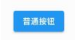
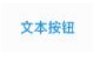
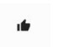

---
# 取二三级标题生成目录
outline: [2,3]
---


## Flutter 按钮组件

###  按钮组件的属性

| 属性      | 说明                                                         |
| --------- | ------------------------------------------------------------ |
| onPressed | 必填参数，按下按钮时触发的回调，接收一个方法，传null表示按钮禁用，会显示 禁用相关样式 |
| child     | 子组件                                                       |
| style     | 通过ButtonStyle装饰                                          |

ButtonStylee里面的常用的参数

| 属性名称        | 值类型    | 属性值                                                       |
| --------------- | --------- | ------------------------------------------------------------ |
| foregroundColor | Color     | 文本颜色                                                     |
| backgroundColor | Color     | 按钮的颜色                                                   |
| shadowColor     | Color     | 阴影颜色                                                     |
| elevation       | double    | 阴影的范围，值越大阴影范围越大                               |
| padding         |           | 内边距                                                       |
| shape           |           | 设置按钮的形状 shape: MaterialStateProperty.all( RoundedRectangleBorder( borderRadius: BorderRadius.circular(10)) ) |
| side            | 设置边 框 | MaterialStateProperty.all(BorderSide(width:1,color: Colors.red)) |

### ElevatedButton

ElevatedButton 即"凸起"按钮，它默认带有阴影和灰色背景。按下后，阴影会变大

使用 ElevatedButton 非常简单，如：



```dart
ElevatedButton(
	onPressed: () {},
	child: const Text("普通按钮")
)	
```

### TextButton

TextButton 即文本按钮，默认背景透明并不带阴影。按下后，会有背景色



```dart
TextButton(
	child: Text("文本按钮"),
	onPressed: () {},
)
```

###  OutlinedButton

OutlineButton 默认有一个边框，不带阴影且背景透明。按下后，边框颜色会变亮、同时出现背景和 阴影


```dart
OutlinedButton(
	child: Text("边框按钮"),
	onPressed: () {},
)
```

### IconButton

IconButton 是一个可点击的Icon，不包括文字，默认没有背景，点击后会出现背景



```dart
IconButton(
	icon: Icon(Icons.thumb_up),
	onPressed: () {},
)

```

###  带图标的按钮

ElevatedButton 、 TextButton 、 OutlineButton 都有一个 icon 构造函数，通过它可以轻松创建 带图标的按钮


```dart
ElevatedButton.icon(
	icon: Icon(Icons.send),
	label: Text("发送"),
	onPressed: _onPressed,
),
OutlineButton.icon(
	icon: Icon(Icons.add),
	label: Text("添加"),
	onPressed: _onPressed,
),
TextButton.icon(
	icon: Icon(Icons.info),
	label: Text("详情"),
	onPressed: _onPressed,
),
```

### 修改按钮的宽度高度

```dart
SizedBox(
height: 80,
width: 200,
child: ElevatedButton(
style:ButtonStyle(
backgroundColor:MaterialStateProperty.all(Colors.red),
foregroundColor: MaterialStateProperty.all(Colors.black)
) ,
onPressed: () {
},
child: const Text('宽度高度'),
),
)

```

### 自适应按钮

```dart
Row(
mainAxisAlignment: MainAxisAlignment.center,
children: <Widget>[
Expanded(
child: Container(
height: 60,
margin: const EdgeInsets.all(10),
child: ElevatedButton(
child: const Text('自适应按钮'),
onPressed: () {
print("自适应按钮");
},
),
),
)
],
),

```

### 配置圆形圆角按钮

```dart
ElevatedButton(
style: ButtonStyle(
backgroundColor:MaterialStateProperty.all(Colors.blue),
foregroundColor: MaterialStateProperty.all(Colors.white),
elevation: MaterialStateProperty.all(20),
shape: MaterialStateProperty.all(
RoundedRectangleBorder(
borderRadius: BorderRadius.circular(10))
),
),
onPressed: () {
print("圆角按钮");
},
child: const Text('圆角')
)
```

圆形按钮

```dart
Container(
height: 80,
child: ElevatedButton(
style: ButtonStyle(
backgroundColor: MaterialStateProperty.all(Colors.blue),
foregroundColor:
MaterialStateProperty.all(Colors.white),
elevation: MaterialStateProperty.all(20),
shape: MaterialStateProperty.all(
CircleBorder(side: BorderSide(color: Colors.white)),
)),
onPressed: () {
print("圆形按钮");
},
child: const Text('圆形按钮')),
)
```

### 修改OutlinedButton边框

```dart
Row(
mainAxisAlignment: MainAxisAlignment.center,
children: <Widget>[
Expanded(
child: Container(
margin: EdgeInsets.all(20),
height: 50,
child: OutlinedButton(
style: ButtonStyle(
foregroundColor:
MaterialStateProperty.all(Colors.black),
side: MaterialStateProperty.all(
const BorderSide(width: 1, color: Colors.red))),
onPressed: () {},
child: const Text("注册 配置边框")),
),
)
],
)

```