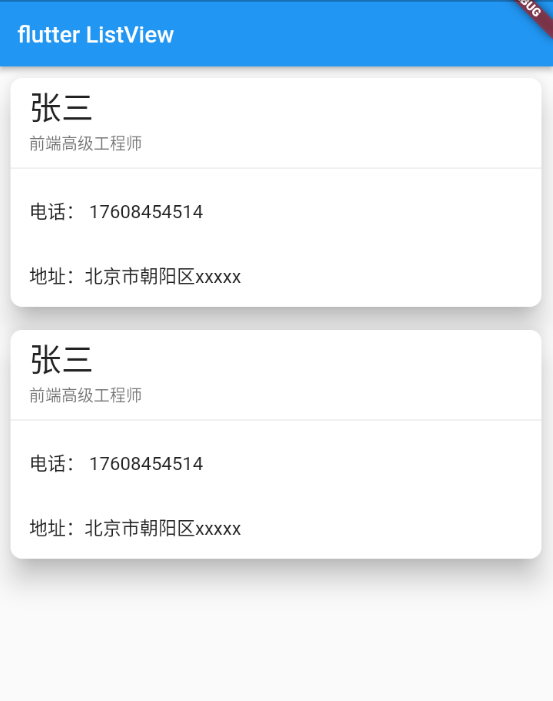

---
# 取二三级标题生成目录
outline: [2,3]
---


## Flutter Card组件

> Card是卡片组件块，内容可以由大多数类型的Widget构成，Card具有圆角和阴影，这让它看起来有立 体感。

| 属性         | 说明                                                         |
| ------------ | ------------------------------------------------------------ |
| margin       | 外边距                                                       |
| child        | 子组件                                                       |
| elevation    | 阴影值的深度                                                 |
| color        | 背景颜色                                                     |
| shadowColor  | 阴影颜色                                                     |
| margin       | 外边距                                                       |
| clipBehavior | clipBehavior 内容溢出的剪切方式 Clip.none不剪切 Clip.hardEdge裁剪但不应 用抗锯齿 Clip.antiAlias裁剪而且抗锯齿 Clip.antiAliasWithSaveLayer带有抗锯 齿的剪辑，并在剪辑之后立即保存saveLayer |
| Shape        | Card的阴影效果，默认的阴影效果为圆角的长方形边。 shape: const RoundedRectangleBorder( borderRadius: BorderRadius.all(Radius.circular(10)) ), |

### Card实现一个通讯录的卡片



```dart
class MyHomePage extends StatelessWidget {
  const MyHomePage({super.key});

  @override
  Widget build(BuildContext context) {
    return ListView(
      children: [
        Card(
          margin: const EdgeInsets.all(10),
          elevation: 20,
          shape: RoundedRectangleBorder(
            borderRadius: BorderRadius.circular(10)
          ),
          child: Column(
            children: const [
              ListTile(
                title: Text('张三',style: TextStyle(fontSize: 28)),
                subtitle: Text('前端高级工程师'),
              ),
              Divider(),
              ListTile(
                title: Text('电话： 17608454514'),
              ),
              ListTile(
                title: Text('地址：北京市朝阳区xxxxx'),
              ),
            ],
          ),
        ),
        Card(
          margin: const EdgeInsets.all(10),
          elevation: 20,
          shape: RoundedRectangleBorder(
            borderRadius: BorderRadius.circular(10)
          ),
          child: Column(
            children: const [
              ListTile(
                title: Text('张三',style: TextStyle(fontSize: 28)),
                subtitle: Text('前端高级工程师'),
              ),
              Divider(),
              ListTile(
                title: Text('电话： 17608454514'),
              ),
              ListTile(
                title: Text('地址：北京市朝阳区xxxxx'),
              ),
            ],
          ),
        )
      ],
    );
  }
}

```

### Card实现一个图文列表卡片


```dart
class MyHomePage extends StatelessWidget {
  const MyHomePage({super.key});

  @override
  Widget build(BuildContext context) {
    return ListView(
      children: [
        Card(
          margin: const EdgeInsets.all(10),
          elevation: 20,
          shape: RoundedRectangleBorder(
            borderRadius: BorderRadius.circular(20)
          ),
          child: Column(
            children: [
              AspectRatio(
                aspectRatio: 16/9,
                child: Image.network('https://www.itying.com/images/flutter/2.png', fit: BoxFit.cover,),
              ),
               ListTile(
                leading: ClipOval(
                  child: Image.network('https://www.itying.com/themes/itying/images/ionic4.png' ,width: 40,height: 40,fit: BoxFit.cover),
                ),
                title: const Text('xxxxxx'),
                subtitle: const Text('xxxxxxxxx'),
              )
            ],
          ),
        ),
        Card(
          margin: const EdgeInsets.all(10),
          elevation: 20,
          shape: RoundedRectangleBorder(
            borderRadius: BorderRadius.circular(20)
          ),
          child: Column(
            children: [
              AspectRatio(
                aspectRatio: 16/9,
                child: Image.network('https://www.itying.com/images/flutter/2.png', fit: BoxFit.cover,),
              ),
               const ListTile(
                leading: CircleAvatar(
                  backgroundImage: NetworkImage('https://www.itying.com/images/flutter/3.png'),
                ),
                title: Text('xxxxxx'),
                subtitle: Text('xxxxxxxxx'),
              )
            ],
          ),
        )
      ],
    );
  }
}
```