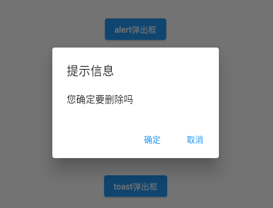
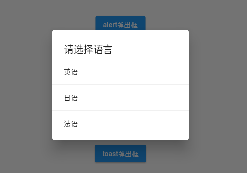
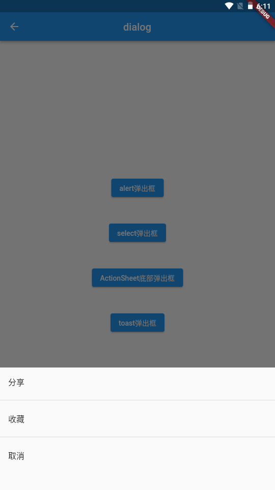
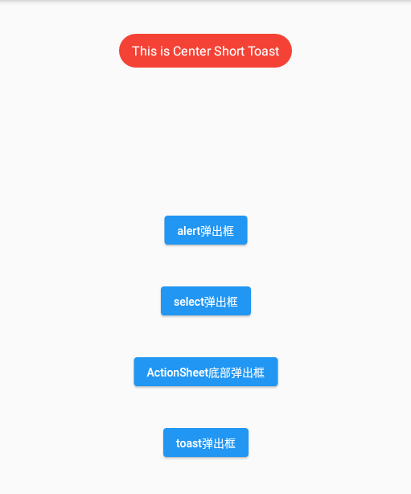

---
# 取二三级标题生成目录
outline: [2,3]
---

## Flutter Dialog

### AlertDialog



```dart
void _alertDialog() async {
    // print('_alertDialog');
    var result = await showDialog(context: context, builder: (context){
      return AlertDialog(
        title: const Text('提示信息'),
        content: const Text('您确定要删除吗'),
        actions: [
          TextButton(onPressed: (){
            print('确定');
            Navigator.of(context).pop('确定...'); // 返回值
          }, child: const Text('确定')),
          TextButton(onPressed: (){
            print('取消');
            Navigator.of(context).pop('取消...'); // 返回值
          }, child: const Text('取消'))
        ],
      );
    });
    print(result); // 返回值
  }
```

### SimpleDialog、SimpleDialogOption



```dart
void _selectDialog() async{
    // print('_selectDialog');
    var result = await showDialog(
      context: context, 
      barrierDismissible : false, // 点击灰色背景是否消失
      builder: (context){
      return SimpleDialog(
        title: const Text('请选择语言'),
        children: [
          SimpleDialogOption(child: const Text('英语'),onPressed: (){ 
              Navigator.of(context).pop('英语...');
              print('英语');
            }),
          const Divider(),
           SimpleDialogOption(child: const Text('日语'),onPressed: (){ print('日语');}),
           const Divider(),
           SimpleDialogOption(child: const Text('法语'),onPressed: (){ print('法语');})
        ],
      );
    });
    print(result);
  }
```

### showModalBottomSheet



```dart
void _modelBottomDialog() async{
    // print('_modelBottomDialog');
    var result = await showModalBottomSheet(
      context: context, 
      builder: (context){
        return SizedBox(
          height: 240,
          child: Column(
            children:  [
              ListTile(title: const Text('分享'), onTap: (){
                print('分享');
                Navigator.of(context).pop('分享...');
              }),
              const Divider(),
              ListTile(title: const Text('收藏'),onTap: (){
                print('收藏');
                Navigator.of(context).pop('收藏...');
              }),
               const Divider(),
              ListTile(title: const Text('取消'),onTap: (){
                print('取消');
                Navigator.of(context).pop('取消...');
              })
            ],
          ),
        );
    });
    print(result);
  }
```

### Flutter Toast



https://pub.dev/packages/fluttertoast

```dart
# add this line to your dependencies
fluttertoast: ^8.0.9
```

```dart
import 'package:fluttertoast/fluttertoast.dart';
```

```dart
void _toastDialog(){
    // print('_toastDialog');
    Fluttertoast.showToast(
        msg: "This is Center Short Toast",
        toastLength: Toast.LENGTH_SHORT,
        gravity: ToastGravity.TOP, // 方位
        timeInSecForIosWeb: 1, // 提示时间
        backgroundColor: Colors.red, // 背景颜色
        textColor: Colors.white, // 文本颜色
        fontSize: 16.0 // 文本大小
    );
  }
```