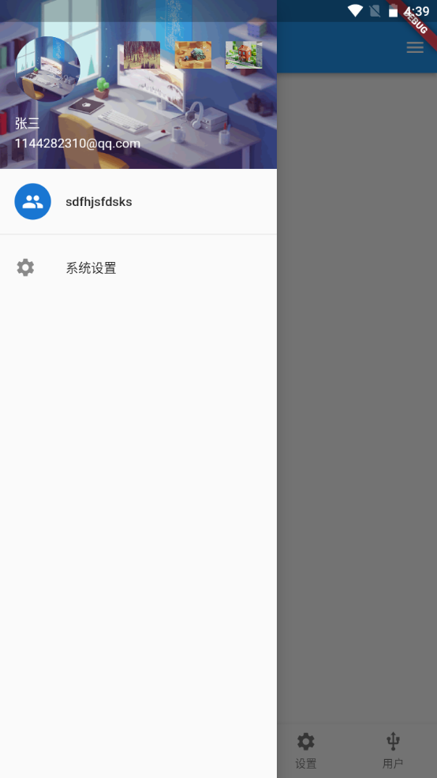

---
# 取二三级标题生成目录
outline: [2,3]
---

## Scaffold属性 抽屉菜单Drawer

> 在Scaffold组件里面传入drawer参数可以定义左侧边栏，传入endDrawer可以定义右侧边栏。侧边栏默 认是隐藏的，我们可以通过手指滑动显示侧边栏，也可以通过点击按钮显示侧边栏。

```dart
return Scaffold(
	appBar: AppBar( title: Text("Flutter App")),
	drawer: Drawer(
		child: Text('左侧边栏'),
	),
	endDrawer: Drawer(
		child: Text('右侧侧边栏'),
	),
);
```

### Flutter DrawerHeade

**常见属性：**

| 属性       | 描述             |
| ---------- | ---------------- |
| decoration | 设置顶部背景颜色 |
| child      | 配置子元素       |
| margin     | 内边距           |
| margin     | 外边距           |


```dart
import 'package:flutter/material.dart';
import './tabs/category.dart';
import './tabs/home.dart';
import './tabs/setting.dart';
import './tabs/user.dart';
import './tabs/message.dart';

class Tabs extends StatefulWidget {
  const Tabs({super.key});

  @override
  State<Tabs> createState() => _TabsState();
}

class _TabsState extends State<Tabs> {
  int _currentIndex= 0;
  final List<Widget> _pages = const [
    Home(),
    Category(),
    Message(),
    Setting(),
    User()
  ];
  @override
  Widget build(BuildContext context) {
    return Scaffold(
      appBar: AppBar(title: const Text('hello')),
      drawer: Drawer(
        child: Column(
        children: [
         Row(
          children: [
            Expanded(
              flex: 1,
              child: DrawerHeader(
              decoration: const BoxDecoration(
                color: Colors.teal,
                image: DecorationImage(image: NetworkImage("https://www.itying.com/images/flutter/2.png"),fit: BoxFit.cover)
              ),
              child: Column(
                children:  const [
                  ListTile(leading: CircleAvatar(backgroundImage: NetworkImage("https://www.itying.com/images/flutter/2.png")), title: Text('张三'),)
                ],
              )
            ),
            )
          ],
         ),
          const ListTile(
            leading: CircleAvatar(
              child: Icon(Icons.people),
            ),
            title: Text('sdfhjsfdsks'),
          ),
          const Divider(),
          const ListTile(
            leading: Icon(Icons.settings),
            title: Text('系统设置'),
          )
        ],
      ),
      ),
      endDrawer: const Drawer(
        child: Text('dssfsd'),
      ),
      body: _pages[_currentIndex],
      bottomNavigationBar: BottomNavigationBar(
        fixedColor: Colors.teal, // 底部菜单的选择颜色
        // iconSize: 20, // 底部菜单大小
        type: BottomNavigationBarType.fixed, // 如果底部有4个或者4个以上的菜单，就需要配置这个
        currentIndex: _currentIndex, 
        onTap: (index){
          setState(() {
            _currentIndex = index;
          });
        },
        items: const [
          BottomNavigationBarItem(icon: Icon(Icons.home),label: '首页'),
          BottomNavigationBarItem(icon: Icon(Icons.category),label: '分类'),
          BottomNavigationBarItem(icon: Icon(Icons.message),label: '消息'),
          BottomNavigationBarItem(icon: Icon(Icons.settings),label: '设置'),
          BottomNavigationBarItem(icon: Icon(Icons.usb_outlined),label: '用户')
        ],
      ),
      floatingActionButton: Container(
        width: 60,
        height: 60,
        padding: const EdgeInsets.all(5),
        margin: const EdgeInsets.only(top: 5),
        decoration:  BoxDecoration(
          color: Colors.white,
          borderRadius: BorderRadius.circular(30)
        ),
        child: FloatingActionButton(
          backgroundColor: _currentIndex ==2 ?Colors.teal: Colors.yellow,
          onPressed: (){
            setState(() {
              _currentIndex = 2;
            });
          },
          child: const Icon(Icons.add)
      ),
      ),
      floatingActionButtonLocation: FloatingActionButtonLocation.centerDocked,
    );
  }
}

```

### Flutter UserAccountsDrawerHeader

| 属性                  | 描述                         |
| --------------------- | ---------------------------- |
| decoration            | 设置顶部背景颜色             |
| accountName           | 账户名称                     |
| accountEmail          | 账户邮箱                     |
| currentAccountPicture | 用户头像                     |
| otherAccountsPictures | 用来设置当前账户其他账户头像 |
| margin                |                              |



```dart
import 'package:flutter/material.dart';
import './tabs/category.dart';
import './tabs/home.dart';
import './tabs/setting.dart';
import './tabs/user.dart';
import './tabs/message.dart';

class Tabs extends StatefulWidget {
  const Tabs({super.key});

  @override
  State<Tabs> createState() => _TabsState();
}

class _TabsState extends State<Tabs> {
  int _currentIndex= 0;
  final List<Widget> _pages = const [
    Home(),
    Category(),
    Message(),
    Setting(),
    User()
  ];
  @override
  Widget build(BuildContext context) {
    return Scaffold(
      appBar: AppBar(title: const Text('hello')),
      drawer: Drawer(
        child: Column(
        children: [
         Row(
          children: [
            Expanded(
              flex: 1,
              child: UserAccountsDrawerHeader(
                accountName: const Text('张三'),
                accountEmail: const Text('1144282310@qq.com'),
                otherAccountsPictures: [
                  Image.network('https://www.itying.com/images/flutter/1.png'),
                  Image.network('https://www.itying.com/images/flutter/3.png'),
                  Image.network('https://www.itying.com/images/flutter/4.png')
                ],
                currentAccountPicture: const CircleAvatar(
                  backgroundImage: NetworkImage('https://www.itying.com/images/flutter/2.png'),
                ),
                decoration: const BoxDecoration(
                  image: DecorationImage(image: NetworkImage("https://www.itying.com/images/flutter/2.png"),fit: BoxFit.cover)
                ),
              ),
            )
          ],
         ),
          const ListTile(
            leading: CircleAvatar(
              child: Icon(Icons.people),
            ),
            title: Text('sdfhjsfdsks'),
          ),
          const Divider(),
          const ListTile(
            leading: Icon(Icons.settings),
            title: Text('系统设置'),
          )
        ],
      ),
      ),
      endDrawer: const Drawer(
        child: Text('dssfsd'),
      ),
      body: _pages[_currentIndex],
      bottomNavigationBar: BottomNavigationBar(
        fixedColor: Colors.teal, // 底部菜单的选择颜色
        // iconSize: 20, // 底部菜单大小
        type: BottomNavigationBarType.fixed, // 如果底部有4个或者4个以上的菜单，就需要配置这个
        currentIndex: _currentIndex, 
        onTap: (index){
          setState(() {
            _currentIndex = index;
          });
        },
        items: const [
          BottomNavigationBarItem(icon: Icon(Icons.home),label: '首页'),
          BottomNavigationBarItem(icon: Icon(Icons.category),label: '分类'),
          BottomNavigationBarItem(icon: Icon(Icons.message),label: '消息'),
          BottomNavigationBarItem(icon: Icon(Icons.settings),label: '设置'),
          BottomNavigationBarItem(icon: Icon(Icons.usb_outlined),label: '用户')
        ],
      ),
      floatingActionButton: Container(
        width: 60,
        height: 60,
        padding: const EdgeInsets.all(5),
        margin: const EdgeInsets.only(top: 5),
        decoration:  BoxDecoration(
          color: Colors.white,
          borderRadius: BorderRadius.circular(30)
        ),
        child: FloatingActionButton(
          backgroundColor: _currentIndex ==2 ?Colors.teal: Colors.yellow,
          onPressed: (){
            setState(() {
              _currentIndex = 2;
            });
          },
          child: const Icon(Icons.add)
      ),
      ),
      floatingActionButtonLocation: FloatingActionButtonLocation.centerDocked,
    );
  }
}

```