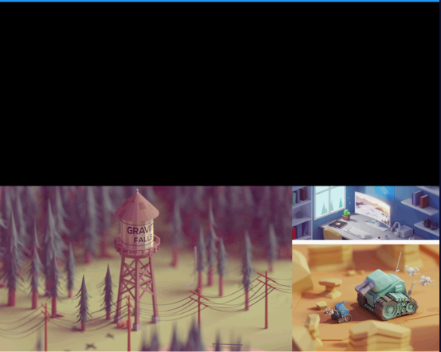

---
# 取二三级标题生成目录
outline: [2,3]
---

## 弹性布局（Flex Expanded）

Flex 组件可以沿着水平或垂直方向排列子组件，如果你知道主轴方向，使用 Row 或 Column 会方便一 些，因为 Row 和 Column 都继承自 Flex ，参数基本相同，所以能使用Flex的地方基本上都可以使用 Row 或 Column 。 Flex 本身功能是很强大的，它也可以和 Expanded 组件配合实现弹性布局 。

### 水平弹性布局

### 垂直弹性布局

```dart
class MyHomePage extends StatelessWidget {
  const MyHomePage({super.key});

  @override
  Widget build(BuildContext context) {
    return Flex(
      direction: Axis.horizontal,
      mainAxisAlignment: MainAxisAlignment.center,
      // children: [
      //   Expanded(
      //     flex: 1,
      //     child: IconContainer(Icons.home,color: Colors.pink)),
      //   Expanded(
      //     flex: 2,
      //     child: IconContainer(Icons.ac_unit_rounded,color: Colors.green))
      // ],  
      children: [
        IconContainer(Icons.home,color: Colors.pink),
        IconContainer(Icons.ac_unit_rounded,color: Colors.green)
      ]
    );
  }
}

// 自定义iconContainer 组件
class IconContainer extends StatelessWidget {
  Color color;
  IconData icon;
  IconContainer(this.icon , {super.key,this.color = Colors.red});

  @override
  Widget build(BuildContext context) {
    return Container(
      alignment: Alignment.center,
      width: 120,
      height: 120,
      decoration:  BoxDecoration(
        color: color
      ),
      child:  Icon(icon,color: Colors.white,size: 28),
    );
  }
}

```


### 使用Row 或Column 结合Expanded实现下面示例



```dart
import 'package:flutter/material.dart';
void main() {
  runApp(const MyApp());
}

class MyApp extends StatelessWidget {
  const MyApp({super.key});

  @override
  Widget build(BuildContext context) {
    return MaterialApp(
      theme: ThemeData(primaryColor: Colors.blue),
      home: Scaffold(
        appBar: AppBar(title: const Text('flutter ListView')),
        body: const MyHomePage(),
      ),
    );
  }
}

class MyHomePage extends StatelessWidget {
  const MyHomePage({super.key});

  @override
  Widget build(BuildContext context) {
    return ListView(
      children: [
        Container(
          height: 200,
          color: Colors.black,
        ),
        Row(
          children: [
            Expanded(
              flex: 2,
              child: SizedBox(
                height: 180,
                child: Image.network('https://www.itying.com/images/flutter/1.png', fit: BoxFit.cover),
              )
            ),
            Expanded(
              flex: 1,
              child: SizedBox(
                height: 180,
                child: Column(
                children: [
                  Expanded(
                    flex: 1,
                    child: SizedBox(
                      width: double.infinity,
                      child: Image.network('https://www.itying.com/images/flutter/2.png', fit: BoxFit.cover),
                    )
                  ),
                  const SizedBox(height: 5),
                  Expanded(
                    flex: 2,
                    child: SizedBox(
                      width: double.infinity,
                      child: Image.network('https://www.itying.com/images/flutter/3.png', fit: BoxFit.cover),
                    )
                  ),
                ],
              )
              )
              
            )
          ],
        )
      ],
    );
  }
}

```