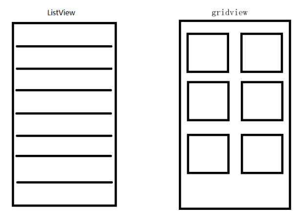
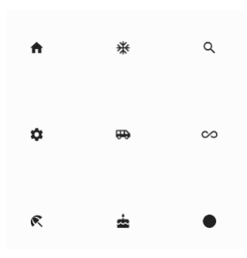
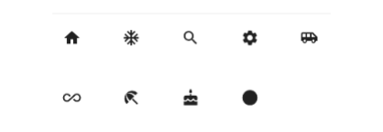
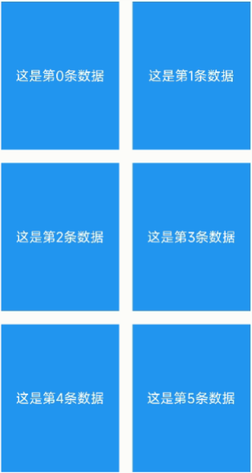

---
# 取二三级标题生成目录
outline: [2,3]
---

## Flutter GridView网格布局组件

### GridView网格布局组件介绍



GridView网格布局在实际项目中用的也是非常多的，当我们想让可以滚动的元素使用矩阵方式排列的时 候。此时我们可以用网格列表组件GridView实现布局。

GridView创建网格列表主要有下面三种方式 

1、可以通过GridView.count 实现网格布局 

2、可以通过GridView.extent 实现网格布局 

3、通过GridView.builder实现动态网格布局

**常用属性：**

| 名称                  | 类型                                                         | 说明                                   |
| --------------------- | ------------------------------------------------------------ | -------------------------------------- |
| scrollDirection       | Axis                                                         | 滚动方法                               |
| padding               | EdgeInsetsGeometry                                           | 内边距                                 |
| resolve               | bool                                                         | 组件反向排序                           |
| crossAxisSpacing      | double                                                       | 水平子Widget之间间 距                  |
| mainAxisSpacing       | double                                                       | 垂直子Widget之间间 距                  |
| crossAxisCount        | int 用在GridView.count                                       | 一行的Widget数量                       |
| maxCrossAxisExtent    | double 用在GridView.extent                                   | 横轴子元素的最大长 度                  |
| 横轴子元素的最大长 度 | double                                                       | 子Widget宽高比例                       |
| children              |                                                              | []                                     |
| gridDelegate          | SliverGridDelegateWithFixedCrossAxisCount SliverGridDelegateWithMaxCrossAxisExtent | 控制布局主要用在 GridView.builder里 面 |

### GridView.count 实现网格布局

GridView.count构造函数内部使用了SliverGridDelegateWithFixedCrossAxisCount，我们通过它可以 快速的创建横轴固定数量子元素的GridView



```dart
class MyHomePage extends StatelessWidget {
  const MyHomePage({super.key});

  @override
  Widget build(BuildContext context) {
    return GridView.count(
      crossAxisCount: 3,
      children: const [
        Icon(Icons.home),
        Icon(Icons.home),
        Icon(Icons.home),
        Icon(Icons.home),
        Icon(Icons.home),
      ],
    );
  }
}

```

### GridView.extent实现网格布局

GridView.extent构造函数内部使用了SliverGridDelegateWithMaxCrossAxisExtent，我们通过它可以 快速的创建横轴子元素为固定最大长度的的GridView。



```dart
class MyHomePage extends StatelessWidget {
  const MyHomePage({super.key});

  @override
  Widget build(BuildContext context) {
    return GridView.extent(
      maxCrossAxisExtent: 180, // 横轴子元素的最大长度
      children: const [
        Icon(Icons.abc),
        Icon(Icons.abc),
        Icon(Icons.abc),
        Icon(Icons.abc),
        Icon(Icons.abc),
        Icon(Icons.abc),
      ],
    );
  }
}
```

### GridView.count 和 GridView.extent属性详解



```dart
class MyHomePage extends StatelessWidget {
  const MyHomePage({super.key});

  List<Widget> _initListData(){
    List<Widget> list = [];
    for(int i=0;i<20;i++){
      list.add(Container(
          alignment: Alignment.center,
          decoration: const BoxDecoration(color: Colors.blue),
          child:  Text('这是第$i个元素'),
        ));
    }
    return list;
  }

  @override
  Widget build(BuildContext context) {
    return GridView.count(
      padding: const EdgeInsets.all(10),
      crossAxisSpacing: 10,  // 水平子widget之间 间距
      mainAxisSpacing: 10, // 垂直子widget之间 间距
      crossAxisCount: 2,
      childAspectRatio: 1.2, // 宽高比
      children: _initListData(),
    );
  }
}

```

### GridView.count 实现动态列表


```dart
class MyHomePage extends StatelessWidget {
  const MyHomePage({super.key});

  List<Widget> _initListData(){
    var tempList = listData.map((value){
      return Container(
        decoration: BoxDecoration(
          border: Border.all(
            color: Colors.black
          )
        ),
        child: Column(
          children: [
            Image.network(value['imageUrl']),
            const SizedBox(height: 10),
            Text(value['title'], style: const TextStyle(fontSize: 18))
          ],
        ),
      );
    });
    return tempList.toList();
  }

  @override
  Widget build(BuildContext context) {
    return GridView.count(
      padding: const EdgeInsets.all(10),
      crossAxisSpacing: 10,  // 水平子widget之间 间距
      mainAxisSpacing: 10, // 垂直子widget之间 间距
      crossAxisCount: 2,
      // childAspectRatio: 0.7, // 宽高比
      children: _initListData(),
    );
  }
}
```

### GridView.builder实现动态列表


**SliverGridDelegateWithFixedCrossAxisCount**

```dart
class MyHomePage extends StatelessWidget {
  const MyHomePage({super.key});

  Widget _initListData(content,index){
    return Container(
        decoration: BoxDecoration(
          border: Border.all(
            color: Colors.black
          )
        ),
        child: Column(
          children: [
            Image.network(listData[index]['imageUrl']),
            const SizedBox(height: 10),
            Text(listData[index]['title'], style: const TextStyle(fontSize: 18))
          ],
        ),
      );
  }

  @override
  Widget build(BuildContext context) {
    return GridView.builder(
      padding: const EdgeInsets.all(10),
      itemCount: listData.length,
      gridDelegate: const SliverGridDelegateWithFixedCrossAxisCount(
        crossAxisCount: 2,
        childAspectRatio: 1,
        crossAxisSpacing: 10,
        mainAxisSpacing: 10,
      ),
      itemBuilder: _initListData,
    );
  }
}
```

**SliverGridDelegateWithMaxCrossAxisExtent**

```dart
class MyHomePage extends StatelessWidget {
  const MyHomePage({super.key});

  Widget _initListData(content,index){
    return Container(
        decoration: BoxDecoration(
          border: Border.all(
            color: Colors.black
          )
        ),
        child: Column(
          children: [
            Image.network(listData[index]['imageUrl']),
            const SizedBox(height: 10),
            Text(listData[index]['title'], style: const TextStyle(fontSize: 18))
          ],
        ),
      );
  }

  @override
  Widget build(BuildContext context) {
    return GridView.builder(
      padding: const EdgeInsets.all(10),
      itemCount: listData.length,
      gridDelegate: const SliverGridDelegateWithMaxCrossAxisExtent(
        maxCrossAxisExtent: 250,
        childAspectRatio: 1,
        crossAxisSpacing: 10,
        mainAxisSpacing: 10,
      ),
      itemBuilder: _initListData,
    );
  }
}
```