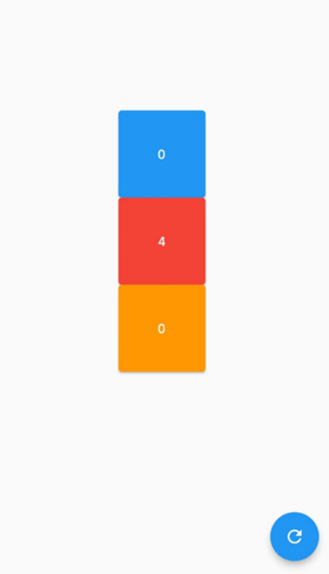
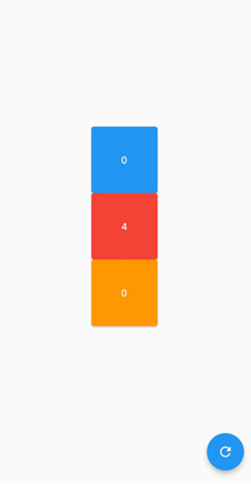

---
# 取二三级标题生成目录
outline: [2,3]
---

## Flutter Key详解

> 我们平时一定接触过很多的 Widget，比如 Container、Row、Column 等，它们在我们绘制界面的过程 中发挥着重要的作用。但是不知道你有没有注意到，在几乎每个 Widget 的构造函数中，都有一个共同 的参数，它们通常在参数列表的第一个，那就是 Key。
>
> 在Flutter中，**Key是不能重复使用的**，所以Key一般用来做唯一标识。组件在更新的时候，其状态的保 存主要是通过判断**组件的类型或者key值**是否一致。因此，当各组件的类型不同的时候，类型已经足够 用来区分不同的组件了，此时我们可以不必使用key。但是如果同时存在多个同一类型的控件的时候， 此时类型已经无法作为区分的条件了，我们就需要使用到key。

#### 没有 Key 会发生什么奇怪现象

> 如下面例： 定义了一个StatefulWidget的Box，点击Box的时候可以改变Box里面的数字，当我们重新 对Box排序的时候Flutter就无法识别到Box的变化了， 这是什么原因呢？



```dart
import 'package:flutter/material.dart';

void main() {
  runApp(const MyApp());
}

class MyApp extends StatelessWidget {
  const MyApp({super.key});

  @override
  Widget build(BuildContext context) {
    return MaterialApp(
      theme: ThemeData(primaryColor: Colors.blue),
      home: const MyHomePage(),
    );
  }
}

class MyHomePage extends StatefulWidget {
  const MyHomePage({super.key});

  @override
  State<MyHomePage> createState() => _MyHomePageState();
}

class _MyHomePageState extends State<MyHomePage> {
  List<Widget> list = [
    const Box( color: Colors.red),
    const Box(,color: Colors.blue),
    const Box( color: Colors.pink)
  ];

  @override
  Widget build(BuildContext context) {
    return Scaffold(
      appBar: AppBar(title: const Text('flutter App')),
      body: Center(
        child: Column(
          mainAxisAlignment: MainAxisAlignment.center,
          children: list,
        ),
      ),
      floatingActionButton:
          FloatingActionButton(onPressed: () {
            setState(() {
              // 打乱list元素的顺序
              list.shuffle();
            });
          }, child: const Icon(Icons.add)),
    );
  }
}

class Box extends StatefulWidget {
  final Color color;
  const Box({super.key, required this.color});

  @override
  State<Box> createState() => _BoxState();
}

class _BoxState extends State<Box> {
  int _count = 0;
  @override
  Widget build(BuildContext context) {
    return Container(
      height: 100,
      width: 100,
      color: Colors.red,
      child: ElevatedButton(
        style: ButtonStyle(
            backgroundColor: MaterialStateProperty.all(widget.color)),
        onPressed: () {
          setState(() {
            _count++;
          });
        },
        child: Text('$_count'),
      ),
    );
  }
}

```

> 运行后我们发现改变list Widget顺序后，Widget颜色会变化，但是每个Widget里面的文本内容并没有 变化，为什么会这样呢？当我们List重新排序后Flutter检测到了Widget的顺序变化，所以重新绘制List Widget，但是Flutter 发现List Widget 里面的元素没有变化，所以就没有改变Widget里面的内容。
>
> 把List 里面的Box的颜色改成一样，这个时候您重新对list进行排序，就很容易理解了。重新排序后虽然 执行了setState，但是代码和以前是一样的，所以Flutter不会重构List Widget里面的内容, 也就是 Flutter没法通过Box里面传入的参数来识别Box是否改变。如果要让FLutter能识别到List Widget子元素 的改变，就需要给每个Box指定一个key。

#### Flutter key：LocalKey、GlobalKey

> 在Flutter中，**Key是不能重复使用的**，所以Key一般用来做唯一标识。组件在更新的时候，其状态的保 存主要是通过判断**组件的类型或者key值**是否一致。因此，当各组件的类型不同的时候，类型已经足够 用来区分不同的组件了，此时我们可以不必使用key。但是如果同时存在多个同一类型的控件的时候， 此时类型已经无法作为区分的条件了，我们就需要使用到key。

 Flutter key子类包含 LocalKey 和 GlobalKey 。

- 局部键（LocalKey）：ValueKey、ObjectKey、UniqueKey
- 全局键（GlobalKey）： GlobalKey、GlobalObjectKey

ValueKey （值key）把一个值作为key ，UniqueKey（唯一key）程序生成唯一的Key，当我们不知道 如何指定ValueKey的时候就可以使用UniqueKey，ObjectKey（对象key）把一个对象实例作为key。 

GlobalKey（全局key），GlobalObjectKey（全局Objec key，和ObjectKey有点类似）

### LocalKey改造上面的例子

```dart
import 'package:flutter/material.dart';

void main() {
  runApp(const MyApp());
}

class MyApp extends StatelessWidget {
  const MyApp({super.key});

  @override
  Widget build(BuildContext context) {
    return MaterialApp(
      theme: ThemeData(primaryColor: Colors.blue),
      home: const MyHomePage(),
    );
  }
}

class MyHomePage extends StatefulWidget {
  const MyHomePage({super.key});

  @override
  State<MyHomePage> createState() => _MyHomePageState();
}

class _MyHomePageState extends State<MyHomePage> {
  List<Widget> list = [
    const Box(key: ValueKey('1'), color: Colors.red),
    Box(key: UniqueKey(), color: Colors.blue),
    const Box(key: ObjectKey(Box(color: Colors.pink)) ,color: Colors.pink)
  ];

  @override
  Widget build(BuildContext context) {
    return Scaffold(
      appBar: AppBar(title: const Text('flutter App')),
      body: Center(
        child: Column(
          mainAxisAlignment: MainAxisAlignment.center,
          children: list,
        ),
      ),
      floatingActionButton:
          FloatingActionButton(onPressed: () {
            setState(() {
              // 打乱list元素的顺序
              list.shuffle();
            });
          }, child: const Icon(Icons.add)),
    );
  }
}

class Box extends StatefulWidget {
  final Color color;
  const Box({super.key, required this.color});

  @override
  State<Box> createState() => _BoxState();
}

class _BoxState extends State<Box> {
  int _count = 0;
  @override
  Widget build(BuildContext context) {
    return Container(
      height: 100,
      width: 100,
      color: Colors.red,
      child: ElevatedButton(
        style: ButtonStyle(
            backgroundColor: MaterialStateProperty.all(widget.color)),
        onPressed: () {
          setState(() {
            _count++;
          });
        },
        child: Text('$_count'),
      ),
    );
  }
}
```

### GlobalKey的使用

> 如果把LocalKey比作局部变量， GlobalKey就类似于全局变量 
>
> 下面使用了LocalKey，当屏幕状态改变的时候把 Colum换成了Row，Box的状态就会丢失。



```dart
import 'package:flutter/material.dart';

void main() {
  runApp(const MyApp());
}

class MyApp extends StatelessWidget {
  const MyApp({super.key});

  @override
  Widget build(BuildContext context) {
    return MaterialApp(
      theme: ThemeData(primaryColor: Colors.blue),
      home: const MyHomePage(),
    );
  }
}

class MyHomePage extends StatefulWidget {
  const MyHomePage({super.key});

  @override
  State<MyHomePage> createState() => _MyHomePageState();
}

class _MyHomePageState extends State<MyHomePage> {
  List<Widget> list = [
    const Box(key: ValueKey('1'), color: Colors.red),
    Box(key: UniqueKey(), color: Colors.blue),
    const Box(key: ObjectKey(Box(color: Colors.pink)) ,color: Colors.pink)
  ];

  @override
  Widget build(BuildContext context) {
    return Scaffold(
      appBar: AppBar(title: const Text('flutter App')),
      body: Center(
        child: Column(
          mainAxisAlignment: MainAxisAlignment.center,
          children: list,
        ),
      ),
      floatingActionButton:
          FloatingActionButton(onPressed: () {
            setState(() {
              // 打乱list元素的顺序
              list.shuffle();
            });
          }, child: const Icon(Icons.add)),
    );
  }
}

class Box extends StatefulWidget {
  final Color color;
  const Box({super.key, required this.color});

  @override
  State<Box> createState() => _BoxState();
}

class _BoxState extends State<Box> {
  int _count = 0;
  @override
  Widget build(BuildContext context) {
    return Container(
      height: 100,
      width: 100,
      color: Colors.red,
      child: ElevatedButton(
        style: ButtonStyle(
            backgroundColor: MaterialStateProperty.all(widget.color)),
        onPressed: () {
          setState(() {
            _count++;
          });
        },
        child: Text('$_count'),
      ),
    );
  }
}

```

> 在前面我们介绍过一个Widget状态的保存主要是通过判断组件的类型或者key值是否一致。LocalKey只 在当前的组件树有效，所以把Colum换成了Row的时候Widget的状态就丢失了。为了解决这个问题我们 就可以使用GlobalKey。
>
> **GlobalKey优化**，把LocalKey换成GlobalKey，如下：

```dart
import 'package:flutter/material.dart';

void main() {
  runApp(const MyApp());
}

class MyApp extends StatelessWidget {
  const MyApp({super.key});

  @override
  Widget build(BuildContext context) {
    return MaterialApp(
      theme: ThemeData(primaryColor: Colors.blue),
      home: const MyHomePage(),
    );
  }
}

class MyHomePage extends StatefulWidget {
  const MyHomePage({super.key});

  @override
  State<MyHomePage> createState() => _MyHomePageState();
}

class _MyHomePageState extends State<MyHomePage> {
  List<Widget> list = [];
  final GlobalKey _globalKey1 = GlobalKey();
  final GlobalKey _globalKey2 = GlobalKey();
  final GlobalKey _globalKey3 = GlobalKey();

  @override
  void initState() {
    // TODO: implement initState
    super.initState();
    // 1.可以保存状态  2.可以排序
    list = [
      Box(key: _globalKey1, color: Colors.red),
      Box(key: _globalKey2, color: Colors.blue),
      Box(key: _globalKey3 ,color: Colors.pink)
    ];
  }

  @override
  Widget build(BuildContext context) {
    print(MediaQuery.of(context).orientation);
    return Scaffold(
      appBar: AppBar(title: const Text('flutter App')),
      body: Center(
        child: MediaQuery.of(context).orientation == Orientation.portrait ? Column(
          mainAxisAlignment: MainAxisAlignment.center,
          children: list,
        ) : Row(
          mainAxisAlignment: MainAxisAlignment.center,
          children: list,
        ),
      ),
      floatingActionButton:
          FloatingActionButton(onPressed: () {
            setState(() {
              // 打乱list元素的顺序
              list.shuffle();
            });
          }, child: const Icon(Icons.add)),
    );
  }
}

class Box extends StatefulWidget {
  final Color color;
  const Box({super.key, required this.color});

  @override
  State<Box> createState() => _BoxState();
}

class _BoxState extends State<Box> {
  int _count = 0;
  @override
  Widget build(BuildContext context) {
    return Container(
      height: 100,
      width: 100,
      color: Colors.red,
      child: ElevatedButton(
        style: ButtonStyle(
            backgroundColor: MaterialStateProperty.all(widget.color)),
        onPressed: () {
          setState(() {
            _count++;
          });
        },
        child: Text('$_count'),
      ),
    );
  }
}

```

### GlobalKey 获取子组件

> globalKey.currentState 可以获取子组件的状态，执行子组件的方法，globalKey.currentWidget可以获 取子组件的属性，_globalKey.currentContext!.findRenderObject()可以获取渲染的属性。

```dart
import 'package:flutter/material.dart';

void main() {
  runApp(const MyApp());
}

class MyApp extends StatelessWidget {
  const MyApp({super.key});

  @override
  Widget build(BuildContext context) {
    return MaterialApp(
      theme: ThemeData(primaryColor: Colors.blue),
      home: const MyHomePage(),
    );
  }
}

class MyHomePage extends StatefulWidget {
  const MyHomePage({super.key});

  @override
  State<MyHomePage> createState() => _MyHomePageState();
}

class _MyHomePageState extends State<MyHomePage> {
  final GlobalKey _globalKey = GlobalKey();

  @override
  Widget build(BuildContext context) {
    return Scaffold(
      appBar: AppBar(title: const Text('flutter App')),
      body: Center(
        child: Box(key: _globalKey, color: Colors.red),
      ),
      floatingActionButton: FloatingActionButton(onPressed: (){
        // 1. 获取子 _BoxState widget 的属性
        var boxState = _globalKey.currentState as _BoxState;
        print(boxState._count);
        setState(() {
          boxState._count++;
        });
        // 调用子方法
        boxState.run();

        // 2. 获取 Box widget 属性(了解)
         var boxWidget = _globalKey.currentWidget as Box;
         print(boxWidget.color); // MaterialColor(primary value: Color(0xfff44336))

        // 3. 获取子组件渲染的属性(了解)
        var renderBox = _globalKey.currentContext!.findRenderObject() as RenderBox;
        print(renderBox.size); // Size(100.0, 100.0)

      }, child: const Icon(Icons.add)),
    );
  }
}

// 子widget
class Box extends StatefulWidget {
  final Color color;
  const Box({Key? key, required this.color}):super(key: key);

  @override
  State<Box> createState() => _BoxState();
}

class _BoxState extends State<Box> {
  int _count = 0;

  void run(){
    print('我是box的方法');
  }

  @override
  Widget build(BuildContext context) {
    return Container(
      height: 100,
      width: 100,
      color: Colors.red,
      child: ElevatedButton(
        style: ButtonStyle(
            backgroundColor: MaterialStateProperty.all(widget.color)),
        onPressed: () {
          setState(() {
            _count++;
          });
        },
        child: Text('$_count'),
      ),
    );
  }
}
```