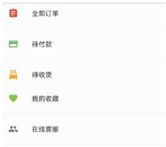
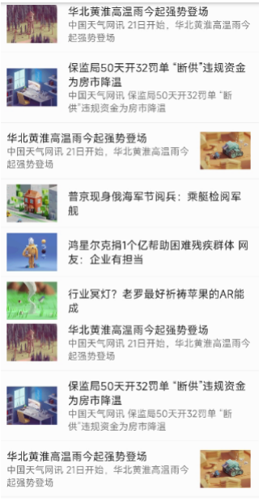
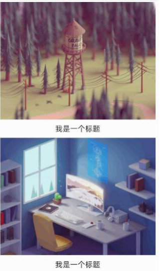
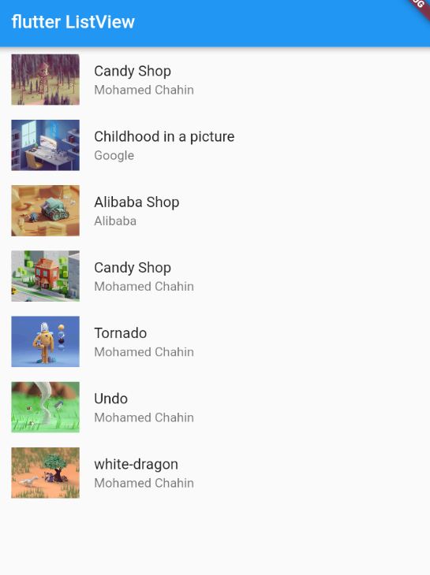

---
# 取二三级标题生成目录
outline: [2,3]
---

## Flutter 列表组件

列表布局是我们项目开发中最常用的一种布局方式。Flutter中我们可以通过ListView来定义列表项，支 持垂直和水平方向展示。通过一个属性就可以控制列表的显示方向。列表有以下分类：

1、垂直列表 

2、垂直图文列表 

3、水平列表 

4、动态列表

**列表组件常用参数：**

| 名称            | 类型               | 说明                                         |
| --------------- | ------------------ | -------------------------------------------- |
| scrollDirection | Axis               | Axis.horizontal水平列表Axis.vertical垂直列表 |
| padding         | EdgeInsetsGeometry | 内边距                                       |
| resolve         | bool               | 组件反向排序                                 |
| children        | List               | 列表元素                                     |

### 垂直列表

**示例一**

```dart
import 'package:flutter/material.dart';

void main() {
  runApp(const MyApp());
}

class MyApp extends StatelessWidget {
  const MyApp({super.key});

  @override
  Widget build(BuildContext context) {
    return MaterialApp(
      theme: ThemeData(
        primaryColor: Colors.blue
      ),
      home: Scaffold(
        appBar: AppBar(title: const Text('flutter icon')),
        body: const MyHomePage(),
      ),
    );
  }
}

class MyHomePage extends StatelessWidget {
  const MyHomePage({super.key});
  @override
  Widget build(BuildContext context) {
    return ListView(
      children: const <Widget>[
        ListTile(title: Text('我是一个列表')),
        Divider(),
        ListTile(title: Text('我是一个列表')),
        Divider(),
        ListTile(title: Text('我是一个列表')),
        Divider(),
        ListTile(title: Text('我是一个列表')),
        Divider(),
        ListTile(title: Text('我是一个列表')),
        Divider(),
      ],
    );
  }
}
```

**示例二**



```dart
// 图标 + 文字的组合
class MyHomePage extends StatelessWidget {
  const MyHomePage({super.key});

  @override
  Widget build(BuildContext context) {
    return ListView(
      children: const <Widget>[
        ListTile(
          leading: Icon(Icons.home, size: 40, color: Colors.red),
          title: Text('首页')),
        Divider(),
        ListTile(
          leading: Icon(Icons.payment, size: 40, color: Colors.red),
          title: Text('待付款')),
        Divider(),
        ListTile(
          leading: Icon(Icons.favorite, size: 40, color: Colors.red),
          title: Text('我的收藏')),
        Divider(),
        ListTile(
          leading: Icon(Icons.people, size: 40, color: Colors.red),
          title: Text('在线客服'),
          trailing: Icon(Icons.chevron_right, size: 40, color: Colors.red),
          ),
        Divider(),
      ],
    );
  }
}
```

### 垂直图文列表

**示例1**



```dart
class MyHomePage extends StatelessWidget {
  const MyHomePage({super.key});

  @override
  Widget build(BuildContext context) {
    return ListView(
      padding: const EdgeInsets.fromLTRB(0, 10, 0, 0),
      children:  const <Widget>[
        ListTile(
          leading: NewsImage(),
          title: Text('安顺一般指安顺市。 安顺，贵州省辖地级市，位于贵州中西部，距贵州省省会贵阳90公里')
        ),
        Divider(),
        ListTile(
          leading: NewsImage(),
          title: Text('安顺一般指安顺市。 安顺，贵州省辖地级市，位于贵州中西部，距贵州省省会贵阳90公里', style: TextStyle(color: Color.fromARGB(233, 1, 233, 194)))
        ),
        Divider(),
        ListTile(
          leading: NewsImage(),
          title: Text('安顺一般指安顺市。 安顺，贵州省辖地级市，位于贵州中西部，距贵州省省会贵阳90公里', style: TextStyle(color: Colors.red)),
          subtitle: Text('大家来看是否水电费胜多负少梵蒂冈的'),
          trailing: NewsImage(),
        ),
        Divider()

      ],
    );
  }
}

class NewsImage extends StatelessWidget {
  const NewsImage({super.key});

  @override
  Widget build(BuildContext context) {
    return Container(
      width: 100,
      height: 100,
      decoration: BoxDecoration(
          color: Colors.yellow,
          borderRadius: BorderRadius.circular(8),
          image: const DecorationImage(
              image: NetworkImage(
                  'https://www.itying.com/images/flutter/1.png'),
              fit: BoxFit.cover)),
    );
  }
}
```

**示例2**



```dart
class MyHomePage extends StatelessWidget {
  const MyHomePage({super.key});

  @override
  Widget build(BuildContext context) {
    return ListView(
      padding: const EdgeInsets.fromLTRB(0, 10, 0, 0),
      children:  <Widget>[
        Image.network('https://www.itying.com/images/flutter/1.png'),
        Container(
          padding: const EdgeInsets.fromLTRB(0, 10, 0, 0),
          height: 44,
          child: const Text('我是一个标题',textAlign: TextAlign.center,style: TextStyle(fontSize: 22)),
        ),
        Image.network('https://www.itying.com/images/flutter/2.png'),
        Container(
          padding: const EdgeInsets.fromLTRB(0, 10, 0, 0),
          height: 44,
          child: const Text('我是一个标题',textAlign: TextAlign.center,style: TextStyle(fontSize: 22)),
        ),
        Image.network('https://www.itying.com/images/flutter/3.png'),
        Container(
          padding: const EdgeInsets.fromLTRB(0, 10, 0, 0),
          height: 44,
          child: const Text('我是一个标题',textAlign: TextAlign.center,style: TextStyle(fontSize: 22)),
        ),
        Image.network('https://www.itying.com/images/flutter/4.png'),
        Container(
          padding: const EdgeInsets.fromLTRB(0, 10, 0, 0),
          height: 44,
          child: const Text('我是一个标题',textAlign: TextAlign.center,style: TextStyle(fontSize: 22)),
        ),
        Image.network('https://www.itying.com/images/flutter/5.png'),
        Container(
          padding: const EdgeInsets.fromLTRB(0, 10, 0, 0),
          height: 44,
          child: const Text('我是一个标题',textAlign: TextAlign.center,style: TextStyle(fontSize: 22)),
        ),
        Image.network('https://www.itying.com/images/flutter/6.png'),
        Container(
          padding: const EdgeInsets.fromLTRB(0, 10, 0, 0),
          height: 44,
          child: const Text('我是一个标题',textAlign: TextAlign.center,style: TextStyle(fontSize: 22)),
        ),
      ],
    );
  }
}
```

### 水平列表 可以左右滑动

```dart
class MyHomePage extends StatelessWidget {
  const MyHomePage({super.key});

  @override
  Widget build(BuildContext context) {
    return SizedBox(
        height: 120,
        child: ListView(
          scrollDirection: Axis.horizontal,
          padding: const EdgeInsets.fromLTRB(10, 10, 10, 0),
          children: <Widget>[
            Container(
              width: 120,
              decoration: const BoxDecoration(color: Colors.red),
            ),
            Container(
              width: 120,
              decoration: const BoxDecoration(color: Colors.green),
            ),
            Container(
              width: 120,
              decoration: const BoxDecoration(color: Colors.pink),
            ),
            Container(
              width: 120,
              decoration: const BoxDecoration(color: Colors.teal),
            ),
            Container(
              width: 120,
              decoration: const BoxDecoration(color: Colors.yellow),
            ),
            Container(
              width: 120,
              decoration: const BoxDecoration(color: Colors.blue),
            )
          ],
        ));
  }
}

```

### ListView动态列表组件 以及循环动态数据

```dart
import 'package:flutter/material.dart';
import './res/listData.dart';

void main() {
  runApp(const MyApp());
}

class MyApp extends StatelessWidget {
  const MyApp({super.key});

  @override
  Widget build(BuildContext context) {
    return MaterialApp(
      theme: ThemeData(primaryColor: Colors.blue),
      home: Scaffold(
        appBar: AppBar(title: const Text('flutter ListView')),
        body: MyHomePage(),
      ),
    );
  }
}

// ListView 实现动态列表
class MyHomePage extends StatelessWidget {
  const MyHomePage({super.key});

  // 自定义方法 - 静态值
  // List <Widget> _initListData (){
  //   List <Widget> list = [];
  //   for(int i = 0;i< 20;i++){
  //     list.add(ListTile(title: Text('这是一个列表---$i')));
  //   }
  //   return list;
  // }

  // 使用map 的值
  // List <Widget> _initListData (){
  //   List <Widget> list = [];
  //   for(int i = 0;i< listData.length;i++){
  //     list.add(
  //       ListTile(
  //         leading: Image.network('${listData[i]["imageUrl"]}'),
  //         title: Text('${listData[i]["title"]}'),
  //         subtitle: Text('${listData[i]["author"]}'),
  //       )
  //     );
  //   }
  //   return list;
  // }

  List <Widget> _initListData (){
    var tempList = listData.map((value) {
      return ListTile(
          leading: Image.network('${value["imageUrl"]}'),
          title: Text('${value["title"]}'),
          subtitle: Text('${value["author"]}'),
        );
    });
    
    return tempList.toList();
  }

  @override
  Widget build(BuildContext context) {
    return ListView(
      children: _initListData(),
    );
  }
}

```

```dart
// ListView 实现动态列表
class MyHomePage extends StatelessWidget {
  List<String> list = [];
  MyHomePage({super.key}){
    for(int i = 0;i< 20;i++){
      list.add('我是一个列表---$i');
    }
  }

  @override
  Widget build(BuildContext context) {
    return ListView.builder(
      itemCount: list.length,
      itemBuilder: (content,index){
        return ListTile(title: Text(list[index]));
      },
    );
  }
}

```



```dart
import 'package:flutter/material.dart';
import './res/listData.dart';
void main() {
  runApp(const MyApp());
}

class MyApp extends StatelessWidget {
  const MyApp({super.key});

  @override
  Widget build(BuildContext context) {
    return MaterialApp(
      theme: ThemeData(primaryColor: Colors.blue),
      home: Scaffold(
        appBar: AppBar(title: const Text('flutter ListView')),
        body: const MyHomePage(),
      ),
    );
  }
}

// ListView 实现动态列表
class MyHomePage extends StatelessWidget {
  const MyHomePage({super.key});

  @override
  Widget build(BuildContext context) {
    return ListView.builder(
      itemCount: listData.length,
      itemBuilder: (content,index){
        return ListTile(
          leading: Image.network(listData[index]["imageUrl"]),
          title: Text(listData[index]["title"]),
          subtitle: Text(listData[index]["author"]),
        );
      },
    );
  }
}

```