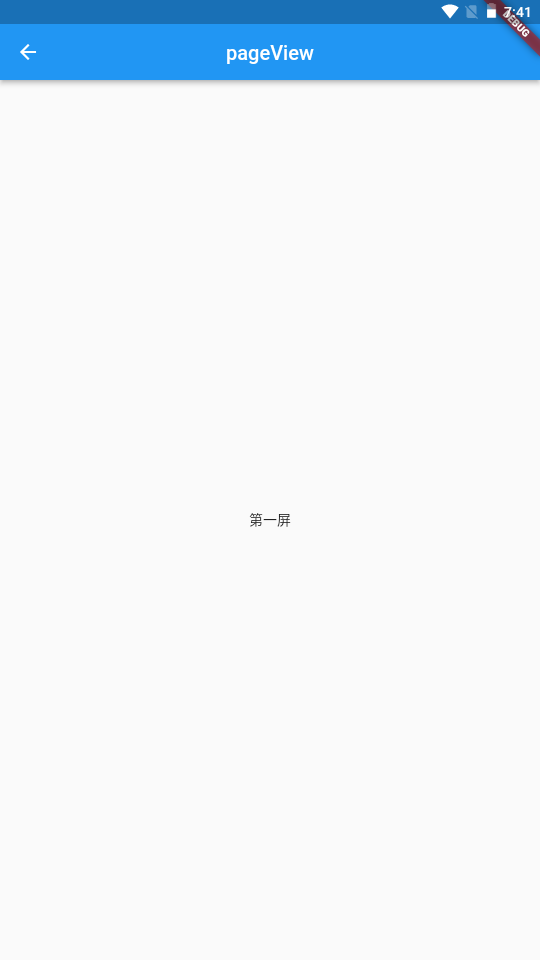

---
# 取二三级标题生成目录
outline: [2,3]
---

## Flutter PageView

>  Flutter中的轮动图以及抖音上下滑页切换视频功能等等，这些都可以通过 PageView 轻松实现

**PageView常见属性：**

| 属性                   | 描述                                         |
| ---------------------- | -------------------------------------------- |
| scrollDirection        | Axis.horizonta水平方向 Axis.vertical锤子方向 |
| children               | 配置子元素                                   |
| allowImplicitScrolling | 缓存当前页面的前后两页                       |
| onPageChanged          | page改变的时候触发                           |

### PageView 的使用



```dart
import 'package:flutter/material.dart';


class PageViewPage extends StatefulWidget {
  const PageViewPage({super.key});

  @override
  State<PageViewPage> createState() => _PageViewPageState();
}

class _PageViewPageState extends State<PageViewPage> {
  @override
  Widget build(BuildContext context) {
    return Scaffold(
      appBar: AppBar(title: const Text("pageView")),
      body: PageView(
        scrollDirection: Axis.vertical, // 配置pageview滑动的方向，默认是水平方向
        children: const [
          Center(
            child: Text('第一屏'),
          ),
          Center(
            child: Text('第二屏'),
          ),
          Center(
            child: Text('第三屏'),
          )
        ],
      ),
    );
  }
}
```

### PageView.builder


```dart
import 'package:flutter/material.dart';


class PageViewBuildPage extends StatefulWidget {
  const PageViewBuildPage({super.key});

  @override
  State<PageViewBuildPage> createState() => _PageViewBuildPageState();
}

class _PageViewBuildPageState extends State<PageViewBuildPage> {
  @override
  Widget build(BuildContext context) {
    return Scaffold(
      appBar: AppBar(title: const Text("pageViewBuild")),
      body: PageView.builder(
        itemCount: 10,
        itemBuilder: (context, index){
          return Center(
            child: Text('第$index屏'),
          );
        },
      ),
    );
  }
}
```

### PageView上拉无限加载的实现思路


````dart
import 'package:flutter/material.dart';


class PageViewFullPage extends StatefulWidget {
  const PageViewFullPage({super.key});

  @override
  State<PageViewFullPage> createState() => _PageViewFullPageState();
}

class _PageViewFullPageState extends State<PageViewFullPage> {

  List<Widget> list = [];

  @override
  void initState() {
    // TODO: implement initState
    super.initState();
    for(var i = 0;i< 10;i++){
      list.add(
        Text('第$i屏')
      );
    }
  }

  @override
  Widget build(BuildContext context) {
    return Scaffold(
      appBar: AppBar(title: const Text("pageViewFullPage")),
      body: PageView(
        scrollDirection: Axis.vertical,
        onPageChanged: (index){
          print(index);
          if(index +2 == list.length){
            setState(() {
              for(var i = 0;i< 10;i++){
                list.add(
                  Text('第$i屏')
                );
              }
            });
          }
        },
        children: list,
      ),
    );
  }
}
````

### PageView 实现一个无限轮播的轮播图


```dart
import 'package:flutter/material.dart';
import '../widget/image.dart';

class PageViewSwiper extends StatefulWidget {
  const PageViewSwiper({super.key});

  @override
  State<PageViewSwiper> createState() => _PageViewSwiperState();
}

class _PageViewSwiperState extends State<PageViewSwiper> {
  int _currentIndex = 0;
  List<Widget> list = [];
  @override
  void initState() {
    // TODO: implement initState
    super.initState();
    list = const [
      ImagePage(
          height: 200, src: 'https://www.itying.com/images/flutter/1.png'),
      ImagePage(
          height: 200, src: 'https://www.itying.com/images/flutter/2.png'),
      ImagePage(height: 200, src: 'https://www.itying.com/images/flutter/3.png')
    ];
  }

  @override
  Widget build(BuildContext context) {
    return Scaffold(
      appBar: AppBar(title: const Text('pageViewSwiper')),
      body: Stack(
        children: [
          SizedBox(
            height: 200,
            child: PageView.builder(
                onPageChanged: (index){
                  setState(() {
                    _currentIndex = index % list.length;
                  });
                },
                itemCount: 1000,
                itemBuilder: (context, index) {
                  return list[index % list.length];
                }),
          ),
          Positioned(
            left: 0,
            right: 0,
            bottom: 2,
            child: Row(
              mainAxisAlignment: MainAxisAlignment.center,
              children: List.generate(list.length, (index){
                return Container(
                  margin: const EdgeInsets.all(10),
                  width: 10,
                  height: 10,
                  decoration: BoxDecoration(
                    color: _currentIndex == index? Colors.red : Colors.blue, 
                    shape: BoxShape.circle // 圆
                    // borderRadius: BorderRadius.circular(5)
                  ),
                );
              }).toList(),
            )
          )
        ],
      ),
    );
  }
}

```

```dart
import 'package:flutter/material.dart';

class ImagePage extends StatelessWidget {
  final double height;
  final double width;
  final String src;
  const ImagePage({super.key, this.width = double.infinity, this.height = 200, required this.src});

  @override
  Widget build(BuildContext context) {
    return Image.network(src, fit: BoxFit.cover);
  }
}
```


### AutomaticKeepAliveClientMixin 缓存PageView页面

> 通过上面的例子我们会发现 每次滑动的时候都会触发子组件中的 build方法 print(widget.url);
>
> 可见 PageView 默认并没有缓存功能，一旦页面滑出屏幕它就会被销毁 ,实际项目开发中对页面进行缓 存是很常见的一个需求，下面我们就看看如何使用AutomaticKeepAliveClientMixin 缓存页面。
>
> **注意**：使用时一定要注意是否必要，因为对所有列表项都缓存的会导致更多的内存消耗。

```dart
import 'package:flutter/material.dart';

class PageViewKeepAlive extends StatefulWidget {
  const PageViewKeepAlive({super.key});

  @override
  State<PageViewKeepAlive> createState() => _PageViewKeepAliveState();
}

class _PageViewKeepAliveState extends State<PageViewKeepAlive> {
  @override
  Widget build(BuildContext context) {
    return Scaffold(
      appBar: AppBar(title: const Text('keepalive')),
      body: PageView.builder(
          itemCount: 10,
          itemBuilder: (context, index) {
            return MyContainer(num: index);
          }),
    );
  }
}

// 自定义组件
class MyContainer extends StatefulWidget {
  final int num;
  const MyContainer({super.key, required this.num});

  @override
  State<MyContainer> createState() => _MyContainerState();
}

class _MyContainerState extends State<MyContainer> with AutomaticKeepAliveClientMixin {
  @override
  Widget build(BuildContext context) {
    // 默认数据是没有缓存，每次滑动都会执行build
    print(widget.num);
    return Center(
      child: Text('第${widget.num}屏'),
    );
  }
  
  @override
  // TODO: implement wantKeepAlive
  bool get wantKeepAlive => true;
}

```

###  自定义KeepAliveWrapper 缓存页面

>  AutomaticKeepAliveClientMixin 可以快速的实现页面缓存功能，但是通过混入的方式实现不是很优 雅， 所以我们有必要对AutomaticKeepAliveClientMixin 混入进行封装

```dart
import 'package:flutter/material.dart';

class KeepAliveWrapper extends StatefulWidget {
  final Widget? child;
  final bool keepAlive;

  const KeepAliveWrapper(
    {super.key, required this.child, this.keepAlive = true}
  );

  @override
  State<KeepAliveWrapper> createState() => _KeepAliveWrapperState();
}

class _KeepAliveWrapperState extends State<KeepAliveWrapper> with AutomaticKeepAliveClientMixin {
  @override
  Widget build(BuildContext context) {
    return widget.child!;
  }

  @override
  bool get wantKeepAlive => widget.keepAlive;

  // @override
  // void didUpdateWidget(covariant KeepAliveWrapper oldWidget) {
  //   if (oldWidget.keepAlive != widget.keepAlive) {
  //   // keepAlive 状态需要更新，实现在 AutomaticKeepAliveClientMixin 中
  //     updateKeepAlive();
  //   }
  //   super.didUpdateWidget(oldWidget);
  // }
}
```