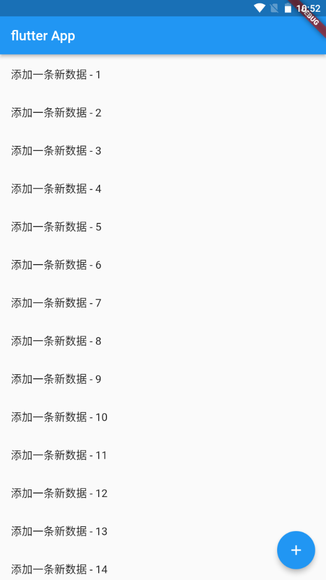

---
# 取二三级标题生成目录
outline: [2,3]
---

## Flutter StatelessWidget 、 StatefulWidget

> 在Flutter中自定义组件其实就是一个类，这个类需要继承StatelessWidget/StatefulWidget。 
>
> StatelessWidget是无状态组件，状态不可变的
>
> widget StatefulWidget是有状态组件，持有的状态可能在widget生命周期改变。 
>
> 通俗的讲：如果我们想改变页面中的数据的话这个时候就需要用到StatefulWidget

### StatefulWidget实现一个计数器的功能


```dart
import 'package:flutter/material.dart';

void main() {
  runApp(const MyApp());
}

class MyApp extends StatelessWidget {
  const MyApp({super.key});

  @override
  Widget build(BuildContext context) {
    return MaterialApp(
      theme: ThemeData(primaryColor: Colors.blue),
      home: const MyHomePage(),
    );
  }
}

class MyHomePage extends StatefulWidget {
  const MyHomePage({super.key});

  @override
  State<MyHomePage> createState() => _MyHomePageState();
}

class _MyHomePageState extends State<MyHomePage> {
  int count = 0;
  @override
  Widget build(BuildContext context) {
    return Scaffold(
      appBar: AppBar(title: const Text('flutter App')),
      body: Center(
        child: Column(
          mainAxisAlignment: MainAxisAlignment.center,
          children: [
            Text('$count', style: Theme.of(context).textTheme.displayMedium),
            ElevatedButton(onPressed: (){
              setState(() {
                count++;
              });
            }, child: const Text('增加'))
          ],
        ),
      ),
      floatingActionButton: FloatingActionButton(onPressed: (){
        setState(() {
                count++;
              });
      },child: const Icon(Icons.add)),
    );
  }
}
```


### StatefulWidget实现一个动态列表



```dart
import 'package:flutter/material.dart';

void main() {
  runApp(const MyApp());
}

class MyApp extends StatelessWidget {
  const MyApp({super.key});

  @override
  Widget build(BuildContext context) {
    return MaterialApp(
      theme: ThemeData(primaryColor: Colors.blue),
      home: const MyHomePage(),
    );
  }
}

class MyHomePage extends StatefulWidget {
  const MyHomePage({super.key});

  @override
  State<MyHomePage> createState() => _MyHomePageState();
}

class _MyHomePageState extends State<MyHomePage> {
  int count = 0;
  final List<String> _list = [];
  @override
  Widget build(BuildContext context) {
    return Scaffold(
      appBar: AppBar(title: const Text('flutter App')),
      body: ListView(
        children: _list.map((value) => ListTile(title: Text(value))).toList(),
      ),
      floatingActionButton: FloatingActionButton(onPressed: (){
        setState(() {
          count++;
          _list.add('添加一条新数据 - $count');      
        });
      },child: const Icon(Icons.add)),
    );
  }
}
```