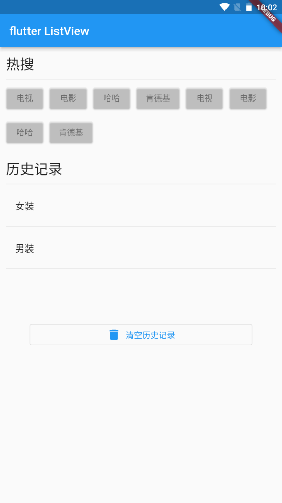

---
# 取二三级标题生成目录
outline: [2,3]
---

## Flutter Wrap组件

> Wrap可以实现流布局，单行的Wrap跟Row表现几乎一致，单列的Wrap则跟Column表现几乎一致。但 Row与Column都是单行单列的，Wrap则突破了这个限制，mainAxis上空间不足时，则向crossAxis上 去扩展显示。

| 属性              | 说明                                                         |
| ----------------- | ------------------------------------------------------------ |
| direction         | 主轴的方向，默认水平                                         |
| alignment         | 主轴的对其方式                                               |
| spacing           | 主轴方向上的间距                                             |
| textDirection     | 文本方向                                                     |
| verticalDirection | 定义了children摆放顺序，默认是down，见Flex相关属性介绍。     |
| runAlignment      | run的对齐方式。run可以理解为新的行或者列，如果是水平方向布局的话， run可以理解为新的一行 |
| runSpacing        | run的间距                                                    |


### 自定义一个按钮组件

```dart
// 自定义一个按钮组件
class Button extends StatelessWidget {
  String text;
  void Function()? onPressed;
  Button(this.text, {super.key, required this.onPressed});

  @override
  Widget build(BuildContext context) {
    return ElevatedButton(
        style: ButtonStyle(
            backgroundColor: MaterialStateProperty.all(
                const Color.fromARGB(31, 250, 244, 244)),
            foregroundColor: MaterialStateProperty.all(Colors.black45)),
        onPressed: onPressed,
        child: Text(text));
  }
}

```

### Wrap组件的使用

```dart
class MyHomePage extends StatelessWidget {
  const MyHomePage({super.key});

  @override
  Widget build(BuildContext context) {
    // return SizedBox(
    //   width: double.infinity,
    //   child: Wrap(
    //   spacing: 10,
    //   runSpacing: 10,
    //   alignment: WrapAlignment.spaceAround,
    //   runAlignment: WrapAlignment.spaceAround,
    //   children: [
    //     Button('第一集', onPressed: (){}),
    //     Button('第二集', onPressed: (){}),
    //     Button('第三集', onPressed: (){}),
    //     Button('第四集', onPressed: (){}),
    //     Button('第五集', onPressed: (){}),
    //     Button('第六集', onPressed: (){}),
    //     Button('第七集', onPressed: (){}),
    //     Button('第八集', onPressed: (){}),
    //     Button('第九集', onPressed: (){}),
    //     Button('第十集', onPressed: (){}),
    //     Button('第十一集', onPressed: (){})
    //   ],
    // ),
    // );
    return Row(
      children: [
        Expanded(
              flex: 2,
              child: SizedBox(
                height: 180,
                child: Image.network('https://www.itying.com/images/flutter/1.png', fit: BoxFit.cover),
              ))
      ],
    );
  }
}

// 自定义一个按钮组件
class Button extends StatelessWidget {
  String text;
  void Function()? onPressed;
  Button(this.text, {super.key, required this.onPressed});

  @override
  Widget build(BuildContext context) {
    return ElevatedButton(
        style: ButtonStyle(
            backgroundColor: MaterialStateProperty.all(
                const Color.fromARGB(31, 250, 244, 244)),
            foregroundColor: MaterialStateProperty.all(Colors.black45)),
        onPressed: onPressed,
        child: Text(text));
  }
}
```

### Wrap组件搜索页面布局



```dart
class MyHomePage extends StatelessWidget {
  const MyHomePage({super.key});

  @override
  Widget build(BuildContext context) {
    return ListView(
      padding: const EdgeInsets.all(10),
      children: [
        Row(
          children: [
            Text('热搜', style: Theme.of(context).textTheme.headlineSmall)
          ],
        ),
        const Divider(),
        Wrap(
          spacing: 10,
          runSpacing: 10,
          children: [
            Button('电视', onPressed: (){}),
            Button('电影', onPressed: (){}),
            Button('哈哈', onPressed: (){}),
            Button('肯德基', onPressed: (){}),
            Button('电视', onPressed: (){}),
            Button('电影', onPressed: (){}),
            Button('哈哈', onPressed: (){}),
            Button('肯德基', onPressed: (){})
          ],
        ),
        const SizedBox(height: 20),
        Row(
          children: [
            Text('历史记录', style: Theme.of(context).textTheme.headlineSmall)
          ],
        ),
        const Divider(),
        Column(
          children: const [
            ListTile(title: Text('女装')),
            Divider(),
            ListTile(title: Text('男装')),
            Divider(),
          ],
        ),
        const SizedBox(height: 40),
        Padding(padding: const EdgeInsets.all(40),child: OutlinedButton.icon(onPressed: (){}, icon: const Icon(Icons.delete), label: const Text('清空历史记录')),)
      ],
    );
  }
}

// 自定义一个按钮组件
class Button extends StatelessWidget {
  String text;
  void Function()? onPressed;
  Button(this.text, {super.key, required this.onPressed});

  @override
  Widget build(BuildContext context) {
    return ElevatedButton(
        style: ButtonStyle(
            backgroundColor: MaterialStateProperty.all(
                const Color.fromARGB(31, 250, 244, 244)),
            foregroundColor: MaterialStateProperty.all(Colors.black45)),
        onPressed: onPressed,
        child: Text(text));
  }
}
```