---
# 取二三级标题生成目录
outline: [2,3]
---

### Flutter AspectRatio

> AspectRatio的作用是根据设置调整子元素child的宽高比。
>
> AspectRatio首先会在布局限制条件允许的范围内尽可能的扩展，widget的高度是由宽度和比率决定 的，类似于BoxFit中的contain，按照固定比率去尽量占满区域。 
>
> 如果在满足所有限制条件过后无法找到一个可行的尺寸，AspectRatio最终将会去优先适应布局限制条 件，而忽略所设置的比率。


| 属性        | 说明                                                         |
| ----------- | ------------------------------------------------------------ |
| aspectRatio | 宽高比，最终可能不会根据这个值去布局，具体则要看综合因素，外层是否允许 按照这种比率进行布局，这只是一个参考值 |
| child       | 子组件                                                       |

```dart
class MyHomePage extends StatelessWidget {
  const MyHomePage({super.key});

  @override
  Widget build(BuildContext context) {
    return AspectRatio(
      // aspectRatio: 2/1, // 宽度沾满屏幕，高度为宽度的一半
      // aspectRatio: 3/1, // 宽度沾满屏幕，高度为宽度的 1/3
       aspectRatio: 1/3,  // 高度沾满屏幕，宽度为宽度的 1/2
      child: Container(
        color: Colors.red,
      ),
      );
  }
}
```

### Flutter Card组件

> Card是卡片组件块，内容可以由大多数类型的Widget构成，Card具有圆角和阴影，这让它看起来有立 体感。

| 属性         | 说明                                                         |
| ------------ | ------------------------------------------------------------ |
| margin       | 外边距                                                       |
| child        | 子组件                                                       |
| elevation    | 阴影值的深度                                                 |
| color        | 背景颜色                                                     |
| shadowColor  | 阴影颜色                                                     |
| margin       | 外边距                                                       |
| clipBehavior | clipBehavior 内容溢出的剪切方式 Clip.none不剪切 Clip.hardEdge裁剪但不应 用抗锯齿 Clip.antiAlias裁剪而且抗锯齿 Clip.antiAliasWithSaveLayer带有抗锯 齿的剪辑，并在剪辑之后立即保存saveLayer |
| Shape        | Card的阴影效果，默认的阴影效果为圆角的长方形边。 shape: const RoundedRectangleBorder( borderRadius: BorderRadius.all(Radius.circular(10)) ), |

#### Card实现一个通讯录的卡片

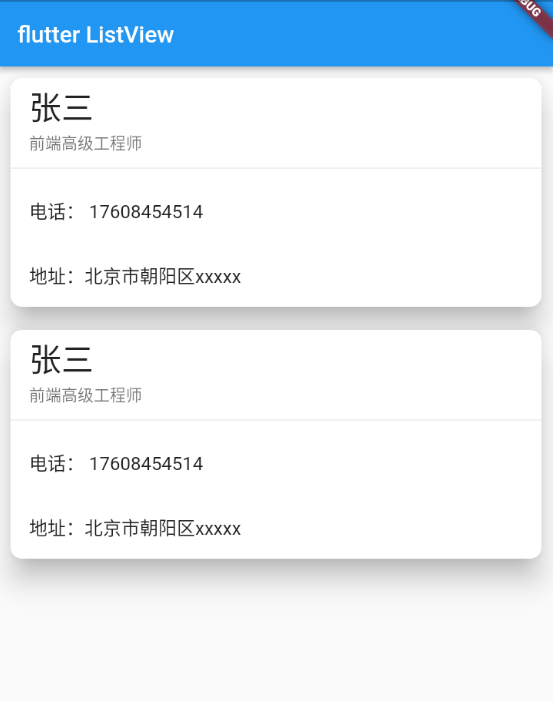

```dart
class MyHomePage extends StatelessWidget {
  const MyHomePage({super.key});

  @override
  Widget build(BuildContext context) {
    return ListView(
      children: [
        Card(
          margin: const EdgeInsets.all(10),
          elevation: 20,
          shape: RoundedRectangleBorder(
            borderRadius: BorderRadius.circular(10)
          ),
          child: Column(
            children: const [
              ListTile(
                title: Text('张三',style: TextStyle(fontSize: 28)),
                subtitle: Text('前端高级工程师'),
              ),
              Divider(),
              ListTile(
                title: Text('电话： 17608454514'),
              ),
              ListTile(
                title: Text('地址：北京市朝阳区xxxxx'),
              ),
            ],
          ),
        ),
        Card(
          margin: const EdgeInsets.all(10),
          elevation: 20,
          shape: RoundedRectangleBorder(
            borderRadius: BorderRadius.circular(10)
          ),
          child: Column(
            children: const [
              ListTile(
                title: Text('张三',style: TextStyle(fontSize: 28)),
                subtitle: Text('前端高级工程师'),
              ),
              Divider(),
              ListTile(
                title: Text('电话： 17608454514'),
              ),
              ListTile(
                title: Text('地址：北京市朝阳区xxxxx'),
              ),
            ],
          ),
        )
      ],
    );
  }
}

```

#### Card实现一个图文列表卡片

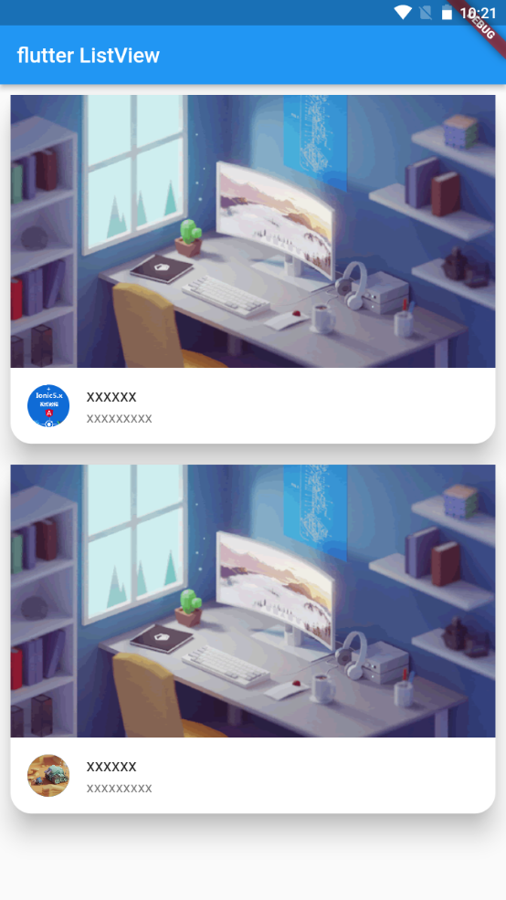

```dart
class MyHomePage extends StatelessWidget {
  const MyHomePage({super.key});

  @override
  Widget build(BuildContext context) {
    return ListView(
      children: [
        Card(
          margin: const EdgeInsets.all(10),
          elevation: 20,
          shape: RoundedRectangleBorder(
            borderRadius: BorderRadius.circular(20)
          ),
          child: Column(
            children: [
              AspectRatio(
                aspectRatio: 16/9,
                child: Image.network('https://www.itying.com/images/flutter/2.png', fit: BoxFit.cover,),
              ),
               ListTile(
                leading: ClipOval(
                  child: Image.network('https://www.itying.com/themes/itying/images/ionic4.png' ,width: 40,height: 40,fit: BoxFit.cover),
                ),
                title: const Text('xxxxxx'),
                subtitle: const Text('xxxxxxxxx'),
              )
            ],
          ),
        ),
        Card(
          margin: const EdgeInsets.all(10),
          elevation: 20,
          shape: RoundedRectangleBorder(
            borderRadius: BorderRadius.circular(20)
          ),
          child: Column(
            children: [
              AspectRatio(
                aspectRatio: 16/9,
                child: Image.network('https://www.itying.com/images/flutter/2.png', fit: BoxFit.cover,),
              ),
               const ListTile(
                leading: CircleAvatar(
                  backgroundImage: NetworkImage('https://www.itying.com/images/flutter/3.png'),
                ),
                title: Text('xxxxxx'),
                subtitle: Text('xxxxxxxxx'),
              )
            ],
          ),
        )
      ],
    );
  }
}
```

####  CircleAvatar实现一个圆形图片

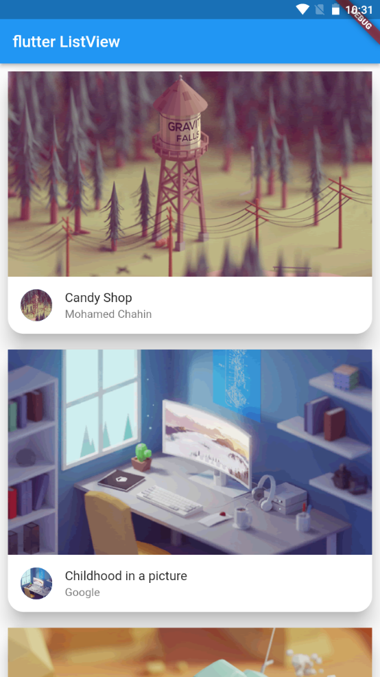

```dart
class MyHomePage extends StatelessWidget {
  const MyHomePage({super.key});

  List<Widget> _iniyListData(){
    var tempList = listData.map((value) {
      return Card(
          margin: const EdgeInsets.all(10),
          elevation: 20,
          shape: RoundedRectangleBorder(
            borderRadius: BorderRadius.circular(20)
          ),
          child: Column(
            children: [
              AspectRatio(
                aspectRatio: 16/9,
                child: Image.network(value['imageUrl'], fit: BoxFit.cover,),
              ),
              ListTile(
                leading: CircleAvatar(
                  backgroundImage:NetworkImage(value['imageUrl'])
                ),
                title:  Text(value['title']),
                subtitle:  Text(value['author']),
              )
            ],
          ),
        );
    });
    return tempList.toList();
  }

  @override
  Widget build(BuildContext context) {
    return ListView(
      children: _iniyListData(),
    );
  }
}
```

#### CircleAvatar实现一个圆形图片

 radius 元的半径

```dart
 leading: CircleAvatar(
                  backgroundImage:NetworkImage(value['imageUrl'])
 ),
```

基本上，CircleAvatar 不提供设置边框的属性。但是，可以将其包裹在具有更大半径和不同背景颜色的 不同 CircleAvatar 中，以创建类似于边框的内容。

```dart
return const CircleAvatar(
 radius: 110,
 backgroundColor: Color(0xffFDCF09),
 child: CircleAvatar(
	radius: 100,
	backgroundImage:
	NetworkImage("https://www.itying.com/images/flutter/3.png"),
	)
)

```

### Flutter 按钮组件

####  按钮组件的属性

| 属性      | 说明                                                         |
| --------- | ------------------------------------------------------------ |
| onPressed | 必填参数，按下按钮时触发的回调，接收一个方法，传null表示按钮禁用，会显示 禁用相关样式 |
| child     | 子组件                                                       |
| style     | 通过ButtonStyle装饰                                          |

ButtonStylee里面的常用的参数

| 属性名称        | 值类型    | 属性值                                                       |
| --------------- | --------- | ------------------------------------------------------------ |
| foregroundColor | Color     | 文本颜色                                                     |
| backgroundColor | Color     | 按钮的颜色                                                   |
| shadowColor     | Color     | 阴影颜色                                                     |
| elevation       | double    | 阴影的范围，值越大阴影范围越大                               |
| padding         |           | 内边距                                                       |
| shape           |           | 设置按钮的形状 shape: MaterialStateProperty.all( RoundedRectangleBorder( borderRadius: BorderRadius.circular(10)) ) |
| side            | 设置边 框 | MaterialStateProperty.all(BorderSide(width:1,color: Colors.red)) |

#### ElevatedButton

ElevatedButton 即"凸起"按钮，它默认带有阴影和灰色背景。按下后，阴影会变大

使用 ElevatedButton 非常简单，如：

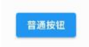

```dart
ElevatedButton(
	onPressed: () {},
	child: const Text("普通按钮")
)	
```

#### TextButton

TextButton 即文本按钮，默认背景透明并不带阴影。按下后，会有背景色

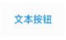

```dart
TextButton(
	child: Text("文本按钮"),
	onPressed: () {},
)
```

####  OutlinedButton

OutlineButton 默认有一个边框，不带阴影且背景透明。按下后，边框颜色会变亮、同时出现背景和 阴影


```dart
OutlinedButton(
	child: Text("边框按钮"),
	onPressed: () {},
)
```

#### IconButton

IconButton 是一个可点击的Icon，不包括文字，默认没有背景，点击后会出现背景


```dart
IconButton(
	icon: Icon(Icons.thumb_up),
	onPressed: () {},
)

```

####  带图标的按钮

ElevatedButton 、 TextButton 、 OutlineButton 都有一个 icon 构造函数，通过它可以轻松创建 带图标的按钮

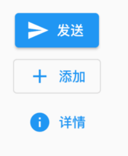

```dart
ElevatedButton.icon(
	icon: Icon(Icons.send),
	label: Text("发送"),
	onPressed: _onPressed,
),
OutlineButton.icon(
	icon: Icon(Icons.add),
	label: Text("添加"),
	onPressed: _onPressed,
),
TextButton.icon(
	icon: Icon(Icons.info),
	label: Text("详情"),
	onPressed: _onPressed,
),
```

#### 修改按钮的宽度高度

```dart
SizedBox(
height: 80,
width: 200,
child: ElevatedButton(
style:ButtonStyle(
backgroundColor:MaterialStateProperty.all(Colors.red),
foregroundColor: MaterialStateProperty.all(Colors.black)
) ,
onPressed: () {
},
child: const Text('宽度高度'),
),
)

```

#### 自适应按钮

```dart
Row(
mainAxisAlignment: MainAxisAlignment.center,
children: <Widget>[
Expanded(
child: Container(
height: 60,
margin: const EdgeInsets.all(10),
child: ElevatedButton(
child: const Text('自适应按钮'),
onPressed: () {
print("自适应按钮");
},
),
),
)
],
),

```

#### 配置圆形圆角按钮

```dart
ElevatedButton(
style: ButtonStyle(
backgroundColor:MaterialStateProperty.all(Colors.blue),
foregroundColor: MaterialStateProperty.all(Colors.white),
elevation: MaterialStateProperty.all(20),
shape: MaterialStateProperty.all(
RoundedRectangleBorder(
borderRadius: BorderRadius.circular(10))
),
),
onPressed: () {
print("圆角按钮");
},
child: const Text('圆角')
)
```

圆形按钮

```dart
Container(
height: 80,
child: ElevatedButton(
style: ButtonStyle(
backgroundColor: MaterialStateProperty.all(Colors.blue),
foregroundColor:
MaterialStateProperty.all(Colors.white),
elevation: MaterialStateProperty.all(20),
shape: MaterialStateProperty.all(
CircleBorder(side: BorderSide(color: Colors.white)),
)),
onPressed: () {
print("圆形按钮");
},
child: const Text('圆形按钮')),
)
```

#### 修改OutlinedButton边框

```dart
Row(
mainAxisAlignment: MainAxisAlignment.center,
children: <Widget>[
Expanded(
child: Container(
margin: EdgeInsets.all(20),
height: 50,
child: OutlinedButton(
style: ButtonStyle(
foregroundColor:
MaterialStateProperty.all(Colors.black),
side: MaterialStateProperty.all(
const BorderSide(width: 1, color: Colors.red))),
onPressed: () {},
child: const Text("注册 配置边框")),
),
)
],
)

```

### Flutter Wrap组件

> Wrap可以实现流布局，单行的Wrap跟Row表现几乎一致，单列的Wrap则跟Column表现几乎一致。但 Row与Column都是单行单列的，Wrap则突破了这个限制，mainAxis上空间不足时，则向crossAxis上 去扩展显示。

| 属性              | 说明                                                         |
| ----------------- | ------------------------------------------------------------ |
| direction         | 主轴的方向，默认水平                                         |
| alignment         | 主轴的对其方式                                               |
| spacing           | 主轴方向上的间距                                             |
| textDirection     | 文本方向                                                     |
| verticalDirection | 定义了children摆放顺序，默认是down，见Flex相关属性介绍。     |
| runAlignment      | run的对齐方式。run可以理解为新的行或者列，如果是水平方向布局的话， run可以理解为新的一行 |
| runSpacing        | run的间距                                                    |

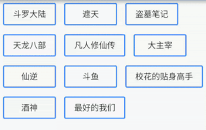

#### 自定义一个按钮组件

```dart
// 自定义一个按钮组件
class Button extends StatelessWidget {
  String text;
  void Function()? onPressed;
  Button(this.text, {super.key, required this.onPressed});

  @override
  Widget build(BuildContext context) {
    return ElevatedButton(
        style: ButtonStyle(
            backgroundColor: MaterialStateProperty.all(
                const Color.fromARGB(31, 250, 244, 244)),
            foregroundColor: MaterialStateProperty.all(Colors.black45)),
        onPressed: onPressed,
        child: Text(text));
  }
}

```

#### Wrap组件的使用

```dart
class MyHomePage extends StatelessWidget {
  const MyHomePage({super.key});

  @override
  Widget build(BuildContext context) {
    // return SizedBox(
    //   width: double.infinity,
    //   child: Wrap(
    //   spacing: 10,
    //   runSpacing: 10,
    //   alignment: WrapAlignment.spaceAround,
    //   runAlignment: WrapAlignment.spaceAround,
    //   children: [
    //     Button('第一集', onPressed: (){}),
    //     Button('第二集', onPressed: (){}),
    //     Button('第三集', onPressed: (){}),
    //     Button('第四集', onPressed: (){}),
    //     Button('第五集', onPressed: (){}),
    //     Button('第六集', onPressed: (){}),
    //     Button('第七集', onPressed: (){}),
    //     Button('第八集', onPressed: (){}),
    //     Button('第九集', onPressed: (){}),
    //     Button('第十集', onPressed: (){}),
    //     Button('第十一集', onPressed: (){})
    //   ],
    // ),
    // );
    return Row(
      children: [
        Expanded(
              flex: 2,
              child: SizedBox(
                height: 180,
                child: Image.network('https://www.itying.com/images/flutter/1.png', fit: BoxFit.cover),
              ))
      ],
    );
  }
}

// 自定义一个按钮组件
class Button extends StatelessWidget {
  String text;
  void Function()? onPressed;
  Button(this.text, {super.key, required this.onPressed});

  @override
  Widget build(BuildContext context) {
    return ElevatedButton(
        style: ButtonStyle(
            backgroundColor: MaterialStateProperty.all(
                const Color.fromARGB(31, 250, 244, 244)),
            foregroundColor: MaterialStateProperty.all(Colors.black45)),
        onPressed: onPressed,
        child: Text(text));
  }
}
```

#### Wrap组件搜索页面布局

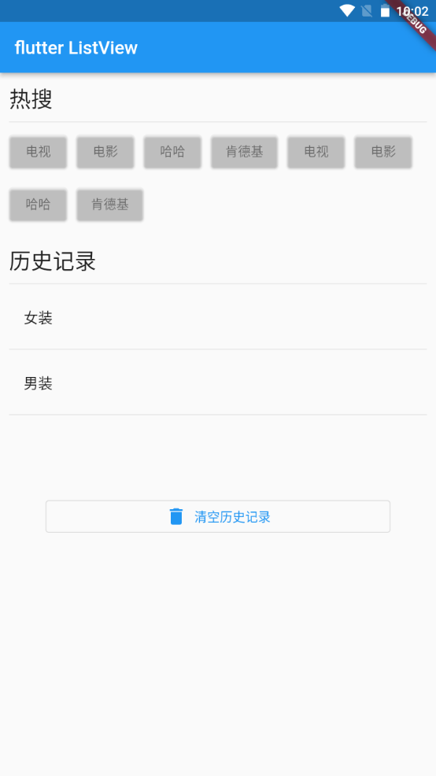

```dart
class MyHomePage extends StatelessWidget {
  const MyHomePage({super.key});

  @override
  Widget build(BuildContext context) {
    return ListView(
      padding: const EdgeInsets.all(10),
      children: [
        Row(
          children: [
            Text('热搜', style: Theme.of(context).textTheme.headlineSmall)
          ],
        ),
        const Divider(),
        Wrap(
          spacing: 10,
          runSpacing: 10,
          children: [
            Button('电视', onPressed: (){}),
            Button('电影', onPressed: (){}),
            Button('哈哈', onPressed: (){}),
            Button('肯德基', onPressed: (){}),
            Button('电视', onPressed: (){}),
            Button('电影', onPressed: (){}),
            Button('哈哈', onPressed: (){}),
            Button('肯德基', onPressed: (){})
          ],
        ),
        const SizedBox(height: 20),
        Row(
          children: [
            Text('历史记录', style: Theme.of(context).textTheme.headlineSmall)
          ],
        ),
        const Divider(),
        Column(
          children: const [
            ListTile(title: Text('女装')),
            Divider(),
            ListTile(title: Text('男装')),
            Divider(),
          ],
        ),
        const SizedBox(height: 40),
        Padding(padding: const EdgeInsets.all(40),child: OutlinedButton.icon(onPressed: (){}, icon: const Icon(Icons.delete), label: const Text('清空历史记录')),)
      ],
    );
  }
}

// 自定义一个按钮组件
class Button extends StatelessWidget {
  String text;
  void Function()? onPressed;
  Button(this.text, {super.key, required this.onPressed});

  @override
  Widget build(BuildContext context) {
    return ElevatedButton(
        style: ButtonStyle(
            backgroundColor: MaterialStateProperty.all(
                const Color.fromARGB(31, 250, 244, 244)),
            foregroundColor: MaterialStateProperty.all(Colors.black45)),
        onPressed: onPressed,
        child: Text(text));
  }
}
```

### Flutter StatelessWidget 、 StatefulWidget

> 在Flutter中自定义组件其实就是一个类，这个类需要继承StatelessWidget/StatefulWidget。 
>
> StatelessWidget是无状态组件，状态不可变的
>
> widget StatefulWidget是有状态组件，持有的状态可能在widget生命周期改变。 
>
> 通俗的讲：如果我们想改变页面中的数据的话这个时候就需要用到StatefulWidget

#### StatefulWidget实现一个计数器的功能

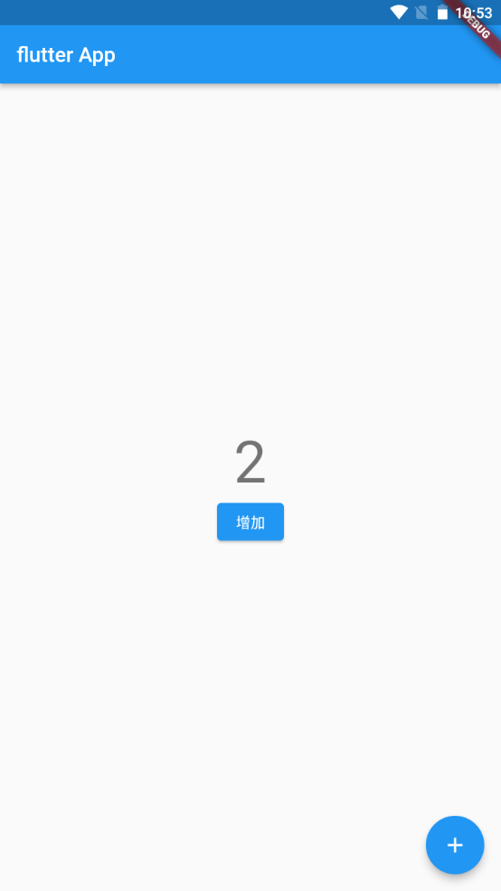

```dart
import 'package:flutter/material.dart';

void main() {
  runApp(const MyApp());
}

class MyApp extends StatelessWidget {
  const MyApp({super.key});

  @override
  Widget build(BuildContext context) {
    return MaterialApp(
      theme: ThemeData(primaryColor: Colors.blue),
      home: const MyHomePage(),
    );
  }
}

class MyHomePage extends StatefulWidget {
  const MyHomePage({super.key});

  @override
  State<MyHomePage> createState() => _MyHomePageState();
}

class _MyHomePageState extends State<MyHomePage> {
  int count = 0;
  @override
  Widget build(BuildContext context) {
    return Scaffold(
      appBar: AppBar(title: const Text('flutter App')),
      body: Center(
        child: Column(
          mainAxisAlignment: MainAxisAlignment.center,
          children: [
            Text('$count', style: Theme.of(context).textTheme.displayMedium),
            ElevatedButton(onPressed: (){
              setState(() {
                count++;
              });
            }, child: const Text('增加'))
          ],
        ),
      ),
      floatingActionButton: FloatingActionButton(onPressed: (){
        setState(() {
                count++;
              });
      },child: const Icon(Icons.add)),
    );
  }
}
```


#### StatefulWidget实现一个动态列表

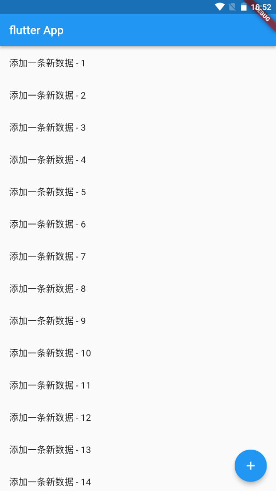

```dart
import 'package:flutter/material.dart';

void main() {
  runApp(const MyApp());
}

class MyApp extends StatelessWidget {
  const MyApp({super.key});

  @override
  Widget build(BuildContext context) {
    return MaterialApp(
      theme: ThemeData(primaryColor: Colors.blue),
      home: const MyHomePage(),
    );
  }
}

class MyHomePage extends StatefulWidget {
  const MyHomePage({super.key});

  @override
  State<MyHomePage> createState() => _MyHomePageState();
}

class _MyHomePageState extends State<MyHomePage> {
  int count = 0;
  final List<String> _list = [];
  @override
  Widget build(BuildContext context) {
    return Scaffold(
      appBar: AppBar(title: const Text('flutter App')),
      body: ListView(
        children: _list.map((value) => ListTile(title: Text(value))).toList(),
      ),
      floatingActionButton: FloatingActionButton(onPressed: (){
        setState(() {
          count++;
          _list.add('添加一条新数据 - $count');      
        });
      },child: const Icon(Icons.add)),
    );
  }
}
```

### Scaffold属性 BottomNavigationBar 自定义底部导航

#### BottomNavigationBar 组件介绍

> BottomNavigationBar 是底部导航条，可以让我们定义底部Tab切换，bottomNavigationBar是 Scaffold组件的参数。

**BottomNavigationBar 常见的属性**

| 属性名       | 说明                                                         |
| ------------ | ------------------------------------------------------------ |
| items        | List 底部导航条按钮集合                                      |
| iconSize     | icon                                                         |
| currentIndex | 默认选中第几个                                               |
| onTap        | 选中变化回调函数                                             |
| fixedColor   | 选中的颜色                                                   |
| type         | BottomNavigationBarType.fixed BottomNavigationBarType.shifting |

#### BottomNavigationBar 自定义底部导航、BottomNavigationBar 底部菜单选中、BottomNavigationBar 自定义底部导航实现页面切换

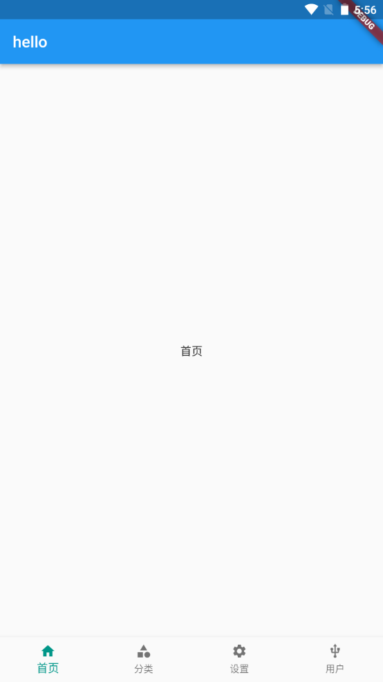

```dart
import 'package:flutter/material.dart';
import './tabs/category.dart';
import './tabs/home.dart';
import './tabs/setting.dart';
import './tabs/user.dart';

class Tabs extends StatefulWidget {
  const Tabs({super.key});

  @override
  State<Tabs> createState() => _TabsState();
}

class _TabsState extends State<Tabs> {
  int _currentIndex= 0;
  final List<Widget> _pages = const [
    Home(),
    Category(),
    Setting(),
    User()
  ];
  @override
  Widget build(BuildContext context) {
    return Scaffold(
      appBar: AppBar(title: const Text('hello')),
      body: _pages[_currentIndex],
      bottomNavigationBar: BottomNavigationBar(
        fixedColor: Colors.teal, // 底部菜单的选择颜色
        iconSize: 20, // 底部菜单大小
        type: BottomNavigationBarType.fixed, // 如果底部有4个或者4个以上的菜单，就需要配置这个
        currentIndex: _currentIndex, 
        onTap: (index){
          print(index);
          setState(() {
            _currentIndex = index;
          });
        },
        items: const [
          BottomNavigationBarItem(icon: Icon(Icons.home),label: '首页'),
          BottomNavigationBarItem(icon: Icon(Icons.category),label: '分类'),
          BottomNavigationBarItem(icon: Icon(Icons.settings),label: '设置'),
          BottomNavigationBarItem(icon: Icon(Icons.usb_outlined),label: '用户')
        ],
      ),
    );
  }
}
```

### Scaffold属性 FloatingActionButton实现类似闲鱼App底 部导航凸起按钮

#### FloatingActionButton详解

> FloatingActionButton简称FAB ,可以实现浮动按钮，也可以实现类似闲鱼app的底部凸起导航

| 属性名称           | 属性值                             |
| ------------------ | ---------------------------------- |
| child              | 子视图，一般为Icon，不推荐使用文字 |
| tooltip            | FAB被长按时显示，也是无障碍功能    |
| backgroundColor    | 背景颜色                           |
| elevation          | 未点击的时候的阴影                 |
| hignlightElevation | 点击时阴影值，默认12.0             |
| onPressed          | 点击事件回调                       |
| shape              | 可以定义FAB的形状等                |
| mini               | 是否是mini类型默认false            |

#### 实现类似闲鱼App底部导航凸起按钮

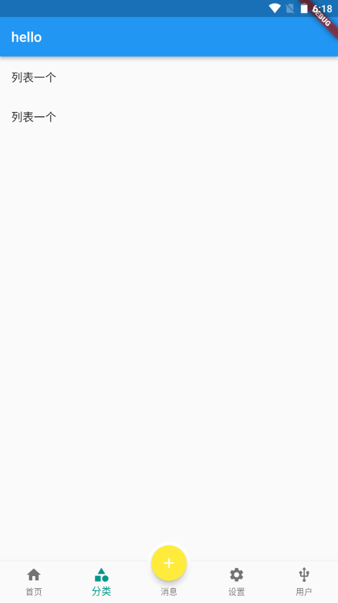

```dart
import 'package:flutter/material.dart';
import './tabs/category.dart';
import './tabs/home.dart';
import './tabs/setting.dart';
import './tabs/user.dart';
import './tabs/message.dart';

class Tabs extends StatefulWidget {
  const Tabs({super.key});

  @override
  State<Tabs> createState() => _TabsState();
}

class _TabsState extends State<Tabs> {
  int _currentIndex= 0;
  final List<Widget> _pages = const [
    Home(),
    Category(),
    Message(),
    Setting(),
    User()
  ];
  @override
  Widget build(BuildContext context) {
    return Scaffold(
      appBar: AppBar(title: const Text('hello')),
      body: _pages[_currentIndex],
      bottomNavigationBar: BottomNavigationBar(
        fixedColor: Colors.teal, // 底部菜单的选择颜色
        // iconSize: 20, // 底部菜单大小
        type: BottomNavigationBarType.fixed, // 如果底部有4个或者4个以上的菜单，就需要配置这个
        currentIndex: _currentIndex, 
        onTap: (index){
          setState(() {
            _currentIndex = index;
          });
        },
        items: const [
          BottomNavigationBarItem(icon: Icon(Icons.home),label: '首页'),
          BottomNavigationBarItem(icon: Icon(Icons.category),label: '分类'),
          BottomNavigationBarItem(icon: Icon(Icons.message),label: '消息'),
          BottomNavigationBarItem(icon: Icon(Icons.settings),label: '设置'),
          BottomNavigationBarItem(icon: Icon(Icons.usb_outlined),label: '用户')
        ],
      ),
      floatingActionButton: Container(
        width: 60,
        height: 60,
        padding: const EdgeInsets.all(5),
        margin: const EdgeInsets.only(top: 5),
        decoration:  BoxDecoration(
          color: Colors.white,
          borderRadius: BorderRadius.circular(30)
        ),
        child: FloatingActionButton(
          backgroundColor: _currentIndex ==2 ?Colors.teal: Colors.yellow,
          onPressed: (){
            setState(() {
              _currentIndex = 2;
            });
          },
          child: const Icon(Icons.add)
      ),
      ),
      floatingActionButtonLocation: FloatingActionButtonLocation.centerDocked,
    );
  }
}
```