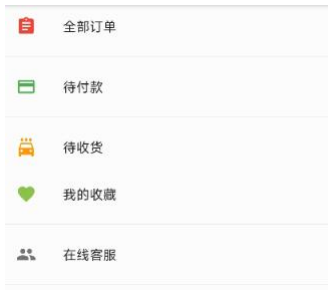
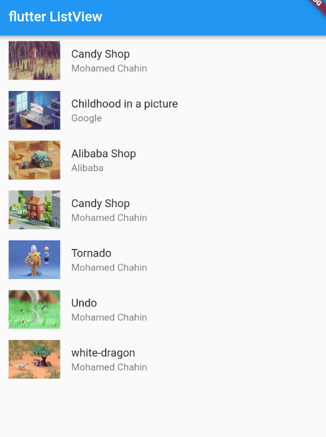
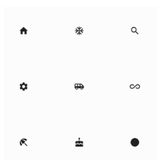
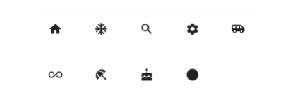
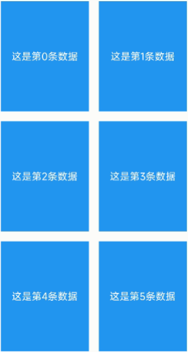
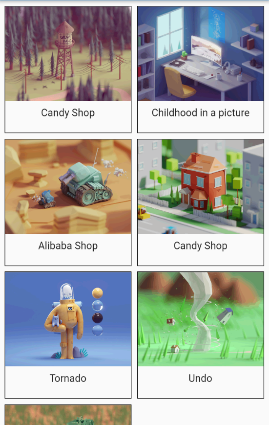

---
# 取二三级标题生成目录
outline: [2,3]
---

### Flutter 列表组件

列表布局是我们项目开发中最常用的一种布局方式。Flutter中我们可以通过ListView来定义列表项，支 持垂直和水平方向展示。通过一个属性就可以控制列表的显示方向。列表有以下分类：

1、垂直列表 

2、垂直图文列表 

3、水平列表 

4、动态列表

**列表组件常用参数：**

| 名称            | 类型               | 说明                                         |
| --------------- | ------------------ | -------------------------------------------- |
| scrollDirection | Axis               | Axis.horizontal水平列表Axis.vertical垂直列表 |
| padding         | EdgeInsetsGeometry | 内边距                                       |
| resolve         | bool               | 组件反向排序                                 |
| children        | List               | 列表元素                                     |

#### 垂直列表

**示例一**

```dart
import 'package:flutter/material.dart';

void main() {
  runApp(const MyApp());
}

class MyApp extends StatelessWidget {
  const MyApp({super.key});

  @override
  Widget build(BuildContext context) {
    return MaterialApp(
      theme: ThemeData(
        primaryColor: Colors.blue
      ),
      home: Scaffold(
        appBar: AppBar(title: const Text('flutter icon')),
        body: const MyHomePage(),
      ),
    );
  }
}

class MyHomePage extends StatelessWidget {
  const MyHomePage({super.key});
  @override
  Widget build(BuildContext context) {
    return ListView(
      children: const <Widget>[
        ListTile(title: Text('我是一个列表')),
        Divider(),
        ListTile(title: Text('我是一个列表')),
        Divider(),
        ListTile(title: Text('我是一个列表')),
        Divider(),
        ListTile(title: Text('我是一个列表')),
        Divider(),
        ListTile(title: Text('我是一个列表')),
        Divider(),
      ],
    );
  }
}
```

**示例二**



```dart
// 图标 + 文字的组合
class MyHomePage extends StatelessWidget {
  const MyHomePage({super.key});

  @override
  Widget build(BuildContext context) {
    return ListView(
      children: const <Widget>[
        ListTile(
          leading: Icon(Icons.home, size: 40, color: Colors.red),
          title: Text('首页')),
        Divider(),
        ListTile(
          leading: Icon(Icons.payment, size: 40, color: Colors.red),
          title: Text('待付款')),
        Divider(),
        ListTile(
          leading: Icon(Icons.favorite, size: 40, color: Colors.red),
          title: Text('我的收藏')),
        Divider(),
        ListTile(
          leading: Icon(Icons.people, size: 40, color: Colors.red),
          title: Text('在线客服'),
          trailing: Icon(Icons.chevron_right, size: 40, color: Colors.red),
          ),
        Divider(),
      ],
    );
  }
}
```

#### 垂直图文列表

**示例1**


```dart
class MyHomePage extends StatelessWidget {
  const MyHomePage({super.key});

  @override
  Widget build(BuildContext context) {
    return ListView(
      padding: const EdgeInsets.fromLTRB(0, 10, 0, 0),
      children:  const <Widget>[
        ListTile(
          leading: NewsImage(),
          title: Text('安顺一般指安顺市。 安顺，贵州省辖地级市，位于贵州中西部，距贵州省省会贵阳90公里')
        ),
        Divider(),
        ListTile(
          leading: NewsImage(),
          title: Text('安顺一般指安顺市。 安顺，贵州省辖地级市，位于贵州中西部，距贵州省省会贵阳90公里', style: TextStyle(color: Color.fromARGB(233, 1, 233, 194)))
        ),
        Divider(),
        ListTile(
          leading: NewsImage(),
          title: Text('安顺一般指安顺市。 安顺，贵州省辖地级市，位于贵州中西部，距贵州省省会贵阳90公里', style: TextStyle(color: Colors.red)),
          subtitle: Text('大家来看是否水电费胜多负少梵蒂冈的'),
          trailing: NewsImage(),
        ),
        Divider()

      ],
    );
  }
}

class NewsImage extends StatelessWidget {
  const NewsImage({super.key});

  @override
  Widget build(BuildContext context) {
    return Container(
      width: 100,
      height: 100,
      decoration: BoxDecoration(
          color: Colors.yellow,
          borderRadius: BorderRadius.circular(8),
          image: const DecorationImage(
              image: NetworkImage(
                  'https://www.itying.com/images/flutter/1.png'),
              fit: BoxFit.cover)),
    );
  }
}
```

**示例2**


```dart
class MyHomePage extends StatelessWidget {
  const MyHomePage({super.key});

  @override
  Widget build(BuildContext context) {
    return ListView(
      padding: const EdgeInsets.fromLTRB(0, 10, 0, 0),
      children:  <Widget>[
        Image.network('https://www.itying.com/images/flutter/1.png'),
        Container(
          padding: const EdgeInsets.fromLTRB(0, 10, 0, 0),
          height: 44,
          child: const Text('我是一个标题',textAlign: TextAlign.center,style: TextStyle(fontSize: 22)),
        ),
        Image.network('https://www.itying.com/images/flutter/2.png'),
        Container(
          padding: const EdgeInsets.fromLTRB(0, 10, 0, 0),
          height: 44,
          child: const Text('我是一个标题',textAlign: TextAlign.center,style: TextStyle(fontSize: 22)),
        ),
        Image.network('https://www.itying.com/images/flutter/3.png'),
        Container(
          padding: const EdgeInsets.fromLTRB(0, 10, 0, 0),
          height: 44,
          child: const Text('我是一个标题',textAlign: TextAlign.center,style: TextStyle(fontSize: 22)),
        ),
        Image.network('https://www.itying.com/images/flutter/4.png'),
        Container(
          padding: const EdgeInsets.fromLTRB(0, 10, 0, 0),
          height: 44,
          child: const Text('我是一个标题',textAlign: TextAlign.center,style: TextStyle(fontSize: 22)),
        ),
        Image.network('https://www.itying.com/images/flutter/5.png'),
        Container(
          padding: const EdgeInsets.fromLTRB(0, 10, 0, 0),
          height: 44,
          child: const Text('我是一个标题',textAlign: TextAlign.center,style: TextStyle(fontSize: 22)),
        ),
        Image.network('https://www.itying.com/images/flutter/6.png'),
        Container(
          padding: const EdgeInsets.fromLTRB(0, 10, 0, 0),
          height: 44,
          child: const Text('我是一个标题',textAlign: TextAlign.center,style: TextStyle(fontSize: 22)),
        ),
      ],
    );
  }
}
```

#### 水平列表 可以左右滑动

```dart
class MyHomePage extends StatelessWidget {
  const MyHomePage({super.key});

  @override
  Widget build(BuildContext context) {
    return SizedBox(
        height: 120,
        child: ListView(
          scrollDirection: Axis.horizontal,
          padding: const EdgeInsets.fromLTRB(10, 10, 10, 0),
          children: <Widget>[
            Container(
              width: 120,
              decoration: const BoxDecoration(color: Colors.red),
            ),
            Container(
              width: 120,
              decoration: const BoxDecoration(color: Colors.green),
            ),
            Container(
              width: 120,
              decoration: const BoxDecoration(color: Colors.pink),
            ),
            Container(
              width: 120,
              decoration: const BoxDecoration(color: Colors.teal),
            ),
            Container(
              width: 120,
              decoration: const BoxDecoration(color: Colors.yellow),
            ),
            Container(
              width: 120,
              decoration: const BoxDecoration(color: Colors.blue),
            )
          ],
        ));
  }
}

```

#### ListView动态列表组件 以及循环动态数据

```dart
import 'package:flutter/material.dart';
import './res/listData.dart';

void main() {
  runApp(const MyApp());
}

class MyApp extends StatelessWidget {
  const MyApp({super.key});

  @override
  Widget build(BuildContext context) {
    return MaterialApp(
      theme: ThemeData(primaryColor: Colors.blue),
      home: Scaffold(
        appBar: AppBar(title: const Text('flutter ListView')),
        body: MyHomePage(),
      ),
    );
  }
}

// ListView 实现动态列表
class MyHomePage extends StatelessWidget {
  const MyHomePage({super.key});

  // 自定义方法 - 静态值
  // List <Widget> _initListData (){
  //   List <Widget> list = [];
  //   for(int i = 0;i< 20;i++){
  //     list.add(ListTile(title: Text('这是一个列表---$i')));
  //   }
  //   return list;
  // }

  // 使用map 的值
  // List <Widget> _initListData (){
  //   List <Widget> list = [];
  //   for(int i = 0;i< listData.length;i++){
  //     list.add(
  //       ListTile(
  //         leading: Image.network('${listData[i]["imageUrl"]}'),
  //         title: Text('${listData[i]["title"]}'),
  //         subtitle: Text('${listData[i]["author"]}'),
  //       )
  //     );
  //   }
  //   return list;
  // }

  List <Widget> _initListData (){
    var tempList = listData.map((value) {
      return ListTile(
          leading: Image.network('${value["imageUrl"]}'),
          title: Text('${value["title"]}'),
          subtitle: Text('${value["author"]}'),
        );
    });
    
    return tempList.toList();
  }

  @override
  Widget build(BuildContext context) {
    return ListView(
      children: _initListData(),
    );
  }
}

```

```dart
// ListView 实现动态列表
class MyHomePage extends StatelessWidget {
  List<String> list = [];
  MyHomePage({super.key}){
    for(int i = 0;i< 20;i++){
      list.add('我是一个列表---$i');
    }
  }

  @override
  Widget build(BuildContext context) {
    return ListView.builder(
      itemCount: list.length,
      itemBuilder: (content,index){
        return ListTile(title: Text(list[index]));
      },
    );
  }
}

```



```dart
import 'package:flutter/material.dart';
import './res/listData.dart';
void main() {
  runApp(const MyApp());
}

class MyApp extends StatelessWidget {
  const MyApp({super.key});

  @override
  Widget build(BuildContext context) {
    return MaterialApp(
      theme: ThemeData(primaryColor: Colors.blue),
      home: Scaffold(
        appBar: AppBar(title: const Text('flutter ListView')),
        body: const MyHomePage(),
      ),
    );
  }
}

// ListView 实现动态列表
class MyHomePage extends StatelessWidget {
  const MyHomePage({super.key});

  @override
  Widget build(BuildContext context) {
    return ListView.builder(
      itemCount: listData.length,
      itemBuilder: (content,index){
        return ListTile(
          leading: Image.network(listData[index]["imageUrl"]),
          title: Text(listData[index]["title"]),
          subtitle: Text(listData[index]["author"]),
        );
      },
    );
  }
}

```

### Flutter GridView网格布局组件

#### GridView网格布局组件介绍


GridView网格布局在实际项目中用的也是非常多的，当我们想让可以滚动的元素使用矩阵方式排列的时 候。此时我们可以用网格列表组件GridView实现布局。

GridView创建网格列表主要有下面三种方式 

1、可以通过GridView.count 实现网格布局 

2、可以通过GridView.extent 实现网格布局 

3、通过GridView.builder实现动态网格布局

**常用属性：**

| 名称                  | 类型                                                         | 说明                                   |
| --------------------- | ------------------------------------------------------------ | -------------------------------------- |
| scrollDirection       | Axis                                                         | 滚动方法                               |
| padding               | EdgeInsetsGeometry                                           | 内边距                                 |
| resolve               | bool                                                         | 组件反向排序                           |
| crossAxisSpacing      | double                                                       | 水平子Widget之间间 距                  |
| mainAxisSpacing       | double                                                       | 垂直子Widget之间间 距                  |
| crossAxisCount        | int 用在GridView.count                                       | 一行的Widget数量                       |
| maxCrossAxisExtent    | double 用在GridView.extent                                   | 横轴子元素的最大长 度                  |
| 横轴子元素的最大长 度 | double                                                       | 子Widget宽高比例                       |
| children              |                                                              | []                                     |
| gridDelegate          | SliverGridDelegateWithFixedCrossAxisCount SliverGridDelegateWithMaxCrossAxisExtent | 控制布局主要用在 GridView.builder里 面 |

#### GridView.count 实现网格布局

GridView.count构造函数内部使用了SliverGridDelegateWithFixedCrossAxisCount，我们通过它可以 快速的创建横轴固定数量子元素的GridView



```dart
class MyHomePage extends StatelessWidget {
  const MyHomePage({super.key});

  @override
  Widget build(BuildContext context) {
    return GridView.count(
      crossAxisCount: 3,
      children: const [
        Icon(Icons.home),
        Icon(Icons.home),
        Icon(Icons.home),
        Icon(Icons.home),
        Icon(Icons.home),
      ],
    );
  }
}

```

#### GridView.extent实现网格布局

GridView.extent构造函数内部使用了SliverGridDelegateWithMaxCrossAxisExtent，我们通过它可以 快速的创建横轴子元素为固定最大长度的的GridView。



```dart
class MyHomePage extends StatelessWidget {
  const MyHomePage({super.key});

  @override
  Widget build(BuildContext context) {
    return GridView.extent(
      maxCrossAxisExtent: 180, // 横轴子元素的最大长度
      children: const [
        Icon(Icons.abc),
        Icon(Icons.abc),
        Icon(Icons.abc),
        Icon(Icons.abc),
        Icon(Icons.abc),
        Icon(Icons.abc),
      ],
    );
  }
}
```

#### GridView.count 和 GridView.extent属性详解



```dart
class MyHomePage extends StatelessWidget {
  const MyHomePage({super.key});

  List<Widget> _initListData(){
    List<Widget> list = [];
    for(int i=0;i<20;i++){
      list.add(Container(
          alignment: Alignment.center,
          decoration: const BoxDecoration(color: Colors.blue),
          child:  Text('这是第$i个元素'),
        ));
    }
    return list;
  }

  @override
  Widget build(BuildContext context) {
    return GridView.count(
      padding: const EdgeInsets.all(10),
      crossAxisSpacing: 10,  // 水平子widget之间 间距
      mainAxisSpacing: 10, // 垂直子widget之间 间距
      crossAxisCount: 2,
      childAspectRatio: 1.2, // 宽高比
      children: _initListData(),
    );
  }
}

```

#### GridView.count 实现动态列表


```dart
class MyHomePage extends StatelessWidget {
  const MyHomePage({super.key});

  List<Widget> _initListData(){
    var tempList = listData.map((value){
      return Container(
        decoration: BoxDecoration(
          border: Border.all(
            color: Colors.black
          )
        ),
        child: Column(
          children: [
            Image.network(value['imageUrl']),
            const SizedBox(height: 10),
            Text(value['title'], style: const TextStyle(fontSize: 18))
          ],
        ),
      );
    });
    return tempList.toList();
  }

  @override
  Widget build(BuildContext context) {
    return GridView.count(
      padding: const EdgeInsets.all(10),
      crossAxisSpacing: 10,  // 水平子widget之间 间距
      mainAxisSpacing: 10, // 垂直子widget之间 间距
      crossAxisCount: 2,
      // childAspectRatio: 0.7, // 宽高比
      children: _initListData(),
    );
  }
}
```

#### GridView.builder实现动态列表



**SliverGridDelegateWithFixedCrossAxisCount**

```dart
class MyHomePage extends StatelessWidget {
  const MyHomePage({super.key});

  Widget _initListData(content,index){
    return Container(
        decoration: BoxDecoration(
          border: Border.all(
            color: Colors.black
          )
        ),
        child: Column(
          children: [
            Image.network(listData[index]['imageUrl']),
            const SizedBox(height: 10),
            Text(listData[index]['title'], style: const TextStyle(fontSize: 18))
          ],
        ),
      );
  }

  @override
  Widget build(BuildContext context) {
    return GridView.builder(
      padding: const EdgeInsets.all(10),
      itemCount: listData.length,
      gridDelegate: const SliverGridDelegateWithFixedCrossAxisCount(
        crossAxisCount: 2,
        childAspectRatio: 1,
        crossAxisSpacing: 10,
        mainAxisSpacing: 10,
      ),
      itemBuilder: _initListData,
    );
  }
}
```

**SliverGridDelegateWithMaxCrossAxisExtent**

```dart
class MyHomePage extends StatelessWidget {
  const MyHomePage({super.key});

  Widget _initListData(content,index){
    return Container(
        decoration: BoxDecoration(
          border: Border.all(
            color: Colors.black
          )
        ),
        child: Column(
          children: [
            Image.network(listData[index]['imageUrl']),
            const SizedBox(height: 10),
            Text(listData[index]['title'], style: const TextStyle(fontSize: 18))
          ],
        ),
      );
  }

  @override
  Widget build(BuildContext context) {
    return GridView.builder(
      padding: const EdgeInsets.all(10),
      itemCount: listData.length,
      gridDelegate: const SliverGridDelegateWithMaxCrossAxisExtent(
        maxCrossAxisExtent: 250,
        childAspectRatio: 1,
        crossAxisSpacing: 10,
        mainAxisSpacing: 10,
      ),
      itemBuilder: _initListData,
    );
  }
}
```

### 线性布局（Row和Column）

#### padding 组件

```dart
class MyHomePage extends StatelessWidget {
  const MyHomePage({super.key});

  @override
  Widget build(BuildContext context) {
    return const Padding(
      padding: EdgeInsets.all(10),
      child: Text('sdsa'),
    );
  }
}

```

#### Row 水平布局组件

| 属性               | 说明           |
| ------------------ | -------------- |
| mainAxisAlignment  | 主轴的排序方式 |
| crossAxisAlignment | 次轴的排序方式 |
| children           | 组件子元素     |

```dart
class MyHomePage extends StatelessWidget {
  const MyHomePage({super.key});

  @override
  Widget build(BuildContext context) {
    return Container(
      // width: double.infinity,
      // height: double.infinity,
      color: Colors.black12,
      child: Row(
      // mainAxisAlignment: MainAxisAlignment.spaceAround,
      // crossAxisAlignment: CrossAxisAlignment.center,
      // children: [
      //   Expanded(
      //     flex: 1,
      //     child: IconContainer(Icons.home, color: Colors.red)
      //   ),
      //   Expanded(
      //     flex: 2,
      //     child: IconContainer(Icons.ac_unit_outlined, color: Colors.green)
      //   ),
      // ],

      // 左侧固定宽, 右侧自适应
      children: [
        Expanded(
          flex: 1,
          child: IconContainer(Icons.home, color: Colors.red)
        ),
        IconContainer(Icons.ac_unit_outlined, color: Colors.green)
      ],
    ),
    );
  }
}

// 自定义iconContainer 组件
class IconContainer extends StatelessWidget {
  Color color;
  IconData icon;
  IconContainer(this.icon , {super.key,this.color = Colors.red});

  @override
  Widget build(BuildContext context) {
    return Container(
      alignment: Alignment.center,
      width: 120,
      height: 120,
      decoration:  BoxDecoration(
        color: color
      ),
      child:  Icon(icon,color: Colors.white,size: 28),
    );
  }
}

```

#### Column垂直布局组件

| 属性               | 说明           |
| ------------------ | -------------- |
| mainAxisAlignment  | 主轴的排序方式 |
| crossAxisAlignment | 次轴的排序方式 |
| children           | 组件子元素     |

#### double.infinity 和double.maxFinite

double.infinity 和double.maxFinite可以让当前元素的width或者height达到父元素的尺寸 

底层代码: 

```dart
static const double nan = 0.0 / 0.0;
static const double infinity = 1.0 / 0.0;
static const double negativeInfinity = -infinity;
static const double minPositive = 5e-324;
static const double maxFinite = 1.7976931348623157e+308;
```

如下可以让Container铺满整个屏幕

```dart
Widget build(BuildContext context) {
return Container(
height: double.infinity,
width: double.infinity,
color: Colors.black26,
child: Column(
crossAxisAlignment: CrossAxisAlignment.center,
mainAxisAlignment: MainAxisAlignment.spaceEvenly,
children: [
IconContainer(Icons.home, color: Colors.red),
IconContainer(Icons.search, color: Colors.blue),
IconContainer(Icons.send, color: Colors.orange),
],
),
);
}
```

如下可以让Container的宽度和高度等于父元素的宽度高度

```dart
class HomePage extends StatelessWidget {
const HomePage({Key? key}) : super(key: key);
@override
Widget build(BuildContext context) {
return Container(
height: 400,
width: 600,
color: Colors.red,
child: Container(
height: double.maxFinite,
width: double.infinity,
color: Colors.black26,
child: Column(
crossAxisAlignment: CrossAxisAlignment.center,
mainAxisAlignment: MainAxisAlignment.spaceEvenly,
children: [
IconContainer(Icons.home, color: Colors.red),
IconContainer(Icons.search, color: Colors.blue),
IconContainer(Icons.send, color: Colors.orange),
],
),
),
);
}
}

```

### 弹性布局（Flex Expanded）

Flex 组件可以沿着水平或垂直方向排列子组件，如果你知道主轴方向，使用 Row 或 Column 会方便一 些，因为 Row 和 Column 都继承自 Flex ，参数基本相同，所以能使用Flex的地方基本上都可以使用 Row 或 Column 。 Flex 本身功能是很强大的，它也可以和 Expanded 组件配合实现弹性布局 。

#### 水平弹性布局

#### 垂直弹性布局

```dart
class MyHomePage extends StatelessWidget {
  const MyHomePage({super.key});

  @override
  Widget build(BuildContext context) {
    return Flex(
      direction: Axis.horizontal,
      mainAxisAlignment: MainAxisAlignment.center,
      // children: [
      //   Expanded(
      //     flex: 1,
      //     child: IconContainer(Icons.home,color: Colors.pink)),
      //   Expanded(
      //     flex: 2,
      //     child: IconContainer(Icons.ac_unit_rounded,color: Colors.green))
      // ],  
      children: [
        IconContainer(Icons.home,color: Colors.pink),
        IconContainer(Icons.ac_unit_rounded,color: Colors.green)
      ]
    );
  }
}

// 自定义iconContainer 组件
class IconContainer extends StatelessWidget {
  Color color;
  IconData icon;
  IconContainer(this.icon , {super.key,this.color = Colors.red});

  @override
  Widget build(BuildContext context) {
    return Container(
      alignment: Alignment.center,
      width: 120,
      height: 120,
      decoration:  BoxDecoration(
        color: color
      ),
      child:  Icon(icon,color: Colors.white,size: 28),
    );
  }
}

```


#### 使用Row 或Column 结合Expanded实现下面示例


```dart
import 'package:flutter/material.dart';
void main() {
  runApp(const MyApp());
}

class MyApp extends StatelessWidget {
  const MyApp({super.key});

  @override
  Widget build(BuildContext context) {
    return MaterialApp(
      theme: ThemeData(primaryColor: Colors.blue),
      home: Scaffold(
        appBar: AppBar(title: const Text('flutter ListView')),
        body: const MyHomePage(),
      ),
    );
  }
}

class MyHomePage extends StatelessWidget {
  const MyHomePage({super.key});

  @override
  Widget build(BuildContext context) {
    return ListView(
      children: [
        Container(
          height: 200,
          color: Colors.black,
        ),
        Row(
          children: [
            Expanded(
              flex: 2,
              child: SizedBox(
                height: 180,
                child: Image.network('https://www.itying.com/images/flutter/1.png', fit: BoxFit.cover),
              )
            ),
            Expanded(
              flex: 1,
              child: SizedBox(
                height: 180,
                child: Column(
                children: [
                  Expanded(
                    flex: 1,
                    child: SizedBox(
                      width: double.infinity,
                      child: Image.network('https://www.itying.com/images/flutter/2.png', fit: BoxFit.cover),
                    )
                  ),
                  const SizedBox(height: 5),
                  Expanded(
                    flex: 2,
                    child: SizedBox(
                      width: double.infinity,
                      child: Image.network('https://www.itying.com/images/flutter/3.png', fit: BoxFit.cover),
                    )
                  ),
                ],
              )
              )
              
            )
          ],
        )
      ],
    );
  }
}

```

### 层叠布局（Stack、Align、 Positioned）

#### Flutter Stack组件

Stack表示堆的意思，我们可以用Stack或者Stack结合Align或者Stack结合 Positiond来实现页面的定位 布局

| 属性      | 说明                     |
| --------- | ------------------------ |
| alignment | 配置所有子元素的显示位置 |
| children  | 子组件                   |

```dart
class MyHomePage extends StatelessWidget {
  const MyHomePage({super.key});
  @override
  Widget build(BuildContext context) {
    return Stack(
      children: [
        Container(
          height: 400,
          width: 300,
          color: Colors.red,
        ),
         Container(
          height: 200,
          width: 200,
          color: Colors.yellow,
        ),
        const Text('flutter')
      ],
    );
  }
}
```

#### Flutter Stack Align

Align 组件可以调整子组件的位置 , Stack组件中结合Align组件也可以控制每个子元素的显示位置

| 属性      | 说明                     |
| --------- | ------------------------ |
| alignment | 配置所有子元素的显示位置 |
| child     | 子组件                   |

**Align结合Container的使用**

我们先来看一个简单的例子： FlutterLogo 是Flutter SDK 提供的一个组件，内容就是 Flutter 的 log

```dart
class HomePage extends StatelessWidget {
const HomePage({Key? key}) : super(key: key);
@override
Widget build(BuildContext context) {
return Container(
height: 120.0,
width: 120.0,
color: Colors.blue.shade50,
child: const Align(
alignment: Alignment.topRight,
child: FlutterLogo(
size: 60,
),
),
);
}
}

```

**Align结合Alignment 参数**

```dart
class HomePage extends StatelessWidget {
const HomePage({Key? key}) : super(key: key);
@override
Widget build(BuildContext context) {
return Container(
height: 120.0,
width: 120.0,
color: Colors.blue.shade50,
child: const Align(
alignment: Alignment(2, 0.0),
child: FlutterLogo(
size: 60,
),
));
}
}

```

Alignment Widget会以矩形的中心点作为坐标原点，即 Alignment(0.0, 0.0) 。 x 、 y 的值从-1到 1分别代表矩形左边到右边的距离和顶部到底边的距离，因此2个水平（或垂直）单位则等于矩形的宽 （或高），如 Alignment(-1.0, -1.0) 代表矩形的左侧顶点，而 Alignment(1.0, 1.0) 代表右侧底 部终点，而 Alignment(1.0, -1.0) 则正是右侧顶点，即 Alignment.topRight 。为了使用方便，矩 形的原点、四个顶点，以及四条边的终点在 Alignment 类中都已经定义为了静态常量。

Alignment 可以通过其坐标转换公式将其坐标转为子元素的具体偏移坐标：

```
(Alignment.x*childWidth/2+childWidth/2, Alignment.y*childHeight/2+childHeight/2)
```

#### Flutter Stack Positioned

Stack组件中结合Positioned组件也可以控制每个子元素的显示位置

| 属性   | 说明                                                         |
| ------ | ------------------------------------------------------------ |
| top    | 子元素距离顶部的距离                                         |
| bottom | 子元素距离底部的距离                                         |
| left   | 子元素距离左侧距离                                           |
| right  | 子元素距离右侧距离                                           |
| child  | 子组件                                                       |
| width  | 组件的高度 （注意：宽度和高度必须是固定值，没法使用double.infinity） |
| height | 子组件的高度                                                 |

```dart
class MyHomePage extends StatelessWidget {
  const MyHomePage({super.key});

  @override
  Widget build(BuildContext context) {
    return Container(
      width: 400,
      height: 300,
      color: Colors.red,
      child: Stack( // 注意： 相对于外部容器进行定位，如果没有外部容器，就相对于整个屏幕定位
        children: [
          Positioned(
            left: 0,
            bottom: 0,
            child: 
            Container(
              height: 100,
              width: 100,
              color: Colors.yellow,
          )),
          const Positioned(
            right: 0,
            top: 140,
            child: Text('flutter'))
        ],
      ),
    );
  }
}
```

#### Flutter Stack Positioned固定导航案例

```dart
class MyHomePage extends StatelessWidget {
  const MyHomePage({super.key});

  @override
  Widget build(BuildContext context) {

    final size =MediaQuery.of(context).size;

    return Stack(
      children: [
        ListView(
          padding: const EdgeInsets.only(top: 50),
          children: const [
            ListTile(title: Text('我是一个列表1')),
            ListTile(title: Text('我是一个列表2')),
            ListTile(title: Text('我是一个列表')),
            ListTile(title: Text('我是一个列表')),
            ListTile(title: Text('我是一个列表')),
            ListTile(title: Text('我是一个列表')),
            ListTile(title: Text('我是一个列表')),
            ListTile(title: Text('我是一个列表')),
            ListTile(title: Text('我是一个列表')),
            ListTile(title: Text('我是一个列表')),
            ListTile(title: Text('我是一个列表')),
            ListTile(title: Text('我是一个列表')),
            ListTile(title: Text('我是一个列表')),
            ListTile(title: Text('我是一个列表')),
            ListTile(title: Text('我是一个列表')),
            ListTile(title: Text('我是一个列表')),
            ListTile(title: Text('我是一个列表')),
          ],
        ),
        Positioned( // 使用 Positioned 定位时，如果里面子组件是行，那么需要指定高度宽度
          left: 0,
          top: 0,
          width: size.width,
          height: 44,
          child: Row(
            children: [
              Expanded(
                flex: 1,
                child: Container(
                  alignment: Alignment.center,
                  height: 44,
                  color: Colors.black,
                  child:
                      const Text('二级导航', style: TextStyle(color: Colors.white)),
              ))
          ],
        ))
      ],
    );
  }
}
```

**简写**

```dart
class MyHomePage extends StatelessWidget {
  const MyHomePage({super.key});

  @override
  Widget build(BuildContext context) {
    final size = MediaQuery.of(context).size;

    return Stack(
      children: [
        ListView(
          padding: const EdgeInsets.only(top: 50),
          children: const [
            ListTile(title: Text('我是一个列表1')),
            ListTile(title: Text('我是一个列表2')),
            ListTile(title: Text('我是一个列表')),
            ListTile(title: Text('我是一个列表')),
            ListTile(title: Text('我是一个列表')),
            ListTile(title: Text('我是一个列表')),
            ListTile(title: Text('我是一个列表')),
            ListTile(title: Text('我是一个列表')),
            ListTile(title: Text('我是一个列表')),
            ListTile(title: Text('我是一个列表')),
            ListTile(title: Text('我是一个列表')),
            ListTile(title: Text('我是一个列表')),
            ListTile(title: Text('我是一个列表')),
            ListTile(title: Text('我是一个列表')),
            ListTile(title: Text('我是一个列表')),
            ListTile(title: Text('我是一个列表')),
            ListTile(title: Text('我是一个列表')),
          ],
        ),
        Positioned(
            // 使用 Positioned 定位时，如果里面子组件是行，那么需要指定高度宽度
            left: 0,
            top: 0,
            width: size.width, // 配置子元素的宽度
            height: 44, // 配置子元素的高度
            child: Container(
              alignment: Alignment.center,
              color: Colors.black,
              child: const Text('二级导航', style: TextStyle(color: Colors.white)),
            ))
      ],
    );
  }
}
```

#### FlutterMediaQuery获取屏幕宽度和高度

```dart
final size =MediaQuery.of(context).size;
```

组件的build方法中可以通过，=MediaQuery.of(context).size;

```dart
Widget build(BuildContext context) {
    final size =MediaQuery.of(context).size;
    final width =size.width;
    final height =size.height;
}
```

#### 类似浮动左右元素效果

```dart
class MyHomePage extends StatelessWidget {
  const MyHomePage({super.key});

  @override
  Widget build(BuildContext context) {
    // row 跟 align 组件不能实现一个左一个右
    // return Row(
    //   children: const [
    //     Align(alignment: Alignment.topLeft,child: Text('收藏')),
    //     Align(alignment: Alignment.topRight,child: Text('购买')),
    //   ],
    // );
    // return Stack(  // Stack 可以
    //   children: const [
    //     Align(alignment: Alignment.topLeft,child: Text('收藏')),
    //     Align(alignment: Alignment.topRight,child: Text('购买')),
    //   ],
    // );
    return Column(
      children: [
        SizedBox(
          width: double.infinity,
          height: 40,
          child: Stack(
            children: const [
              Align(alignment: Alignment.topLeft, child: Text('收藏')),
              Align(alignment: Alignment.topRight, child: Text('购买')),
            ],
          ),
        ),
        SizedBox(
          width: double.infinity,
          height: 40,
          child: Stack(
            children: const [
              Positioned(left: 10, child: Text('收藏')),
              Positioned(right: 10, child: Text('购买')),
            ],
          ),
        )
      ],
    );
  }
}
```