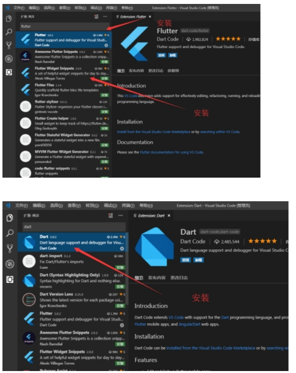

## 创建flutter项目的方式

### 一、使用Android studio

### 二、使用命令行

```shell
flutter create <project name>
```

## Vscode中开发 运行Flutter应用

> 如果你习惯用Android Studio的话可以直接用Android Studio直接开发Flutter。但是Android Studio比 较耗费电脑资源，所以这里我们推荐使用Vscode

### Vscode中安装Flutter插件 Dart插件。



### Vscode中打开flutter项目进行开发

注意：定位到项目目录，不需要定位到项目目录对应的android目录


### 运行Flutter项目、热加载Flutter项目

```
flutter run
flutter run -d all

Flutter run key commands.
r Hot reload.
R Hot restart.
h List all available interactive commands.
d Detach (terminate "flutter run" but leave application running).
c Clear the screen
q Quit (terminate the application on the device).

```

常用的快捷键 

r 键 ：点击后热加载，也就算是重新加载吧。 

R键：热重启项目。 

p 键：显示网格，这个可以很好的掌握布局情况，工作中很有用。 

o 键：切换android和ios的预览模式。 

q 键：退出调试预览模式。

查看设备

```
flutter devices
```

运行在所有的设备

```
flutter run -d all
```

指定设备运行

```
flutter run -d chrome
```

## Flutter中设置Android的应用名称和图标

http://www.hzhcontrols.com/new-1209816.html

## Flutter Android Studio打apk包

> 最新版的 Android Studio 没有Generate Signed Bundle/Apk，所以得自己生成签名
>
> 1. 打开命令行工具，进入JDK的bin目录（默认路径为 C:\Program Files\Java\jdk\bin）
>
>    > 我的保存在 C:\Users\Administrator\.android
>    >
>    > SHA1: 25:24:07:57:23:16:F5:D8:8F:57:63:EC:0A:9D:35:E4:9E:DC:DE:A9
>    >
>    > SHA256: 32:67:B9:43:B2:B7:53:C4:A9:1D:B7:AD:4E:33:8F:12:2F:97:60:ED:8E:02:78:96:56:D6:DD:17:C9:F7:C3:45
>
> 2. 输入以下命令创建Keystore文件：
>
> keytool -genkey -v -keystore myKeystore.keystore -alias myAlias -keyalg RSA -keysize 2048 -validity 10000
>
> 解释：
>
> -genkey：指定要生成一个新的密钥对和自签名证书。
>
> -v：指定详细输出，便于调试。
>
> -keystore：指定要保存的Keystore文件名。
>
> -alias：指定别名，用于标识密钥和证书。
>
> -keyalg：指定密钥算法，这里使用RSA算法。
>
> -keysize：指定密钥长度，这里设置为2048。
>
> -validity：指定证书有效期，以天为单位。
>
> 3. 根据提示输入相关信息，如口令、姓名、单位、城市、省份、国家等。
>
> 4. 执行命令后，Keystore文件将被保存在当前目录下。

https://blog.csdn.net/m0_68349563/article/details/129760240