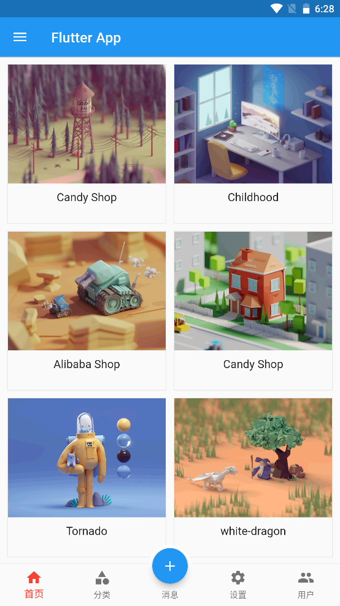

---
# 取二三级标题生成目录
outline: [2,3]
---

### Flutter Key详解

> 我们平时一定接触过很多的 Widget，比如 Container、Row、Column 等，它们在我们绘制界面的过程 中发挥着重要的作用。但是不知道你有没有注意到，在几乎每个 Widget 的构造函数中，都有一个共同 的参数，它们通常在参数列表的第一个，那就是 Key。
>
> 在Flutter中，**Key是不能重复使用的**，所以Key一般用来做唯一标识。组件在更新的时候，其状态的保 存主要是通过判断**组件的类型或者key值**是否一致。因此，当各组件的类型不同的时候，类型已经足够 用来区分不同的组件了，此时我们可以不必使用key。但是如果同时存在多个同一类型的控件的时候， 此时类型已经无法作为区分的条件了，我们就需要使用到key。

#### 没有 Key 会发生什么奇怪现象

> 如下面例： 定义了一个StatefulWidget的Box，点击Box的时候可以改变Box里面的数字，当我们重新 对Box排序的时候Flutter就无法识别到Box的变化了， 这是什么原因呢？


```dart
import 'package:flutter/material.dart';

void main() {
  runApp(const MyApp());
}

class MyApp extends StatelessWidget {
  const MyApp({super.key});

  @override
  Widget build(BuildContext context) {
    return MaterialApp(
      theme: ThemeData(primaryColor: Colors.blue),
      home: const MyHomePage(),
    );
  }
}

class MyHomePage extends StatefulWidget {
  const MyHomePage({super.key});

  @override
  State<MyHomePage> createState() => _MyHomePageState();
}

class _MyHomePageState extends State<MyHomePage> {
  List<Widget> list = [
    const Box( color: Colors.red),
    const Box(,color: Colors.blue),
    const Box( color: Colors.pink)
  ];

  @override
  Widget build(BuildContext context) {
    return Scaffold(
      appBar: AppBar(title: const Text('flutter App')),
      body: Center(
        child: Column(
          mainAxisAlignment: MainAxisAlignment.center,
          children: list,
        ),
      ),
      floatingActionButton:
          FloatingActionButton(onPressed: () {
            setState(() {
              // 打乱list元素的顺序
              list.shuffle();
            });
          }, child: const Icon(Icons.add)),
    );
  }
}

class Box extends StatefulWidget {
  final Color color;
  const Box({super.key, required this.color});

  @override
  State<Box> createState() => _BoxState();
}

class _BoxState extends State<Box> {
  int _count = 0;
  @override
  Widget build(BuildContext context) {
    return Container(
      height: 100,
      width: 100,
      color: Colors.red,
      child: ElevatedButton(
        style: ButtonStyle(
            backgroundColor: MaterialStateProperty.all(widget.color)),
        onPressed: () {
          setState(() {
            _count++;
          });
        },
        child: Text('$_count'),
      ),
    );
  }
}

```

> 运行后我们发现改变list Widget顺序后，Widget颜色会变化，但是每个Widget里面的文本内容并没有 变化，为什么会这样呢？当我们List重新排序后Flutter检测到了Widget的顺序变化，所以重新绘制List Widget，但是Flutter 发现List Widget 里面的元素没有变化，所以就没有改变Widget里面的内容。
>
> 把List 里面的Box的颜色改成一样，这个时候您重新对list进行排序，就很容易理解了。重新排序后虽然 执行了setState，但是代码和以前是一样的，所以Flutter不会重构List Widget里面的内容, 也就是 Flutter没法通过Box里面传入的参数来识别Box是否改变。如果要让FLutter能识别到List Widget子元素 的改变，就需要给每个Box指定一个key。

#### Flutter key：LocalKey、GlobalKey

> 在Flutter中，**Key是不能重复使用的**，所以Key一般用来做唯一标识。组件在更新的时候，其状态的保 存主要是通过判断**组件的类型或者key值**是否一致。因此，当各组件的类型不同的时候，类型已经足够 用来区分不同的组件了，此时我们可以不必使用key。但是如果同时存在多个同一类型的控件的时候， 此时类型已经无法作为区分的条件了，我们就需要使用到key。

 Flutter key子类包含 LocalKey 和 GlobalKey 。

- 局部键（LocalKey）：ValueKey、ObjectKey、UniqueKey
- 全局键（GlobalKey）： GlobalKey、GlobalObjectKey

ValueKey （值key）把一个值作为key ，UniqueKey（唯一key）程序生成唯一的Key，当我们不知道 如何指定ValueKey的时候就可以使用UniqueKey，ObjectKey（对象key）把一个对象实例作为key。 

GlobalKey（全局key），GlobalObjectKey（全局Objec key，和ObjectKey有点类似）

#### LocalKey改造上面的例子

```dart
import 'package:flutter/material.dart';

void main() {
  runApp(const MyApp());
}

class MyApp extends StatelessWidget {
  const MyApp({super.key});

  @override
  Widget build(BuildContext context) {
    return MaterialApp(
      theme: ThemeData(primaryColor: Colors.blue),
      home: const MyHomePage(),
    );
  }
}

class MyHomePage extends StatefulWidget {
  const MyHomePage({super.key});

  @override
  State<MyHomePage> createState() => _MyHomePageState();
}

class _MyHomePageState extends State<MyHomePage> {
  List<Widget> list = [
    const Box(key: ValueKey('1'), color: Colors.red),
    Box(key: UniqueKey(), color: Colors.blue),
    const Box(key: ObjectKey(Box(color: Colors.pink)) ,color: Colors.pink)
  ];

  @override
  Widget build(BuildContext context) {
    return Scaffold(
      appBar: AppBar(title: const Text('flutter App')),
      body: Center(
        child: Column(
          mainAxisAlignment: MainAxisAlignment.center,
          children: list,
        ),
      ),
      floatingActionButton:
          FloatingActionButton(onPressed: () {
            setState(() {
              // 打乱list元素的顺序
              list.shuffle();
            });
          }, child: const Icon(Icons.add)),
    );
  }
}

class Box extends StatefulWidget {
  final Color color;
  const Box({super.key, required this.color});

  @override
  State<Box> createState() => _BoxState();
}

class _BoxState extends State<Box> {
  int _count = 0;
  @override
  Widget build(BuildContext context) {
    return Container(
      height: 100,
      width: 100,
      color: Colors.red,
      child: ElevatedButton(
        style: ButtonStyle(
            backgroundColor: MaterialStateProperty.all(widget.color)),
        onPressed: () {
          setState(() {
            _count++;
          });
        },
        child: Text('$_count'),
      ),
    );
  }
}
```

#### GlobalKey的使用

> 如果把LocalKey比作局部变量， GlobalKey就类似于全局变量 
>
> 下面使用了LocalKey，当屏幕状态改变的时候把 Colum换成了Row，Box的状态就会丢失。


```dart
import 'package:flutter/material.dart';

void main() {
  runApp(const MyApp());
}

class MyApp extends StatelessWidget {
  const MyApp({super.key});

  @override
  Widget build(BuildContext context) {
    return MaterialApp(
      theme: ThemeData(primaryColor: Colors.blue),
      home: const MyHomePage(),
    );
  }
}

class MyHomePage extends StatefulWidget {
  const MyHomePage({super.key});

  @override
  State<MyHomePage> createState() => _MyHomePageState();
}

class _MyHomePageState extends State<MyHomePage> {
  List<Widget> list = [
    const Box(key: ValueKey('1'), color: Colors.red),
    Box(key: UniqueKey(), color: Colors.blue),
    const Box(key: ObjectKey(Box(color: Colors.pink)) ,color: Colors.pink)
  ];

  @override
  Widget build(BuildContext context) {
    return Scaffold(
      appBar: AppBar(title: const Text('flutter App')),
      body: Center(
        child: Column(
          mainAxisAlignment: MainAxisAlignment.center,
          children: list,
        ),
      ),
      floatingActionButton:
          FloatingActionButton(onPressed: () {
            setState(() {
              // 打乱list元素的顺序
              list.shuffle();
            });
          }, child: const Icon(Icons.add)),
    );
  }
}

class Box extends StatefulWidget {
  final Color color;
  const Box({super.key, required this.color});

  @override
  State<Box> createState() => _BoxState();
}

class _BoxState extends State<Box> {
  int _count = 0;
  @override
  Widget build(BuildContext context) {
    return Container(
      height: 100,
      width: 100,
      color: Colors.red,
      child: ElevatedButton(
        style: ButtonStyle(
            backgroundColor: MaterialStateProperty.all(widget.color)),
        onPressed: () {
          setState(() {
            _count++;
          });
        },
        child: Text('$_count'),
      ),
    );
  }
}

```

> 在前面我们介绍过一个Widget状态的保存主要是通过判断组件的类型或者key值是否一致。LocalKey只 在当前的组件树有效，所以把Colum换成了Row的时候Widget的状态就丢失了。为了解决这个问题我们 就可以使用GlobalKey。
>
> **GlobalKey优化**，把LocalKey换成GlobalKey，如下：

```dart
import 'package:flutter/material.dart';

void main() {
  runApp(const MyApp());
}

class MyApp extends StatelessWidget {
  const MyApp({super.key});

  @override
  Widget build(BuildContext context) {
    return MaterialApp(
      theme: ThemeData(primaryColor: Colors.blue),
      home: const MyHomePage(),
    );
  }
}

class MyHomePage extends StatefulWidget {
  const MyHomePage({super.key});

  @override
  State<MyHomePage> createState() => _MyHomePageState();
}

class _MyHomePageState extends State<MyHomePage> {
  List<Widget> list = [];
  final GlobalKey _globalKey1 = GlobalKey();
  final GlobalKey _globalKey2 = GlobalKey();
  final GlobalKey _globalKey3 = GlobalKey();

  @override
  void initState() {
    // TODO: implement initState
    super.initState();
    // 1.可以保存状态  2.可以排序
    list = [
      Box(key: _globalKey1, color: Colors.red),
      Box(key: _globalKey2, color: Colors.blue),
      Box(key: _globalKey3 ,color: Colors.pink)
    ];
  }

  @override
  Widget build(BuildContext context) {
    print(MediaQuery.of(context).orientation);
    return Scaffold(
      appBar: AppBar(title: const Text('flutter App')),
      body: Center(
        child: MediaQuery.of(context).orientation == Orientation.portrait ? Column(
          mainAxisAlignment: MainAxisAlignment.center,
          children: list,
        ) : Row(
          mainAxisAlignment: MainAxisAlignment.center,
          children: list,
        ),
      ),
      floatingActionButton:
          FloatingActionButton(onPressed: () {
            setState(() {
              // 打乱list元素的顺序
              list.shuffle();
            });
          }, child: const Icon(Icons.add)),
    );
  }
}

class Box extends StatefulWidget {
  final Color color;
  const Box({super.key, required this.color});

  @override
  State<Box> createState() => _BoxState();
}

class _BoxState extends State<Box> {
  int _count = 0;
  @override
  Widget build(BuildContext context) {
    return Container(
      height: 100,
      width: 100,
      color: Colors.red,
      child: ElevatedButton(
        style: ButtonStyle(
            backgroundColor: MaterialStateProperty.all(widget.color)),
        onPressed: () {
          setState(() {
            _count++;
          });
        },
        child: Text('$_count'),
      ),
    );
  }
}

```

#### GlobalKey 获取子组件

> globalKey.currentState 可以获取子组件的状态，执行子组件的方法，globalKey.currentWidget可以获 取子组件的属性，_globalKey.currentContext!.findRenderObject()可以获取渲染的属性。

```dart
import 'package:flutter/material.dart';

void main() {
  runApp(const MyApp());
}

class MyApp extends StatelessWidget {
  const MyApp({super.key});

  @override
  Widget build(BuildContext context) {
    return MaterialApp(
      theme: ThemeData(primaryColor: Colors.blue),
      home: const MyHomePage(),
    );
  }
}

class MyHomePage extends StatefulWidget {
  const MyHomePage({super.key});

  @override
  State<MyHomePage> createState() => _MyHomePageState();
}

class _MyHomePageState extends State<MyHomePage> {
  final GlobalKey _globalKey = GlobalKey();

  @override
  Widget build(BuildContext context) {
    return Scaffold(
      appBar: AppBar(title: const Text('flutter App')),
      body: Center(
        child: Box(key: _globalKey, color: Colors.red),
      ),
      floatingActionButton: FloatingActionButton(onPressed: (){
        // 1. 获取子 _BoxState widget 的属性
        var boxState = _globalKey.currentState as _BoxState;
        print(boxState._count);
        setState(() {
          boxState._count++;
        });
        // 调用子方法
        boxState.run();

        // 2. 获取 Box widget 属性(了解)
         var boxWidget = _globalKey.currentWidget as Box;
         print(boxWidget.color); // MaterialColor(primary value: Color(0xfff44336))

        // 3. 获取子组件渲染的属性(了解)
        var renderBox = _globalKey.currentContext!.findRenderObject() as RenderBox;
        print(renderBox.size); // Size(100.0, 100.0)

      }, child: const Icon(Icons.add)),
    );
  }
}

// 子widget
class Box extends StatefulWidget {
  final Color color;
  const Box({Key? key, required this.color}):super(key: key);

  @override
  State<Box> createState() => _BoxState();
}

class _BoxState extends State<Box> {
  int _count = 0;

  void run(){
    print('我是box的方法');
  }

  @override
  Widget build(BuildContext context) {
    return Container(
      height: 100,
      width: 100,
      color: Colors.red,
      child: ElevatedButton(
        style: ButtonStyle(
            backgroundColor: MaterialStateProperty.all(widget.color)),
        onPressed: () {
          setState(() {
            _count++;
          });
        },
        child: Text('$_count'),
      ),
    );
  }
}
```

#### Widget Tree、Element Tree 和 RenderObject Tree

> Flutter应用是由是Widget Tree、Element Tree 和 RenderObject Tree组成 Widget可以理解成一个类，Element可以理解成Widget的实例，Widget与Element的关系可以是一对 多，一份配置可以创造多个Element实例

| 属性         | 描述                                                         |
| ------------ | ------------------------------------------------------------ |
| Widget       | Widget就是一个类， 是Element 的配置信息。与Element的关系可以是一对 多，一份配置可以创造多个Element实例 |
| Element      | Widget 的实例化，内部持有Widget和RenderObject。              |
| RenderObject | 负责渲染绘制                                                 |

### AnimatedList 实现动态列表

#### AnimatedList实现动画

> AnimatedList 和 ListView 的功能大体相似，不同的是， AnimatedList 可以在列表中插入或删除节点 时执行一个动画，在需要添加或删除列表项的场景中会提高用户体验。
>
> AnimatedList 和 ListView 的功能大体相似，不同的是， AnimatedList 可以在列表中插入或删除节点 时执行一个动画，在需要添加或删除列表项的场景中会提高用户体验。
>
> ```dart
> void insertItem(int index, { Duration duration = _kDuration });
> void removeItem(int index, AnimatedListRemovedItemBuilder builder, { Duration
> duration = _kDuration }) ;
> ```

**AnimatedList常见属性：**

| 属性             | 描述                                                         |
| ---------------- | ------------------------------------------------------------ |
| key              | globalKey final globalKey = GlobalKey();                     |
| initialItemCount | 子元素数量                                                   |
| itemBuilder      | 方法 ( BuildContext context, int index, Animation animation) {} |

**关于GlobalKey**： 每个 Widget 都对应一个 Element ，我们可以直接对 Widget 进行操作，但是无法直 接操作 Widget 对应的 Element 。而 GlobalKey 就是那把直接访问 Element 的钥匙。通过 GlobalKey 可以获取到 Widget 对应的 Element 。

#### AnimatedList增加列表FadeTransition、ScaleTransition

**FadeTransition Demo、ScaleTransition demo**

```dart
import 'dart:async';
import 'package:flutter/material.dart';

void main() {
  runApp(const MyApp());
}

class MyApp extends StatelessWidget {
  const MyApp({super.key});

  @override
  Widget build(BuildContext context) {
    return MaterialApp(
      theme: ThemeData(primaryColor: Colors.blue),
      home: const MyHomePage(),
    );
  }
}

class MyHomePage extends StatefulWidget {
  const MyHomePage({super.key});

  @override
  State<MyHomePage> createState() => _MyHomePageState();
}

class _MyHomePageState extends State<MyHomePage> {
  final _globalKey = GlobalKey<AnimatedListState>();
  List<String> list = ["第一条","第二条"];
  bool flag = true;

  Widget _buildItem(index){
    return ListTile(
      title: Text(list[index]),
      trailing: IconButton(
        icon: const Icon(Icons.delete),
        onPressed: (){
          // 删除
          _deleteItem(index);
        },
      ),
    );
  }

  _deleteItem(index){
    if(flag == true){
      flag = false;
        _globalKey.currentState!.removeItem(index, (context, animation){
        var removeItem = _buildItem(index);
        list.removeAt(index); // 数组中删除数据
        return FadeTransition(
          opacity: animation,
          child: removeItem, // 删除的时候执行动画的元素
        );
      });

      // 解决快速删除的bug
      Timer.periodic(const Duration(milliseconds: 500), (timer) { 
        flag = true;
        timer.cancel();
      });
    }
  }

  @override
  Widget build(BuildContext context) {
    return Scaffold(
      appBar: AppBar(title: const Text('flutter App')),
      body: AnimatedList(
        key: _globalKey, // 必须要一个key，不然报错
        initialItemCount: list.length,
        itemBuilder: (context, index, animation){
          // return FadeTransition(
            return ScaleTransition(
            // opacity: animation,
            scale: animation,
            child: _buildItem(index),
          );
        }
      ),
      floatingActionButton: FloatingActionButton(onPressed: (){
        setState(() {
          list.add('我是新增的数据');
          _globalKey.currentState!.insertItem(list.length - 1);
        });
      }, child: const Icon(Icons.add)),
    );
  }
}
```

#### AnimatedList 删除列表

> 完整版，可以参考上面

```dart
_deleteItem(index){
    if(flag == true){
      flag = false;
        _globalKey.currentState!.removeItem(index, (context, animation){
        var removeItem = _buildItem(index);
        list.removeAt(index); // 数组中删除数据
        return FadeTransition(
          opacity: animation,
          child: removeItem, // 删除的时候执行动画的元素
        );
      });

      // 解决快速删除的bug
      Timer.periodic(const Duration(milliseconds: 500), (timer) { 
        flag = true;
        timer.cancel();
      });
    }
  }
```

### Flutter 动画原理

动画原理

> 在任何系统的 UI 框架中，动画实现的原理都是相同的，即：在一段时间内，快速地多次改变 UI 外观：由于人眼会产生视觉暂留，所以最终看到的就是一个涟续哟动画，这和电影的原理是一样的．我们将 uI 的一次改变称为一个动画帧，对应一次屏幕刷新，而决定动画流畅度的一个重要指标就是帧率FPS （frame per second) ，即每秒的动画帧数．很明显，帧率越高则动画就会越流畅！一般情况下，对于人眼来说，动画帧率超过1 6 FpS ，就基本能看了，超过 32 「FPS 就会感觉相对平滑，而超过 32 FPS ．大多数人基本上就感受不到差别了。由于动画的每一帧都是要改变 UI 输出，所以在一个时间段内连续的改变 UI 输出握鱿较耗资源的，对设备韵软硬件系统要求都铰高，所以在 Ul 系统中，动画的平均帧率是盆要的性能指标，而在flut ter 中，理想情况下是可以实现 60 印 S 的，这刻系生应用能达到的帧率是基本是持平的。 

Flutter 动画简介

Flutter 中动画主要分为：隐式动画、显式动画、自定义隐式动画、自定义显式动画、和 Hero 动画 

### Flutter隐式动画

通过几行代码就可以实现隐式动画，由于隐式动画背后的实现原理和繁琐的细节都被隐去了，所以叫隐式动画， FLutte 中提供的 AnimatedContainer 、 AnimatedPadding 、 AnimatedPosi 石 oned 、助 imatedopecity 、 AnimatedDefaultT6x6tyle 、助 imatedswitcher 胡属于隐式动画．

隐式动画中可以通过 duration 配置动画时长、可以通过 curve （曲线）来配置动画过程

#### AnimatedContainer

```dart
import 'package:flutter/material.dart';

void main() {
  runApp(const MyApp());
}

class MyApp extends StatelessWidget {
  const MyApp({super.key});

  @override
  Widget build(BuildContext context) {
    return MaterialApp(
      theme: ThemeData(primaryColor: Colors.blue),
      home: const MyHomePage(),
    );
  }
}

class MyHomePage extends StatefulWidget {
  const MyHomePage({super.key});

  @override
  State<MyHomePage> createState() => _MyHomePageState();
}

class _MyHomePageState extends State<MyHomePage> {
  bool flag = true;

  @override
  Widget build(BuildContext context) {
    return Scaffold(
      appBar: AppBar(title: const Text('flutter App')),
      body: Center(
        child: AnimatedContainer(
          duration: const Duration(seconds: 1, milliseconds: 100),
          width: flag?200:300,
          height: flag?200:300,
          transform: flag?Matrix4.translationValues(0, 0, 0):Matrix4.translationValues(100, 0, 0),
          color: Colors.yellow,
        ),
      ),
      floatingActionButton: FloatingActionButton(onPressed: (){
       setState(() {
         flag = !flag;
       });
      }, child: const Icon(Icons.add)),
    );
  }
}
```

#### AnimatedContainer 侧边栏

```dart
import 'package:flutter/material.dart';

void main() {
  runApp(const MyApp());
}

class MyApp extends StatelessWidget {
  const MyApp({super.key});

  @override
  Widget build(BuildContext context) {
    return MaterialApp(
      theme: ThemeData(primaryColor: Colors.blue),
      home: const MyHomePage(),
    );
  }
}

class MyHomePage extends StatefulWidget {
  const MyHomePage({super.key});

  @override
  State<MyHomePage> createState() => _MyHomePageState();
}

class _MyHomePageState extends State<MyHomePage> {
  bool flag = true;

  @override
  Widget build(BuildContext context) {
    return Stack(
      children: [
        Scaffold(
      appBar: AppBar(title: const Text('flutter App')),
      body: Stack(
        children: [
          ListView(
            children: const [
              ListTile(title: Text('大豪科技世纪东方'))
            ],
          ),
        ],
      ),
      floatingActionButton: FloatingActionButton(onPressed: (){
       setState(() {
         flag = !flag;
       });
      }, child: const Icon(Icons.add)),
    ),
    Positioned(
            left: 0,
            top: 0,
            bottom: 0,
            child: AnimatedContainer(
            duration: const Duration(seconds: 1,milliseconds: 100),
            width: 200,
            height: double.infinity,
            transform: flag?Matrix4.translationValues(-200, 0, 0): Matrix4.translationValues(0, 0, 0),
            color: Colors.yellow,
          ))
      ],
    );
  }
}
```

#### AnimatedDefaultTextStyle

```dart
import 'package:flutter/material.dart';

void main() {
  runApp(const MyApp());
}

class MyApp extends StatelessWidget {
  const MyApp({super.key});

  @override
  Widget build(BuildContext context) {
    return MaterialApp(
      theme: ThemeData(primaryColor: Colors.blue),
      home: const MyHomePage(),
    );
  }
}

class MyHomePage extends StatefulWidget {
  const MyHomePage({super.key});

  @override
  State<MyHomePage> createState() => _MyHomePageState();
}

class _MyHomePageState extends State<MyHomePage> {
  bool flag = true;

  @override
  Widget build(BuildContext context) {
    return Scaffold(
      appBar: AppBar(title: const Text('flutter App')),
      body: Center(
        child: Container(
          alignment: Alignment.center,
          width: 300,
          height: 300,
          color: Colors.blue,
          child:  AnimatedDefaultTextStyle(
            duration: const Duration(seconds: 1),
            style: flag? const TextStyle(fontSize: 20): const TextStyle(fontSize: 50),
            child: const Text("data"),
          ),
        ),
      ),
      floatingActionButton: FloatingActionButton(
          onPressed: () {
            setState(() {
              flag = !flag;
            });
          },
          child: const Icon(Icons.add)),
    );
  }
}
```

#### AnimatedOpacity

```dart
import 'package:flutter/material.dart';

void main() {
  runApp(const MyApp());
}

class MyApp extends StatelessWidget {
  const MyApp({super.key});

  @override
  Widget build(BuildContext context) {
    return MaterialApp(
      theme: ThemeData(primaryColor: Colors.blue),
      home: const MyHomePage(),
    );
  }
}

class MyHomePage extends StatefulWidget {
  const MyHomePage({super.key});

  @override
  State<MyHomePage> createState() => _MyHomePageState();
}

class _MyHomePageState extends State<MyHomePage> {
  bool flag = true;

  @override
  Widget build(BuildContext context) {
    return Scaffold(
      appBar: AppBar(title: const Text('flutter App')),
      body: Center(
        child: AnimatedOpacity(
          duration: const Duration(seconds: 1),
          curve: Curves.linear,
          opacity: flag? 0.2:1,
          child: Container(
            width: 100,
            height: 100,
            color: Colors.red,
          ),
        ),
      ),
      floatingActionButton: FloatingActionButton(
          onPressed: () {
            setState(() {
              flag = !flag;
            });
          },
          child: const Icon(Icons.add)),
    );
  }
}

```

#### AnimatedPadding

```dart
import 'package:flutter/material.dart';

void main() {
  runApp(const MyApp());
}

class MyApp extends StatelessWidget {
  const MyApp({super.key});

  @override
  Widget build(BuildContext context) {
    return MaterialApp(
      theme: ThemeData(primaryColor: Colors.blue),
      home: const MyHomePage(),
    );
  }
}

class MyHomePage extends StatefulWidget {
  const MyHomePage({super.key});

  @override
  State<MyHomePage> createState() => _MyHomePageState();
}

class _MyHomePageState extends State<MyHomePage> {
  bool flag = true;

  @override
  Widget build(BuildContext context) {
    return Scaffold(
      appBar: AppBar(title: const Text('flutter App')),
      body: AnimatedPadding(
        curve: Curves.decelerate,
        duration: const Duration(seconds: 1),
        padding:  EdgeInsets.fromLTRB(10, flag? 10: 400, 0, 0),
        child: Container(
          width: 100,
          height: 100,
          color: Colors.red,
        ),
      ),
      floatingActionButton: FloatingActionButton(onPressed: (){
       setState(() {
         flag = !flag;
       });
      }, child: const Icon(Icons.add)),
    );
  }
}
```

#### AnimatedPositioned

```dart
import 'package:flutter/material.dart';

void main() {
  runApp(const MyApp());
}

class MyApp extends StatelessWidget {
  const MyApp({super.key});

  @override
  Widget build(BuildContext context) {
    return MaterialApp(
      theme: ThemeData(primaryColor: Colors.blue),
      home: const MyHomePage(),
    );
  }
}

class MyHomePage extends StatefulWidget {
  const MyHomePage({super.key});

  @override
  State<MyHomePage> createState() => _MyHomePageState();
}

class _MyHomePageState extends State<MyHomePage> {
  bool flag = true;

  @override
  Widget build(BuildContext context) {
    return Scaffold(
      appBar: AppBar(title: const Text('flutter App')),
      body: Center(
        child: Stack(
          children: [
            AnimatedPositioned(
              duration: const Duration(seconds: 1, milliseconds: 500),
                top: flag?10:500,
                right: flag?10:300,
                curve: Curves.easeIn,
                child: Container(
                  width: 60,
                  height: 60,
                  color: Colors.blue,
                )),
            ListView(
              children: const [
                ListTile(title: Text("data")),
                ListTile(title: Text("data")),
                ListTile(title: Text("data")),
                ListTile(title: Text("data"))
              ],
            )
          ],
        ),
      ),
      floatingActionButton: FloatingActionButton(
          onPressed: () {
            setState(() {
              flag = !flag;
            });
          },
          child: const Icon(Icons.add)),
    );
  }
}
```

#### AnimatedSwitcher-1

```dart
import 'package:flutter/material.dart';

void main() {
  runApp(const MyApp());
}

class MyApp extends StatelessWidget {
  const MyApp({super.key});

  @override
  Widget build(BuildContext context) {
    return MaterialApp(
      theme: ThemeData(primaryColor: Colors.blue),
      home: const MyHomePage(),
    );
  }
}

class MyHomePage extends StatefulWidget {
  const MyHomePage({super.key});

  @override
  State<MyHomePage> createState() => _MyHomePageState();
}

class _MyHomePageState extends State<MyHomePage> {
  bool flag = true;

  @override
  Widget build(BuildContext context) {
    return Scaffold(
      appBar: AppBar(title: const Text('flutter App')),
      body: Center(
        child: Container(
          alignment: Alignment.center,
          width: 400,
          height: 300,
          color: Colors.red,
          child:   AnimatedSwitcher(
            duration: const Duration(seconds: 1),
            child: flag ? const CircularProgressIndicator() : Image.network('https://www.itying.com/images/flutter/3.png',fit: BoxFit.cover,),
          ),
        ),
      ),
      floatingActionButton: FloatingActionButton(
          onPressed: () {
            setState(() {
              flag = !flag;
            });
          },
          child: const Icon(Icons.add)),
    );
  }
}
```

#### AnimatedSwitcher-2

```dart
import 'package:flutter/material.dart';

void main() {
  runApp(const MyApp());
}

class MyApp extends StatelessWidget {
  const MyApp({super.key});

  @override
  Widget build(BuildContext context) {
    return MaterialApp(
      theme: ThemeData(primaryColor: Colors.blue),
      home: const MyHomePage(),
    );
  }
}

class MyHomePage extends StatefulWidget {
  const MyHomePage({super.key});

  @override
  State<MyHomePage> createState() => _MyHomePageState();
}

class _MyHomePageState extends State<MyHomePage> {
  bool flag = true;

  @override
  Widget build(BuildContext context) {
    return Scaffold(
      appBar: AppBar(title: const Text('flutter App')),
      body: Center(
        child: Container(
          alignment: Alignment.center,
          width: 400,
          height: 300,
          color: Colors.red,
          child:   AnimatedSwitcher(
            transitionBuilder:((child,animation){
              // 第一个动画 好看
              // return ScaleTransition(scale: animation,child: child);
              // 第二个
              return ScaleTransition(scale: animation,child: FadeTransition(opacity: animation,child: child,));
            }),
            duration: const Duration(seconds: 1),
            child: flag ? const CircularProgressIndicator() : Image.network('https://www.itying.com/images/flutter/3.png',fit: BoxFit.cover,),
          ),
        ),
      ),
      floatingActionButton: FloatingActionButton(
          onPressed: () {
            setState(() {
              flag = !flag;
            });
          },
          child: const Icon(Icons.add)),
    );
  }
}
```

#### AnimatedSwitcher 文字动画

```dart
import 'package:flutter/material.dart';

void main() {
  runApp(const MyApp());
}

class MyApp extends StatelessWidget {
  const MyApp({super.key});

  @override
  Widget build(BuildContext context) {
    return MaterialApp(
      theme: ThemeData(primaryColor: Colors.blue),
      home: const MyHomePage(),
    );
  }
}

class MyHomePage extends StatefulWidget {
  const MyHomePage({super.key});

  @override
  State<MyHomePage> createState() => _MyHomePageState();
}

class _MyHomePageState extends State<MyHomePage> {
  bool flag = true;

  @override
  Widget build(BuildContext context) {
    return Scaffold(
      appBar: AppBar(title: const Text('flutter App')),
      body: Center(
        child: Container(
          alignment: Alignment.center,
          width: 400,
          height: 300,
          color: Colors.red,
          child:   AnimatedSwitcher(
            transitionBuilder:((child,animation){
              // 第一个动画 好看
              // return ScaleTransition(scale: animation,child: child);
              // 第二个
              return ScaleTransition(scale: animation,child: FadeTransition(opacity: animation,child: child,));
            }),
            duration: const Duration(seconds: 1),
            // 让文字也能加上动画
            child: Text(key:UniqueKey(),flag?'sdfs':'sdfdsfsfsggdfrtee'),
          ),
        ),
      ),
      floatingActionButton: FloatingActionButton(
          onPressed: () {
            setState(() {
              flag = !flag;
            });
          },
          child: const Icon(Icons.add)),
    );
  }
}
```

### 显示动画

> 常见的显示动画有RotationTransition、FadeTransition、ScaleTransition、SlideTransition、AnimaedIcon。在显示动画中开发者需要创建一个AnimationController，通过AnimationController控制动画的开始、暂停、重置、跳转、倒播等

#### RotationTransition

> 旋转动画

```dart
import 'package:flutter/material.dart';

void main() {
  runApp(const MyApp());
}

class MyApp extends StatelessWidget {
  const MyApp({super.key});

  @override
  Widget build(BuildContext context) {
    return MaterialApp(
      theme: ThemeData(primaryColor: Colors.blue),
      home: const MyHomePage(),
    );
  }
}

class MyHomePage extends StatefulWidget {
  const MyHomePage({super.key});

  @override
  State<MyHomePage> createState() => _MyHomePageState();
}

class _MyHomePageState extends State<MyHomePage> with SingleTickerProviderStateMixin {
  late AnimationController _controller;
  @override
  void initState() {
    // TODO: implement initState
    super.initState();
    _controller = AnimationController(
      vsync: this, // 让程序和手机的刷新频率统一
      duration: const Duration(seconds: 1)
    );
  }

  @override
  Widget build(BuildContext context) {
    return Scaffold(
      appBar: AppBar(title: const Text('flutter App 动画')),
      body: Center(
        child: Column(
          children: [
             const SizedBox(height: 40),
            RotationTransition(
              turns: _controller,
              child: const FlutterLogo(size: 60),
            ),
            const SizedBox(height: 40),
            Row(
              mainAxisAlignment: MainAxisAlignment.spaceAround,
              children: [
                ElevatedButton(onPressed: (){_controller.forward();}, child: const Text('forward')),
                ElevatedButton(onPressed: (){_controller.reverse();}, child: const Text('reverse')),
                ElevatedButton(onPressed: (){_controller.stop();}, child: const Text('stop')),
                ElevatedButton(onPressed: (){_controller.reset();}, child: const Text('reset')),
              ],
            )
          ],
        ),
      ),
      floatingActionButton: FloatingActionButton(
          onPressed: () {
            _controller.repeat();
          },
          child: const Icon(Icons.add)),
    );
  }
}
```

#### FadeTransition

> 显示与隐藏

```dart
import 'package:flutter/material.dart';

void main() {
  runApp(const MyApp());
}

class MyApp extends StatelessWidget {
  const MyApp({super.key});

  @override
  Widget build(BuildContext context) {
    return MaterialApp(
      theme: ThemeData(primaryColor: Colors.blue),
      home: const MyHomePage(),
    );
  }
}

class MyHomePage extends StatefulWidget {
  const MyHomePage({super.key});

  @override
  State<MyHomePage> createState() => _MyHomePageState();
}

class _MyHomePageState extends State<MyHomePage> with SingleTickerProviderStateMixin {
  late AnimationController _controller;
  @override
  void initState() {
    // TODO: implement initState
    super.initState();
    _controller = AnimationController(
      vsync: this, // 让程序和手机的刷新频率统一
      duration: const Duration(seconds: 1),
        // 设置区间
      // lowerBound : , // 从哪个值
      // upperBound: , // 到那个值 
    );
    _controller.addListener(() { });
  }

  @override
  Widget build(BuildContext context) {
    return Scaffold(
      appBar: AppBar(title: const Text('flutter App 动画')),
      body: Center(
        child: Column(
          children: [
             const SizedBox(height: 40),
            FadeTransition(
              opacity: _controller,
              child: const FlutterLogo(size: 120),
            ),
            const SizedBox(height: 40),
            Row(
              mainAxisAlignment: MainAxisAlignment.spaceAround,
              children: [
                ElevatedButton(onPressed: (){_controller.forward();}, child: const Text('forward')),
                ElevatedButton(onPressed: (){_controller.reverse();}, child: const Text('reverse')),
                ElevatedButton(onPressed: (){_controller.stop();}, child: const Text('stop')),
                ElevatedButton(onPressed: (){_controller.reset();}, child: const Text('reset')),
              ],
            )
          ],
        ),
      ),
      floatingActionButton: FloatingActionButton(
          onPressed: () {
            _controller.repeat();
          },
          child: const Icon(Icons.add)),
    );
  }
}
```

#### ScaleTransition

> 缩放

```dart
import 'package:flutter/material.dart';

void main() {
  runApp(const MyApp());
}

class MyApp extends StatelessWidget {
  const MyApp({super.key});

  @override
  Widget build(BuildContext context) {
    return MaterialApp(
      theme: ThemeData(primaryColor: Colors.blue),
      home: const MyHomePage(),
    );
  }
}

class MyHomePage extends StatefulWidget {
  const MyHomePage({super.key});

  @override
  State<MyHomePage> createState() => _MyHomePageState();
}

class _MyHomePageState extends State<MyHomePage> with SingleTickerProviderStateMixin {
  late AnimationController _controller;
  @override
  void initState() {
    // TODO: implement initState
    super.initState();
    _controller = AnimationController(
      vsync: this, // 让程序和手机的刷新频率统一
      duration: const Duration(seconds: 1),
    );
    _controller.addListener(() { });
  }

  @override
  Widget build(BuildContext context) {
    return Scaffold(
      appBar: AppBar(title: const Text('flutter App 动画')),
      body: Center(
        child: Column(
          children: [
             const SizedBox(height: 40),
            ScaleTransition(
              scale: _controller,
              child: const FlutterLogo(size: 120),
            ),
            const SizedBox(height: 40),
            Row(
              mainAxisAlignment: MainAxisAlignment.spaceAround,
              children: [
                ElevatedButton(onPressed: (){_controller.forward();}, child: const Text('forward')),
                ElevatedButton(onPressed: (){_controller.reverse();}, child: const Text('reverse')),
                ElevatedButton(onPressed: (){_controller.stop();}, child: const Text('stop')),
                ElevatedButton(onPressed: (){_controller.reset();}, child: const Text('reset')),
              ],
            )
          ],
        ),
      ),
      floatingActionButton: FloatingActionButton(
          onPressed: () {
            _controller.repeat(reverse: true);
          },
          child: const Icon(Icons.add)),
    );
  }
}
```

#### ScaleTransition - Tween

```dart
import 'package:flutter/material.dart';

void main() {
  runApp(const MyApp());
}

class MyApp extends StatelessWidget {
  const MyApp({super.key});

  @override
  Widget build(BuildContext context) {
    return MaterialApp(
      theme: ThemeData(primaryColor: Colors.blue),
      home: const MyHomePage(),
    );
  }
}

class MyHomePage extends StatefulWidget {
  const MyHomePage({super.key});

  @override
  State<MyHomePage> createState() => _MyHomePageState();
}

class _MyHomePageState extends State<MyHomePage> with SingleTickerProviderStateMixin {
  late AnimationController _controller;
  @override
  void initState() {
    // TODO: implement initState
    super.initState();
    _controller = AnimationController(
      vsync: this, // 让程序和手机的刷新频率统一
      duration: const Duration(seconds: 1),
    );
    _controller.addListener(() { });
  }

  @override
  Widget build(BuildContext context) {
    return Scaffold(
      appBar: AppBar(title: const Text('flutter App 动画')),
      body: Center(
        child: Column(
          children: [
             const SizedBox(height: 40),
            ScaleTransition(
              // Tween 配置运动的范围
              scale: _controller.drive(Tween(begin: 0.5,end: 1.2)),
              child: Container(
                width: 200,
                height: 200,
                color: Colors.red,
              ),
            ),
            const SizedBox(height: 40),
            Row(
              mainAxisAlignment: MainAxisAlignment.spaceAround,
              children: [
                ElevatedButton(onPressed: (){_controller.forward();}, child: const Text('forward')), // 运动一次
                ElevatedButton(onPressed: (){_controller.reverse();}, child: const Text('reverse')), // 逆时针运动一次
                ElevatedButton(onPressed: (){_controller.stop();}, child: const Text('stop')),
                ElevatedButton(onPressed: (){_controller.reset();}, child: const Text('reset')),
              ],
            )
          ],
        ),
      ),
      floatingActionButton: FloatingActionButton(
          onPressed: () {
            // repeat 重复动画， reverse：true 从1-0
            _controller.repeat(reverse: true);
          },
          child: const Icon(Icons.add)),
    );
  }
}
```

#### SlideTransition

> 位移动画

```dart
import 'package:flutter/material.dart';

void main() {
  runApp(const MyApp());
}

class MyApp extends StatelessWidget {
  const MyApp({super.key});

  @override
  Widget build(BuildContext context) {
    return MaterialApp(
      theme: ThemeData(primaryColor: Colors.blue),
      home: const MyHomePage(),
    );
  }
}

class MyHomePage extends StatefulWidget {
  const MyHomePage({super.key});

  @override
  State<MyHomePage> createState() => _MyHomePageState();
}

class _MyHomePageState extends State<MyHomePage> with SingleTickerProviderStateMixin {
  late AnimationController _controller;
  @override
  void initState() {
    // TODO: implement initState
    super.initState();
    _controller = AnimationController(
      vsync: this, // 让程序和手机的刷新频率统一
      duration: const Duration(seconds: 1),
    );
    _controller.addListener(() { });
  }

  @override
  Widget build(BuildContext context) {
    return Scaffold(
      appBar: AppBar(title: const Text('flutter App 动画')),
      body: Center(
        child: Column(
          children: [
             const SizedBox(height: 40),
            SlideTransition(
              // Tween 配置运动的范围
              // drive
              // position: _controller.drive(Tween(begin: const Offset(0, 0),end: const Offset(0.5, 0.5))),
              // 直接链式调用 Tween
              position: Tween(begin: const Offset(0, 0),end: const Offset(0, 2))
              .chain(
                CurveTween(curve: Curves.bounceInOut)
              )
              .chain(
                CurveTween(curve: const Interval(0.2, 0.8)) // 当前时间点的包分之二十开始，运动到时间点的百分之八十结束
              )
              .animate(_controller),
              child: Container(
                width: 200,
                height: 200,
                color: Colors.red,
              ),
            ),
            const SizedBox(height: 40),
            Row(
              mainAxisAlignment: MainAxisAlignment.spaceAround,
              children: [
                ElevatedButton(onPressed: (){_controller.forward();}, child: const Text('forward')), // 运动一次
                ElevatedButton(onPressed: (){_controller.reverse();}, child: const Text('reverse')), // 逆时针运动一次
                ElevatedButton(onPressed: (){_controller.stop();}, child: const Text('stop')),
                ElevatedButton(onPressed: (){_controller.reset();}, child: const Text('reset')),
              ],
            )
          ],
        ),
      ),
      floatingActionButton: FloatingActionButton(
          onPressed: () {
            // repeat 重复动画， reverse：true 从1-0
            _controller.repeat(reverse: true);
          },
          child: const Icon(Icons.add)),
    );
  }
}
```

### Animated动画以及交错式动画

#### AnimatedIcon

> 按钮动画

```dart
import 'package:flutter/material.dart';

void main() {
  runApp(const MyApp());
}

class MyApp extends StatelessWidget {
  const MyApp({super.key});

  @override
  Widget build(BuildContext context) {
    return MaterialApp(
      theme: ThemeData(primaryColor: Colors.blue),
      home: const MyHomePage(),
    );
  }
}

class MyHomePage extends StatefulWidget {
  const MyHomePage({super.key});

  @override
  State<MyHomePage> createState() => _MyHomePageState();
}

class _MyHomePageState extends State<MyHomePage> with SingleTickerProviderStateMixin {
  late AnimationController _controller;
  @override
  void initState() {
    // TODO: implement initState
    super.initState();
    _controller = AnimationController(vsync: this,duration: const Duration(seconds: 1));
  }
  @override
  Widget build(BuildContext context) {
    return Scaffold(
      appBar: AppBar(title: const Text('flutter App 动画')),
      body: Center(
       child: Column(
        mainAxisAlignment: MainAxisAlignment.center,
        children: [
            AnimatedIcon(
            icon: AnimatedIcons.menu_close,
            progress: _controller,
            size: 40,
          ),
          AnimatedIcon(
            icon: AnimatedIcons.home_menu,
            progress: _controller,
            size: 40,
          ),
           AnimatedIcon(
            icon: AnimatedIcons.search_ellipsis,
            progress: _controller,
            size: 40,
          )
        ],
       ),
      ),
      floatingActionButton: FloatingActionButton(
          onPressed: () {
            _controller.forward();
          },
          child: const Icon(Icons.refresh)),
    );
  }
}
```

#### 交错按钮动画

```dart
import 'package:flutter/material.dart';

void main() {
  runApp(const MyApp());
}

class MyApp extends StatelessWidget {
  const MyApp({super.key});

  @override
  Widget build(BuildContext context) {
    return MaterialApp(
      theme: ThemeData(primaryColor: Colors.blue),
      home: const MyHomePage(),
    );
  }
}

class MyHomePage extends StatefulWidget {
  const MyHomePage({super.key});

  @override
  State<MyHomePage> createState() => _MyHomePageState();
}

class _MyHomePageState extends State<MyHomePage> with SingleTickerProviderStateMixin {
  late AnimationController _controller;
  bool flag =  true;
  @override
  void initState() {
    // TODO: implement initState
    super.initState();
    _controller = AnimationController(vsync: this,duration: const Duration(seconds: 1));
  }
  @override
  Widget build(BuildContext context) {
    return Scaffold(
      appBar: AppBar(title: const Text('flutter App 动画')),
      body: Center(
       child: Stack(
        children: [
          // 0-0.5 search消失，0.5-1的时候让close显示
          ScaleTransition(scale: _controller.drive(Tween(begin: 0.0,end: 1.0).chain(CurveTween(curve: const Interval(0.5, 1)))),child: const Icon(Icons.close,size: 40)),
          ScaleTransition(scale: _controller.drive(Tween(begin: 1.0,end: 0.0).chain(CurveTween(curve: const Interval(0, 0.5)))),child: const Icon(Icons.search,size: 40)), 
        ],
       ),
      ),
      floatingActionButton: FloatingActionButton(
          onPressed: () {
            flag?_controller.forward():_controller.reverse();
            flag = !flag;
          },
          child: const Icon(Icons.refresh)),
    );
  }
}
```

#### 多个交错式动画

```dart
import 'package:flutter/material.dart';

void main() {
  runApp(const MyApp());
}

class MyApp extends StatelessWidget {
  const MyApp({super.key});

  @override
  Widget build(BuildContext context) {
    return MaterialApp(
      theme: ThemeData(primaryColor: Colors.blue),
      home: const MyHomePage(),
    );
  }
}

class MyHomePage extends StatefulWidget {
  const MyHomePage({super.key});

  @override
  State<MyHomePage> createState() => _MyHomePageState();
}

class _MyHomePageState extends State<MyHomePage> with SingleTickerProviderStateMixin {
  late AnimationController _controller;
  bool flag =  true;
  @override
  void initState() {
    // TODO: implement initState
    super.initState();
    _controller = AnimationController(vsync: this,duration: const Duration(seconds: 1));
  }
  @override
  Widget build(BuildContext context) {
    return Scaffold(
      appBar: AppBar(title: const Text('flutter App 动画')),
      body: Center(
       child: Column(
        mainAxisAlignment: MainAxisAlignment.center,
        children: [
         SlideBox(
          controller: _controller,
          color: Colors.blue[100],
          curve: const Interval(0.0, 0.3),
         ),
         SlideBox(
          controller: _controller,
          color: Colors.blue[300],
          curve: const Interval(0.2, 0.5),
         ),
         SlideBox(
          controller: _controller,
          color: Colors.blue[500],
          curve: const Interval(0.4, 0.7),
         ),
          SlideBox(
          controller: _controller,
          color: Colors.blue[700],
          curve: const Interval(0.6, 0.9),
         ),
          SlideBox(
          controller: _controller,
          color: Colors.blue[900],
          curve: const Interval(0.8, 1.0),
         )
        ],
       ),
      ),
      floatingActionButton: FloatingActionButton(
          onPressed: () {
            flag?_controller.forward():_controller.reverse();
            flag = !flag;
          },
          child: const Icon(Icons.refresh)),
    );
  }
}


class SlideBox extends StatelessWidget {
  final AnimationController controller;
  final Color? color;
  final Curve curve;
  const SlideBox({super.key,required this.controller,required this.color,required this.curve});

  @override
  Widget build(BuildContext context) {
    return  SlideTransition(
          position: controller.drive(
            Tween(begin: const Offset(0.0, 0.0),end: const Offset(1,0.0)).chain(CurveTween(curve: curve))
          ),
          child:  Container(
            width: 120,
            height: 60,
            color: color,
          ),
         );
  }
}
```

### Hero动画结合photo_view实现类似朋友圈的图片预览、滑动、放大、缩小

#### hero动画的使用

> 微信朋友圈点击小图片的时候会有一个动画效果到大图预览，这个动画效果就可以使用Hero动画实现
>
> hero指的是可以在路由（页面）之间飞行的widget，简单来说Hero动画就是在路由切换时，有一个共享widget可以在新旧路由间切换



**home.dart**

```dart
import 'package:flutter/material.dart';
import '../../res/listData.dart';

class HomePage extends StatefulWidget {
  const HomePage({super.key});

  @override
  State<HomePage> createState() => _HomePageState();
}

class _HomePageState extends State<HomePage> {
  List<Widget> _getListData() {
    var tempList = listData.map((value) {
      return GestureDetector(
        onTap: (){
          Navigator.pushNamed(context, '/hero', arguments: {
            "imageUrl":value["imageUrl"],
            "initialPage": value['id'],
            "listData": listData
          });
        },
        child: Container(
          decoration: BoxDecoration(
              border: Border.all(
                  color: const Color.fromRGBO(233, 233, 233, 0.9), width: 1)),
          child: Column(
            children: <Widget>[
              Hero(tag: value["imageUrl"], child: Image.network(value['imageUrl'])),
              const SizedBox(height: 10),
              Text(
                value['title'],
                textAlign: TextAlign.center,
                style: const TextStyle(fontSize: 16),
              )
            ],
          ),
        ),
      );
    });
    return tempList.toList();
  }

  @override
  Widget build(BuildContext context) {
    return GridView.count(
      crossAxisSpacing: 10.0, //水平子 Widget 之间间距
      mainAxisSpacing: 10.0, //垂直子 Widget 之间间距
      padding: const EdgeInsets.all(10),
      crossAxisCount: 2, //一行的 Widget 数量
      // childAspectRatio:0.7,  //宽度和高度的比例
      children: _getListData(),
    );
  }
}
```

**hero.dart**

> 路由动画并且预览单张图片

```dart
import 'package:flutter/material.dart';
import 'package:photo_view/photo_view_gallery.dart';

class HeroPage extends StatefulWidget {
  final Map arguments;
  const HeroPage({super.key, required this.arguments});

  @override
  State<HeroPage> createState() => _HeroPageState();
}

class _HeroPageState extends State<HeroPage> {
  late List listData = [];
  late int initialPage = 0;

  @override
  void initState() {
    // TODO: implement initState
    super.initState();
    listData = widget.arguments['listData'];
    initialPage = widget.arguments['initialPage'] - 1;
  }

  @override
  Widget build(BuildContext context) {
    // 这是第一种动画
    // return GestureDetector(
    //   onTap: (){
    //     Navigator.pop(context);
    //   },
    //   child: Scaffold(
    //     backgroundColor: Colors.black,
    //     body: Center(
    //       child: AspectRatio(
    //         aspectRatio: 16 / 9,
    //         child: Hero(
    //             tag: widget.arguments["imageUrl"],
    //             child: Image.network(
    //                 'https://www.itying.com/images/flutter/3.png')),
    //       ),
    //     ),
    //   ),
    // );
    // 这是第二种 路由动画
    return GestureDetector(
      onTap: (){
        Navigator.pop(context);
      },
      child: Hero(tag: widget.arguments['imageUrl'], child: Scaffold(
        backgroundColor: Colors.black,
        body: Center(
          // child: AspectRatio(
          //   aspectRatio: 16 / 9,
          //   // child: Image.network('https://www.itying.com/images/flutter/3.png'),
          //   // 预览单张图片
          //   // child: PhotoView(
          //   //   imageProvider: NetworkImage(widget.arguments['imageUrl']),
          //   // )
          // ),
        ),
      ),
    ));
  }
}
```

#### 预览多张并且在下方显示页码

```dart
import 'package:flutter/material.dart';
import 'package:photo_view/photo_view_gallery.dart';

class HeroPage extends StatefulWidget {
  final Map arguments;
  const HeroPage({super.key, required this.arguments});

  @override
  State<HeroPage> createState() => _HeroPageState();
}

class _HeroPageState extends State<HeroPage> {
  List listData = [];
  int initialPage = 0;
  late int currentPage;

  @override
  void initState() {
    // TODO: implement initState
    super.initState();
    listData = widget.arguments['listData'];
    initialPage = widget.arguments['initialPage'] - 1;
    currentPage = initialPage + 1;
  }

  @override
  Widget build(BuildContext context) {
    return GestureDetector(
        onTap: () {
          Navigator.pop(context);
        },
        child: Hero(
          tag: widget.arguments['imageUrl'],
          child: Scaffold(
            backgroundColor: Colors.black,
            body: Stack(
              children: [
                Center(
                  // 预览多张图片
                  child: PhotoViewGallery.builder(
                      itemCount: listData.length,
                      pageController: PageController(initialPage: initialPage),
                      onPageChanged: (index){
                        setState(() {
                          currentPage = index + 1;
                        });
                      },
                      builder: ((context, index) {
                        return PhotoViewGalleryPageOptions(
                            imageProvider:
                                NetworkImage(listData[index]['imageUrl']));
                      })),
                ),
                Positioned(
                  left: 0,
                  right: 0,
                  bottom: 20,
                  child: Container(
                    alignment: Alignment.center,
                    child: Text('$currentPage/${listData.length}', style: const TextStyle(color: Colors.white))),
                  )
              ],
            ),
          ),
    ));
  }
}
```