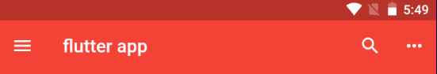
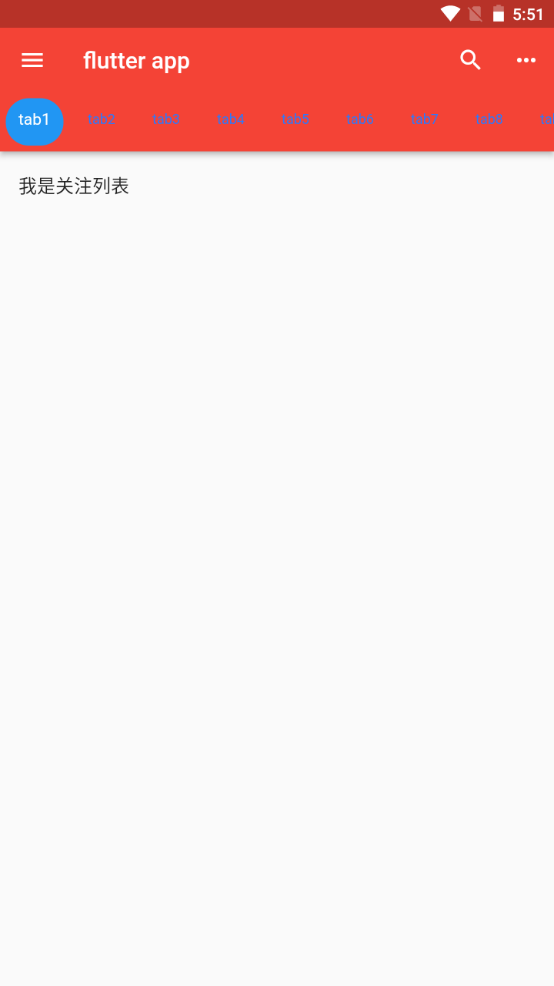
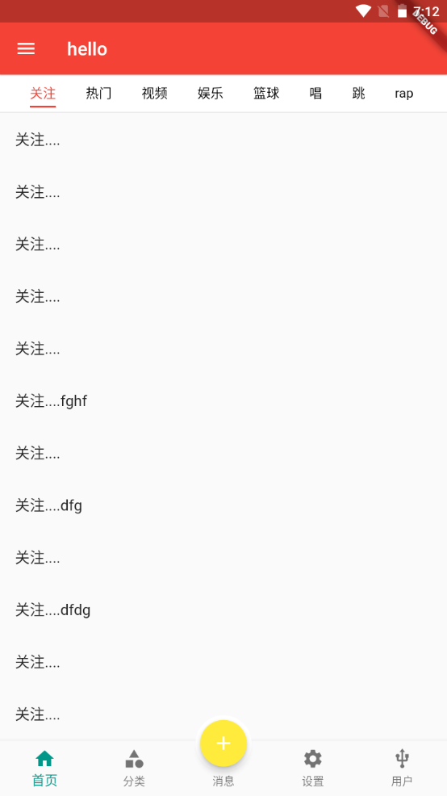
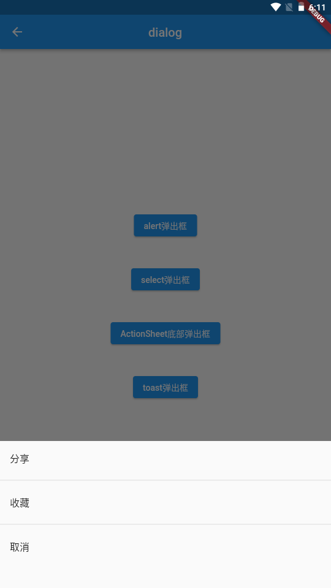
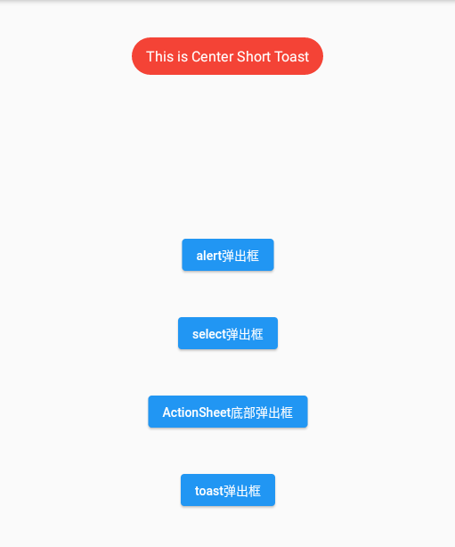

---
# 取二三级标题生成目录
outline: [2,3]
---

### Scaffold属性 抽屉菜单Drawer

> 在Scaffold组件里面传入drawer参数可以定义左侧边栏，传入endDrawer可以定义右侧边栏。侧边栏默 认是隐藏的，我们可以通过手指滑动显示侧边栏，也可以通过点击按钮显示侧边栏。

```dart
return Scaffold(
	appBar: AppBar( title: Text("Flutter App")),
	drawer: Drawer(
		child: Text('左侧边栏'),
	),
	endDrawer: Drawer(
		child: Text('右侧侧边栏'),
	),
);
```

#### Flutter DrawerHeade

**常见属性：**

| 属性       | 描述             |
| ---------- | ---------------- |
| decoration | 设置顶部背景颜色 |
| child      | 配置子元素       |
| margin     | 内边距           |
| margin     | 外边距           |


```dart
import 'package:flutter/material.dart';
import './tabs/category.dart';
import './tabs/home.dart';
import './tabs/setting.dart';
import './tabs/user.dart';
import './tabs/message.dart';

class Tabs extends StatefulWidget {
  const Tabs({super.key});

  @override
  State<Tabs> createState() => _TabsState();
}

class _TabsState extends State<Tabs> {
  int _currentIndex= 0;
  final List<Widget> _pages = const [
    Home(),
    Category(),
    Message(),
    Setting(),
    User()
  ];
  @override
  Widget build(BuildContext context) {
    return Scaffold(
      appBar: AppBar(title: const Text('hello')),
      drawer: Drawer(
        child: Column(
        children: [
         Row(
          children: [
            Expanded(
              flex: 1,
              child: DrawerHeader(
              decoration: const BoxDecoration(
                color: Colors.teal,
                image: DecorationImage(image: NetworkImage("https://www.itying.com/images/flutter/2.png"),fit: BoxFit.cover)
              ),
              child: Column(
                children:  const [
                  ListTile(leading: CircleAvatar(backgroundImage: NetworkImage("https://www.itying.com/images/flutter/2.png")), title: Text('张三'),)
                ],
              )
            ),
            )
          ],
         ),
          const ListTile(
            leading: CircleAvatar(
              child: Icon(Icons.people),
            ),
            title: Text('sdfhjsfdsks'),
          ),
          const Divider(),
          const ListTile(
            leading: Icon(Icons.settings),
            title: Text('系统设置'),
          )
        ],
      ),
      ),
      endDrawer: const Drawer(
        child: Text('dssfsd'),
      ),
      body: _pages[_currentIndex],
      bottomNavigationBar: BottomNavigationBar(
        fixedColor: Colors.teal, // 底部菜单的选择颜色
        // iconSize: 20, // 底部菜单大小
        type: BottomNavigationBarType.fixed, // 如果底部有4个或者4个以上的菜单，就需要配置这个
        currentIndex: _currentIndex, 
        onTap: (index){
          setState(() {
            _currentIndex = index;
          });
        },
        items: const [
          BottomNavigationBarItem(icon: Icon(Icons.home),label: '首页'),
          BottomNavigationBarItem(icon: Icon(Icons.category),label: '分类'),
          BottomNavigationBarItem(icon: Icon(Icons.message),label: '消息'),
          BottomNavigationBarItem(icon: Icon(Icons.settings),label: '设置'),
          BottomNavigationBarItem(icon: Icon(Icons.usb_outlined),label: '用户')
        ],
      ),
      floatingActionButton: Container(
        width: 60,
        height: 60,
        padding: const EdgeInsets.all(5),
        margin: const EdgeInsets.only(top: 5),
        decoration:  BoxDecoration(
          color: Colors.white,
          borderRadius: BorderRadius.circular(30)
        ),
        child: FloatingActionButton(
          backgroundColor: _currentIndex ==2 ?Colors.teal: Colors.yellow,
          onPressed: (){
            setState(() {
              _currentIndex = 2;
            });
          },
          child: const Icon(Icons.add)
      ),
      ),
      floatingActionButtonLocation: FloatingActionButtonLocation.centerDocked,
    );
  }
}

```

#### Flutter UserAccountsDrawerHeader

| 属性                  | 描述                         |
| --------------------- | ---------------------------- |
| decoration            | 设置顶部背景颜色             |
| accountName           | 账户名称                     |
| accountEmail          | 账户邮箱                     |
| currentAccountPicture | 用户头像                     |
| otherAccountsPictures | 用来设置当前账户其他账户头像 |
| margin                |                              |


```dart
import 'package:flutter/material.dart';
import './tabs/category.dart';
import './tabs/home.dart';
import './tabs/setting.dart';
import './tabs/user.dart';
import './tabs/message.dart';

class Tabs extends StatefulWidget {
  const Tabs({super.key});

  @override
  State<Tabs> createState() => _TabsState();
}

class _TabsState extends State<Tabs> {
  int _currentIndex= 0;
  final List<Widget> _pages = const [
    Home(),
    Category(),
    Message(),
    Setting(),
    User()
  ];
  @override
  Widget build(BuildContext context) {
    return Scaffold(
      appBar: AppBar(title: const Text('hello')),
      drawer: Drawer(
        child: Column(
        children: [
         Row(
          children: [
            Expanded(
              flex: 1,
              child: UserAccountsDrawerHeader(
                accountName: const Text('张三'),
                accountEmail: const Text('1144282310@qq.com'),
                otherAccountsPictures: [
                  Image.network('https://www.itying.com/images/flutter/1.png'),
                  Image.network('https://www.itying.com/images/flutter/3.png'),
                  Image.network('https://www.itying.com/images/flutter/4.png')
                ],
                currentAccountPicture: const CircleAvatar(
                  backgroundImage: NetworkImage('https://www.itying.com/images/flutter/2.png'),
                ),
                decoration: const BoxDecoration(
                  image: DecorationImage(image: NetworkImage("https://www.itying.com/images/flutter/2.png"),fit: BoxFit.cover)
                ),
              ),
            )
          ],
         ),
          const ListTile(
            leading: CircleAvatar(
              child: Icon(Icons.people),
            ),
            title: Text('sdfhjsfdsks'),
          ),
          const Divider(),
          const ListTile(
            leading: Icon(Icons.settings),
            title: Text('系统设置'),
          )
        ],
      ),
      ),
      endDrawer: const Drawer(
        child: Text('dssfsd'),
      ),
      body: _pages[_currentIndex],
      bottomNavigationBar: BottomNavigationBar(
        fixedColor: Colors.teal, // 底部菜单的选择颜色
        // iconSize: 20, // 底部菜单大小
        type: BottomNavigationBarType.fixed, // 如果底部有4个或者4个以上的菜单，就需要配置这个
        currentIndex: _currentIndex, 
        onTap: (index){
          setState(() {
            _currentIndex = index;
          });
        },
        items: const [
          BottomNavigationBarItem(icon: Icon(Icons.home),label: '首页'),
          BottomNavigationBarItem(icon: Icon(Icons.category),label: '分类'),
          BottomNavigationBarItem(icon: Icon(Icons.message),label: '消息'),
          BottomNavigationBarItem(icon: Icon(Icons.settings),label: '设置'),
          BottomNavigationBarItem(icon: Icon(Icons.usb_outlined),label: '用户')
        ],
      ),
      floatingActionButton: Container(
        width: 60,
        height: 60,
        padding: const EdgeInsets.all(5),
        margin: const EdgeInsets.only(top: 5),
        decoration:  BoxDecoration(
          color: Colors.white,
          borderRadius: BorderRadius.circular(30)
        ),
        child: FloatingActionButton(
          backgroundColor: _currentIndex ==2 ?Colors.teal: Colors.yellow,
          onPressed: (){
            setState(() {
              _currentIndex = 2;
            });
          },
          child: const Icon(Icons.add)
      ),
      ),
      floatingActionButtonLocation: FloatingActionButtonLocation.centerDocked,
    );
  }
}

```

### Flutter AppBar TabBar TabBarView

#### AppBar自定义顶部按钮图标、颜色

| 属性            | 描述                                                         |
| --------------- | ------------------------------------------------------------ |
| leading         | 在标题前面显示的一个控件，在首页通常显示应用的 logo；在其他界面通 常显示为返回按钮 |
| title           | 标题，通常显示为当前界面的标题文字，可以放组件               |
| actions         | 通常使用 IconButton 来表示，可以放按钮组                     |
| bottom          | 通常放tabBar，标题下面显示一个 Tab 导航栏                    |
| backgroundColor | 导航背景颜色                                                 |
| iconTheme       | 图标样式                                                     |
| centerTitle     | 标题是否居中显示                                             |



```dart
import 'package:flutter/material.dart';

void main() {
  runApp(const MyApp());
}

class MyApp extends StatelessWidget {
  const MyApp({super.key});

  @override
  Widget build(BuildContext context) {
    return MaterialApp(
      theme: ThemeData(primaryColor: Colors.blue),
      debugShowCheckedModeBanner: false,
      home: const MyHomePage(),
    );
  }
}

class MyHomePage extends StatefulWidget {
  const MyHomePage({super.key});

  @override
  State<MyHomePage> createState() => _MyHomePageState();
}

class _MyHomePageState extends State<MyHomePage> {
  @override
  Widget build(BuildContext context) {
    return Scaffold(
      appBar: AppBar(
        leading: IconButton(icon: const Icon(Icons.menu), onPressed: (){
          print('左侧按钮呗点击了');
        }),
        backgroundColor: Colors.red,  //  导航背景颜色
        title: const Text('flutter app'),
        actions: [ // 右侧的按钮图标
          IconButton(icon: const Icon(Icons.search), onPressed: (){
            print('搜索');
          }),
          IconButton(icon: const Icon(Icons.more_horiz), onPressed: (){
            print('more');
          })
        ],
      ),
      body: const Text('hhaa'),
    );
  }
}
```

#### Flutter AppBar结合TabBar实现顶部Tab切换



**TabBar常见属性：**

| 属性                 | 描述                                                         |
| -------------------- | ------------------------------------------------------------ |
| tabs                 | 显示的标签内容，一般使用Tab对象,也可以是其他的Widget         |
| controller           | TabController对象                                            |
| isScrollable         | 是否可滚动                                                   |
| indicatorColor       | 指示器颜色                                                   |
| indicatorWeight      | 指示器高度                                                   |
| indicatorPadding     | 底部指示器的Padding                                          |
| indicator            | 指示器decoration，例如边框等                                 |
| indicatorSize        | 指示器大小计算方式，TabBarIndicatorSize.label跟文字等 宽,TabBarIndicatorSize.tab跟每个tab等宽 |
| labelColor           | 选中label颜色                                                |
| labelStyle           | 选中label的Style                                             |
| labelPadding         | 每个label的padding值                                         |
| unselectedLabelColor | 未选中label颜色                                              |
| unselectedLabelStyle | 未选中label的Style                                           |

#### Tabbar TabBarView实现类似头条顶部导航

1、混入SingleTickerProviderStateMixin

```dart
class _MyHomePageState extends State<MyHomePage> with SingleTickerProviderStateMixin{}
```

2、定义TabController

```dart
late TabController _tabController;

  // 生命周期函数： 当组件初始化的时候就会触发
  @override
  void initState() {
    super.initState();
    _tabController = TabController(length: 9, vsync: this);
  }
```

```dart
import 'package:flutter/material.dart';

void main() {
  runApp(const MyApp());
}

class MyApp extends StatelessWidget {
  const MyApp({super.key});

  @override
  Widget build(BuildContext context) {
    return MaterialApp(
      theme: ThemeData(primaryColor: Colors.blue),
      debugShowCheckedModeBanner: false,
      home: const MyHomePage(),
    );
  }
}

class MyHomePage extends StatefulWidget {
  const MyHomePage({super.key});

  @override
  State<MyHomePage> createState() => _MyHomePageState();
}

class _MyHomePageState extends State<MyHomePage> with SingleTickerProviderStateMixin {
  late TabController _tabController;
  List<Widget> list = [];

  // 生命周期函数： 当组件初始化的时候就会触发
  @override
  void initState() {
    super.initState();
    _tabController = TabController(length: 9, vsync: this);
  }

  @override
  Widget build(BuildContext context) {
    return Scaffold(
      appBar: AppBar(
        leading: IconButton(icon: const Icon(Icons.menu), onPressed: (){
          print('左侧按钮呗点击了');
        }),
        backgroundColor: Colors.red,  //  导航背景颜色
        title: const Text('flutter app'),
        actions: [ // 右侧的按钮图标
          IconButton(icon: const Icon(Icons.search), onPressed: (){
            print('搜索');
          }),
          IconButton(icon: const Icon(Icons.more_horiz), onPressed: (){
            print('more');
          })
        ],
        bottom: TabBar(
          controller: _tabController, // 注意： 【配置 controller 需要去掉TabBar 的const
          isScrollable: true, // 是否可以滚动
          indicatorColor: Colors.white, // 下面选中条的颜色
          indicatorWeight: 5, // 下面选中条的高度
          indicatorPadding: const EdgeInsets.all(5), // tab padding
          // indicatorSize: TabBarIndicatorSize.label,
          indicator: BoxDecoration( // 每一个tab的样式
            color: Colors.blue,
            borderRadius: BorderRadius.circular(20)
          ),
          labelColor: Colors.white, // 选中颜色
          labelStyle: const TextStyle( // 选中样式
            fontSize: 14
          ),
          unselectedLabelColor: Colors.blueAccent[400], // 未选中颜色
          unselectedLabelStyle: const TextStyle( // 未选中样式
            fontSize: 12
          ),
          tabs: const [
            Tab(child: Text('tab1')),
            Tab(child: Text('tab2')),
            Tab(child: Text('tab3')),
            Tab(child: Text('tab4')),
            Tab(child: Text('tab5')),
            Tab(child: Text('tab6')),
            Tab(child: Text('tab7')),
            Tab(child: Text('tab8')),
            Tab(child: Text('tab9')),
          ]
        ),
      ),
      body: TabBarView(
        controller: _tabController,
        children: [
          ListView(
            children: const [
              ListTile(title: Text('我是关注列表'))
            ],
          ),
          ListView(
            children: const [
              ListTile(title: Text('我是热门列表'))
            ],
          ),
          ListView(
            children: const [
              ListTile(title: Text('我是视频列表'))
            ],
          ),
          ListView(
            children: const [
              ListTile(title: Text('我是关注列表'))
            ],
          ),
          ListView(
            children: const [
              ListTile(title: Text('我是热门列表'))
            ],
          ),
          ListView(
            children: const [
              ListTile(title: Text('我是视频列表'))
            ],
          ),
          ListView(
            children: const [
              ListTile(title: Text('我是关注列表'))
            ],
          ),
          ListView(
            children: const [
              ListTile(title: Text('我是热门列表'))
            ],
          ),
          ListView(
            children: const [
              ListTile(title: Text('我是视频列表'))
            ],
          )
        ]
      ),
    );
  }
}
```

#### BottomNavigationBar 的页面中使用Tabbar



> 当前home组件页面被 tabs 组件引用, 可以参考上去设置   《Scaffold属性 FloatingActionButton实现类似闲鱼App底 部导航凸起按钮》的代码

```dart
import 'package:flutter/material.dart';
import '../../tools/keepAliveWrapper.dart';

class Home extends StatefulWidget {
  const Home({super.key});

  @override
  State<Home> createState() => _HomeState();
}

class _HomeState extends State<Home> with SingleTickerProviderStateMixin {
  late TabController _tabController;

  @override
  void initState() {
    super.initState();
    _tabController = TabController(length: 8, vsync: this);
    // 监听 _tabController 的改变事件
    // _tabController.addListener(() {
    //   print(_tabController.index); // 会获取 2次
    // });
    _tabController.addListener(() {
      if(_tabController.animation!.value == _tabController.index){
        print(_tabController.index);
      }
    });
  }

  // 组件销毁触发
  @override
  void dispose() {
    // TODO: implement dispose
    super.dispose();
    _tabController.dispose();
  }

  @override
  Widget build(BuildContext context) {
    return Scaffold(
      appBar: PreferredSize(
        preferredSize: const Size.fromHeight(40),
        child: AppBar(
            elevation: 0.5,
            backgroundColor: Colors.white,
            title: SizedBox(
              height: 30,
              child: TabBar(
                // onTap: (index){
                //   print(index); // 只能监听点击事件，不能监听滑动事件
                // },
                isScrollable: true,
                controller: _tabController,
                indicatorColor: Colors.red,
                labelColor: Colors.red,
                labelStyle: const TextStyle(fontSize: 14),
                unselectedLabelColor: Colors.black,
                indicatorSize: TabBarIndicatorSize.label,
                tabs: const [
                  Tab(child: Text('关注')),
                  Tab(child: Text('热门')),
                  Tab(child: Text('视频')),
                  Tab(child: Text('娱乐')),
                  Tab(child: Text('篮球')),
                  Tab(child: Text('唱')),
                  Tab(child: Text('跳')),
                  Tab(child: Text('rap')),
                ],
              ),
            )),
      ),
      body: TabBarView(controller: _tabController, children: [
        KeepAliveWrapper( // 自定义的缓存组件
          child: ListView(
            children: const [
              ListTile(title: Text('关注....')),
              ListTile(title: Text('关注....')),
              ListTile(title: Text('关注....')),
              ListTile(title: Text('关注....')),
              ListTile(title: Text('关注....')),
              ListTile(title: Text('关注....fghf')),
              ListTile(title: Text('关注....')),
              ListTile(title: Text('关注....dfg')),
              ListTile(title: Text('关注....')),
              ListTile(title: Text('关注....dfdg')),
              ListTile(title: Text('关注....')),
              ListTile(title: Text('关注....')),
              ListTile(title: Text('关注....')),
              ListTile(title: Text('关注....')),
              ListTile(title: Text('关注....')),
              ListTile(title: Text('关注....')),
              ListTile(title: Text('关注....')),
              ListTile(title: Text('关注....111')),
              ListTile(title: Text('关注....222')),
              ListTile(title: Text('关注....')),
              ListTile(title: Text('关注....')),
              ListTile(title: Text('关注....')),
              ListTile(title: Text('关注....dfghdfh')),
              ListTile(title: Text('关注....bottom')),
            ],
        )),
        ListView(
          children: const [ListTile(title: Text('热门....'))],
        ),
        ListView(
          children: const [ListTile(title: Text('视频....'))],
        ),
        ListView(
          children: const [ListTile(title: Text('娱乐....'))],
        ),
        ListView(
          children: const [ListTile(title: Text('篮球....'))],
        ),
        ListView(
          children: const [ListTile(title: Text('唱....'))],
        ),
        ListView(
          children: const [ListTile(title: Text('跳....'))],
        ),
        ListView(
          children: const [ListTile(title: Text('rap....'))],
        )
      ]),
    );
  }
}
```

#### preferredSize组件

> PreferredSize可以改变appBar的高度

```dart
appBar: PreferredSize(
        preferredSize: const Size.fromHeight(40),
        child: AppBar(
            elevation: 0.5,
            backgroundColor: Colors.white,
            title: SizedBox(
              height: 30,
              child: TabBar(
                // onTap: (index){
                //   print(index); // 只能监听点击事件，不能监听滑动事件
                // },
                isScrollable: true,
                controller: _tabController,
                indicatorColor: Colors.red,
                labelColor: Colors.red,
                labelStyle: const TextStyle(fontSize: 14),
                unselectedLabelColor: Colors.black,
                indicatorSize: TabBarIndicatorSize.label,
                tabs: const [
                  Tab(child: Text('关注')),
                  Tab(child: Text('热门')),
                  Tab(child: Text('视频')),
                  Tab(child: Text('娱乐')),
                  Tab(child: Text('篮球')),
                  Tab(child: Text('唱')),
                  Tab(child: Text('跳')),
                  Tab(child: Text('rap')),
                ],
              ),
            )),
      ),
```

#### 自定义KeepAliveWrapper 缓存页面

> AutomaticKeepAliveClientMixin 可以快速的实现页面缓存功能，但是通过混入的方式实现不是很优 雅， 所以我们有必要对AutomaticKeepAliveClientMixin 混入进行封装

```dart
import 'package:flutter/material.dart';

class KeepAliveWrapper extends StatefulWidget {
  final Widget? child;
  final bool keepAlive;

  const KeepAliveWrapper(
    {super.key, required this.child, this.keepAlive = true}
  );

  @override
  State<KeepAliveWrapper> createState() => _KeepAliveWrapperState();
}

class _KeepAliveWrapperState extends State<KeepAliveWrapper> with AutomaticKeepAliveClientMixin {
  @override
  Widget build(BuildContext context) {
    return widget.child!;
  }

  @override
  bool get wantKeepAlive => widget.keepAlive;

  @override
  void didUpdateWidget(covariant KeepAliveWrapper oldWidget) {
    if (oldWidget.keepAlive != widget.keepAlive) {
    // keepAlive 状态需要更新，实现在 AutomaticKeepAliveClientMixin 中
      updateKeepAlive();
    }
    super.didUpdateWidget(oldWidget);
  }
}
```

#### 监听TabController改变事件

```dart
@override
  void initState() {
    super.initState();
    _tabController = TabController(length: 8, vsync: this);
    // 监听 _tabController 的改变事件
    // _tabController.addListener(() {
    //   print(_tabController.index); // 会获取 2次
    // });
    _tabController.addListener(() {
      if(_tabController.animation!.value == _tabController.index){
        print(_tabController.index);
      }
    });
  }
```

#### MaterialApp 去掉debug图标

```dart
return MaterialApp(
    debugShowCheckedModeBanner:false , //去掉debug图标
    home:Tabs(),
    ...
);
```

### Flutter中的路由

#### Flutter中的路由

> Flutter中的路由通俗的讲就是页面跳转。在Flutter中通过Navigator组件管理路由导航。 并提供了管理堆栈的方法。如：Navigator.push和Navigator.pop Flutter中给我们提供了两种配置路由跳转的方式：1、基本路由 2、命名路由

#### Flutter 中的普通路由使用

> 比如我们现在想从HomePage组件跳转到SearchPage组件。
>
> **1、需要在HomPage中引入SearchPage.dart**
>
> ```dart
> import '../SearchPage.dart';
> ```
>
> **2、在HomePage中通过下面方法跳转**
>
> ```dart
> ElevatedButton(onPressed: (){
>  Navigator.of(context).push(
>        MaterialPageRoute(builder: (BuildContext context){
>              return const SearchPage();
>          })
>  );
> }, child: const Text('搜索')),
> ```


#### Flutter 中的普通路由跳转传值

> 跳转传值和调用组件传值的实现方法是一样的
>
> **1、定义一个NewsPage接收传值**
>
> ```dart
> import 'package:flutter/material.dart';
> // 新闻页面接收上个页面传过来的参数
> 
> class NewsPage extends StatefulWidget {
> final String title;
> final int aid;
> const NewsPage({super.key,required this.title, required this.aid});
> 
> @override
> State<NewsPage> createState() => _NewsPageState();
> }
> 
> class _NewsPageState extends State<NewsPage> {
> 
> @override
> void initState() {
>  // TODO: implement initState
>  super.initState();
>  print(widget.aid);
> }
> 
> @override
> Widget build(BuildContext context) {
>  return Scaffold(
>    appBar: AppBar(title: Text(widget.title)),
>    body: Text(widget.title),
>    floatingActionButton: FloatingActionButton(
>      onPressed: (){
>        Navigator.pop(context);
>      },
>      child: const Icon(Icons.arrow_back),
>    ),
>  );
> }
> }
> ```
>
> **2、跳转页面实现传值**
>
> ```dart
> Navigator.of(context).push(
>  MaterialPageRoute(builder: (BuildContext context){
>        return const NewsPage(title: '我是 传过来的值 111', aid: 12);
>     })
>  );
> }, child: const Text('新闻-跳转传值'))
> ```

#### Flutter 中的命名路由

**1、main.dart中配置路由**

```dart
import 'package:flutter/material.dart';
import './pages/tabs.dart';
import './pages/search.dart';
import './pages/news.dart';
import './pages/form.dart';

void main() {
  runApp(const MyApp());
}

class MyApp extends StatelessWidget {
  const MyApp({super.key});

  @override
  Widget build(BuildContext context) {
    return MaterialApp(
      theme: ThemeData(primaryColor: Colors.blue),
      // home: const Tabs(),
      initialRoute: "/",
      routes: {
        "/": (context)=> const Tabs(),
        "/news": (context)=> const NewsPage(),
        "/form": (context)=> const FormPage(),
        "/search": (context)=> const SearchPage(),
      },
    );
  }
}
```

**2、跳转路由**

```dart
ElevatedButton(onPressed: (){
    Navigator.pushNamed(context, "/news");
}, child: const Text('命名路由跳转 - news')),
```

#### Flutter 中的命名路由传值

> 官方文档：https://flutter.dev/docs/cookbook/navigation/navigate-with-arguments

**1. 配置onGenerateRoute**

```dart
import 'package:flutter/material.dart';
import '../pages/tabs.dart';
import '../pages/search.dart';
import '../pages/news.dart';
import '../pages/form.dart';
import '../pages/shop.dart';

void main() {
  runApp(const MyApp());
}

class MyApp extends StatelessWidget {
  // 1. 配置路由
  Map routes = {
        "/": (context)=> const Tabs(),
        "/news": (context)=> const NewsPage(),
        "/form": (context, { arguments }) => FormPage(arguments: arguments),
        "/search": (context)=> const SearchPage(),
        "/shop": (context, { arguments })=> ShopPage(arguments: arguments),
 };
  const MyApp({super.key});

  @override
  Widget build(BuildContext context) {
    return MaterialApp(
      theme: ThemeData(primaryColor: Colors.blue),
      // home: const Tabs(),
      initialRoute: "/",
      onGenerateRoute: (RouteSettings settings){
        // 统一处理
        final String? name = settings.name;
        final Function? pageContentBuilder = routes[name];
        if (pageContentBuilder != null) {
          if (settings.arguments != null) {
            final Route route = MaterialPageRoute(
              builder: (context) => pageContentBuilder(context, arguments: settings.arguments));
            return route;
          } else {
            final Route route = MaterialPageRoute(
              builder: (context) => pageContentBuilder(context));
            return route;
          }
        }
        return null;
  	  },
    );
  }
}
```

**2. 定义页面接收arguments传参**

```dart
import 'package:flutter/material.dart';
// 其他页面跳转到form页面进行命名路由传值

class FormPage extends StatefulWidget {
  final Map arguments;
  const FormPage({super.key, required this.arguments});

  @override
  State<FormPage> createState() => _FormPageState();
}

class _FormPageState extends State<FormPage> {

  @override
  void initState() {
    // TODO: implement initState
    super.initState();
    print(widget.arguments);
  }

  @override
  Widget build(BuildContext context) {
    return Scaffold(
      appBar: AppBar(
        title: const Text('表单页面')
      ),
      body:  const Center(
        child: Text('form....'),
      ),
    );
  }
}
```

**3.跳转页面实现传参**

```dart
          ElevatedButton(onPressed: (){
            Navigator.pushNamed(context, "/form", arguments: {
              "title" : '我是命名路由传值'
            });
          }, child: const Text('命名路由传值 - form')),
```

#### Flutter 中的命名路由单独抽离到一个文件

**新建routers/routers.dart 配置路由**

```dart
import 'package:flutter/material.dart';
import '../pages/tabs.dart';
import '../pages/search.dart';
import '../pages/news.dart';
import '../pages/form.dart';
import '../pages/shop.dart';

  // 1. 配置路由
  Map routes = {
        "/": (context)=> const Tabs(),
        "/news": (context)=> const NewsPage(),
        "/form": (context, { arguments }) => FormPage(arguments: arguments),
        "/search": (context)=> const SearchPage(),
        "/shop": (context, { arguments })=> ShopPage(arguments: arguments),
 };

   // 2. 配置onGenerateRoute  固定写法  这个方法也相当于一个中间件，这里可以做权限判断
 var onGenerateRoute = (RouteSettings settings){
        // 统一处理
        final String? name = settings.name;
        final Function? pageContentBuilder = routes[name];
        if (pageContentBuilder != null) {
          if (settings.arguments != null) {
            final Route route = MaterialPageRoute(
              builder: (context) => pageContentBuilder(context, arguments: settings.arguments));
            return route;
          } else {
            final Route route = MaterialPageRoute(
              builder: (context) => pageContentBuilder(context));
            return route;
          }
        }
        return null;
  };
```

**修改main.dart**

```dart
import 'package:flutter/material.dart';
import './routes/routes.dart';

void main() {
  runApp(const MyApp());
}

class MyApp extends StatelessWidget {
  const MyApp({super.key});

  @override
  Widget build(BuildContext context) {
    return MaterialApp(
      theme: ThemeData(primaryColor: Colors.blue),
      // home: const Tabs(),
      initialRoute: "/",
      onGenerateRoute: onGenerateRoute,
    );
  }
}
```

**实现页面跳转传值**

```dart
 ElevatedButton(
   onPressed: (){
     Navigator.pushNamed(context, "/shop", arguments: {
        "title" : '我是命名路由传值 - shop'
     });
 	}, 
   child: const Text('命名路由传值 - shop')
 )
```

#### Flutter 返回上一级路由

```dart
Navigator.of(context).pop();
```

#### Flutter 中替换路由

> 比如我们从用户中心页面跳转到了registerFirst页面，然后从registerFirst页面通过 pushReplacementNamed跳转到了registerSecond页面。这个时候当我们点击registerSecond的返回 按钮的时候它会直接返回到用户中心。

```dart
ElevatedButton(onPressed: (){
            // 命名路由跳转
            // Navigator.pushNamed(context, "/registerThird");
            // 替换路由跳转
            Navigator.of(context).pushReplacementNamed('/registerThird');
 }, child: const Text('下一步'))
```

#### Flutter 返回到根路由

> 比如我们从用户中心跳转到registerFirst页面，然后从registerFirst页面跳转到registerSecond页面，然 后从registerSecond跳转到了registerThird页面。这个时候我们想的是registerThird注册成功后返回到 用户中心。 这个时候就用到了返回到根路由的方法。

```dart
		// 返回跟目录
 Navigator.of(context).pushAndRemoveUntil(
              MaterialPageRoute(builder: (BuildContext context){
                return const Tabs(index: 4); 
              }), (route) => false);
}, child: const Text('完成注册'))
```

#### Flutter Android 和Ios使用同样风格的路由跳

> Material组件库中提供了一个MaterialPageRoute组件，它可以使用和平台风格一致的路由切换动画， 如在iOS上会左右滑动切换，而在Android上会上下滑动切换 , CupertinoPageRoute是Cupertino组件 库提供的iOS风格的路由切换组件如果在Android上也想使用左右切换风格，可以使用
>
> CupertinoPageRoute

**1、routers.dart中引入cupertino.dart**

```dart
// 配置 ios 风格的路由
// 1. 引入 cupertino.dart
// 2. 使用 CupertinoPageRoute
import 'package:flutter/cupertino.dart'; 
```

**2、MaterialPageRoute改为CupertinoPageRout**

```dart
var onGenerateRoute = (RouteSettings settings) {
  // 统一处理
  final String? name = settings.name;
  final Function? pageContentBuilder = routes[name];
  if (pageContentBuilder != null) {
    if (settings.arguments != null) {
      final Route route = CupertinoPageRoute(
          builder: (context) =>
              pageContentBuilder(context, arguments: settings.arguments));
      return route;
    } else {
      final Route route =
          CupertinoPageRoute(builder: (context) => pageContentBuilder(context));
      return route;
    }
  }
  return null;
};
```

#### 全局配置主题

```dart
class MyApp extends StatelessWidget {
  const MyApp({super.key});

  @override
  Widget build(BuildContext context) {
    return MaterialApp(
      theme: ThemeData(
        primaryColor: Colors.blue,
        appBarTheme: const AppBarTheme(  // 全局appbar居中
          centerTitle: true
        )
        ),
      // home: const Tabs(),
      initialRoute: "/",
      onGenerateRoute: onGenerateRoute,
    );
  }
}
```

### Flutter Dialog

#### AlertDialog


```dart
void _alertDialog() async {
    // print('_alertDialog');
    var result = await showDialog(context: context, builder: (context){
      return AlertDialog(
        title: const Text('提示信息'),
        content: const Text('您确定要删除吗'),
        actions: [
          TextButton(onPressed: (){
            print('确定');
            Navigator.of(context).pop('确定...'); // 返回值
          }, child: const Text('确定')),
          TextButton(onPressed: (){
            print('取消');
            Navigator.of(context).pop('取消...'); // 返回值
          }, child: const Text('取消'))
        ],
      );
    });
    print(result); // 返回值
  }
```

#### SimpleDialog、SimpleDialogOption


```dart
void _selectDialog() async{
    // print('_selectDialog');
    var result = await showDialog(
      context: context, 
      barrierDismissible : false, // 点击灰色背景是否消失
      builder: (context){
      return SimpleDialog(
        title: const Text('请选择语言'),
        children: [
          SimpleDialogOption(child: const Text('英语'),onPressed: (){ 
              Navigator.of(context).pop('英语...');
              print('英语');
            }),
          const Divider(),
           SimpleDialogOption(child: const Text('日语'),onPressed: (){ print('日语');}),
           const Divider(),
           SimpleDialogOption(child: const Text('法语'),onPressed: (){ print('法语');})
        ],
      );
    });
    print(result);
  }
```

#### showModalBottomSheet



```dart
void _modelBottomDialog() async{
    // print('_modelBottomDialog');
    var result = await showModalBottomSheet(
      context: context, 
      builder: (context){
        return SizedBox(
          height: 240,
          child: Column(
            children:  [
              ListTile(title: const Text('分享'), onTap: (){
                print('分享');
                Navigator.of(context).pop('分享...');
              }),
              const Divider(),
              ListTile(title: const Text('收藏'),onTap: (){
                print('收藏');
                Navigator.of(context).pop('收藏...');
              }),
               const Divider(),
              ListTile(title: const Text('取消'),onTap: (){
                print('取消');
                Navigator.of(context).pop('取消...');
              })
            ],
          ),
        );
    });
    print(result);
  }
```

#### Flutter Toast



https://pub.dev/packages/fluttertoast

```dart
# add this line to your dependencies
fluttertoast: ^8.0.9
```

```dart
import 'package:fluttertoast/fluttertoast.dart';
```

```dart
void _toastDialog(){
    // print('_toastDialog');
    Fluttertoast.showToast(
        msg: "This is Center Short Toast",
        toastLength: Toast.LENGTH_SHORT,
        gravity: ToastGravity.TOP, // 方位
        timeInSecForIosWeb: 1, // 提示时间
        backgroundColor: Colors.red, // 背景颜色
        textColor: Colors.white, // 文本颜色
        fontSize: 16.0 // 文本大小
    );
  }
```

#### 自定义Flutter Dialog 、Material组件、InkWell组件

> 自定义Dialog对象，需要继承Dialog类，尽管Dialog提供了child参数可以用来写视图界面，但是往往会 达不到我们想要的效果，因为默认的Dialog背景框是满屏的。如果我们想完全定义界面，就需要重写 build函数。下面我们通过两个案例给大家演示一下Dialog的使用。

**自定义一个提示的Dialog**

1. 新建myDialog.dart

```dart
import 'package:flutter/material.dart';

class MyDialog extends Dialog{
  final String title;
  final String content;
  final void Function()? onTap;
  const MyDialog({Key?key, required this.title,required this.content, required this.onTap}):super(key: key);
  @override
  Widget build(context){
    return Material(
      type: MaterialType.transparency,
      child: Center(
        child: Container(
          height: 300,
          width: 300,
          color: Colors.white,
          child: Column(
            children: [
              Padding(padding: const EdgeInsets.all(10),child: Stack(
                children: [
                   Align(alignment: Alignment.centerLeft,child: Text( title, style: const TextStyle(fontSize: 18, fontWeight: FontWeight.w600))),
                   Align(alignment: Alignment.centerRight,child: InkWell(
                    onTap: onTap,
                    child: const Icon(Icons.close),
                   ))
                ],
              )),
              const Divider(),
              Container(
                padding: const EdgeInsets.all(10),
                width: double.infinity,
                child: Text(content),
              )
            ],
          ),
      ),
      ),
    );
  }
}
```

2. 调用Mydialog

```dart
 void _myDialog(){
    showDialog(context: context, builder: (context){
      return  MyDialog(title: '提示信息',content: '这是一段内容',onTap: () {
        print('消失');
        Navigator.pop(context);
      });
    });
  }
```

#### Flutter定时器 让dialog自动关闭

**Flutter定时器**

```dart
import 'dart:async';
const timeout = Duration(seconds: 3);
var t=Timer.periodic(timeout, (timer) {
print('afterTimer='+DateTime.now().toString()););
// timer.cancel(); // 取消定时器
});
t.cancel(); // 取消定时器
```

组件销毁的时候取消定时器 

```dart
void dispose() {
    super.dispose();
    t.cancel();
}

```

**MyDialog过几秒后关闭**

```dart
import 'package:flutter/material.dart';
import 'dart:async';

class MyDialog extends Dialog{
  final String title;
  final String content;
  final void Function()? onTap;
  const MyDialog({Key?key, required this.title,required this.content, required this.onTap}):super(key: key);

  _showTimer(context){
    Timer.periodic(
     const Duration(milliseconds: 3000), (t) {
      print('关闭');
      Navigator.of(context).pop();
      t.cancel();
    });
  }

  @override
  Widget build(context){
    _showTimer(context);
    return Material(
      type: MaterialType.transparency,
      child: Center(
        child: Container(
          height: 300,
          width: 300,
          color: Colors.white,
          child: Column(
            children: [
              Padding(padding: const EdgeInsets.all(10),child: Stack(
                children: [
                   Align(alignment: Alignment.centerLeft,child: Text( title, style: const TextStyle(fontSize: 18, fontWeight: FontWeight.w600))),
                   Align(alignment: Alignment.centerRight,child: InkWell(
                    onTap: onTap,
                    child: const Icon(Icons.close),
                   ))
                ],
              )),
              const Divider(),
              Container(
                padding: const EdgeInsets.all(10),
                width: double.infinity,
                child: Text(content),
              )
            ],
          ),
      ),
      ),
    );
  }
}
```

### Flutter PageView

>  Flutter中的轮动图以及抖音上下滑页切换视频功能等等，这些都可以通过 PageView 轻松实现

**PageView常见属性：**

| 属性                   | 描述                                         |
| ---------------------- | -------------------------------------------- |
| scrollDirection        | Axis.horizonta水平方向 Axis.vertical锤子方向 |
| children               | 配置子元素                                   |
| allowImplicitScrolling | 缓存当前页面的前后两页                       |
| onPageChanged          | page改变的时候触发                           |

#### PageView 的使用


```dart
import 'package:flutter/material.dart';


class PageViewPage extends StatefulWidget {
  const PageViewPage({super.key});

  @override
  State<PageViewPage> createState() => _PageViewPageState();
}

class _PageViewPageState extends State<PageViewPage> {
  @override
  Widget build(BuildContext context) {
    return Scaffold(
      appBar: AppBar(title: const Text("pageView")),
      body: PageView(
        scrollDirection: Axis.vertical, // 配置pageview滑动的方向，默认是水平方向
        children: const [
          Center(
            child: Text('第一屏'),
          ),
          Center(
            child: Text('第二屏'),
          ),
          Center(
            child: Text('第三屏'),
          )
        ],
      ),
    );
  }
}
```

#### PageView.builder


```dart
import 'package:flutter/material.dart';


class PageViewBuildPage extends StatefulWidget {
  const PageViewBuildPage({super.key});

  @override
  State<PageViewBuildPage> createState() => _PageViewBuildPageState();
}

class _PageViewBuildPageState extends State<PageViewBuildPage> {
  @override
  Widget build(BuildContext context) {
    return Scaffold(
      appBar: AppBar(title: const Text("pageViewBuild")),
      body: PageView.builder(
        itemCount: 10,
        itemBuilder: (context, index){
          return Center(
            child: Text('第$index屏'),
          );
        },
      ),
    );
  }
}
```

#### PageView上拉无限加载的实现思路


````dart
import 'package:flutter/material.dart';


class PageViewFullPage extends StatefulWidget {
  const PageViewFullPage({super.key});

  @override
  State<PageViewFullPage> createState() => _PageViewFullPageState();
}

class _PageViewFullPageState extends State<PageViewFullPage> {

  List<Widget> list = [];

  @override
  void initState() {
    // TODO: implement initState
    super.initState();
    for(var i = 0;i< 10;i++){
      list.add(
        Text('第$i屏')
      );
    }
  }

  @override
  Widget build(BuildContext context) {
    return Scaffold(
      appBar: AppBar(title: const Text("pageViewFullPage")),
      body: PageView(
        scrollDirection: Axis.vertical,
        onPageChanged: (index){
          print(index);
          if(index +2 == list.length){
            setState(() {
              for(var i = 0;i< 10;i++){
                list.add(
                  Text('第$i屏')
                );
              }
            });
          }
        },
        children: list,
      ),
    );
  }
}
````

#### PageView 实现一个无限轮播的轮播图


```dart
import 'package:flutter/material.dart';
import '../widget/image.dart';

class PageViewSwiper extends StatefulWidget {
  const PageViewSwiper({super.key});

  @override
  State<PageViewSwiper> createState() => _PageViewSwiperState();
}

class _PageViewSwiperState extends State<PageViewSwiper> {
  int _currentIndex = 0;
  List<Widget> list = [];
  @override
  void initState() {
    // TODO: implement initState
    super.initState();
    list = const [
      ImagePage(
          height: 200, src: 'https://www.itying.com/images/flutter/1.png'),
      ImagePage(
          height: 200, src: 'https://www.itying.com/images/flutter/2.png'),
      ImagePage(height: 200, src: 'https://www.itying.com/images/flutter/3.png')
    ];
  }

  @override
  Widget build(BuildContext context) {
    return Scaffold(
      appBar: AppBar(title: const Text('pageViewSwiper')),
      body: Stack(
        children: [
          SizedBox(
            height: 200,
            child: PageView.builder(
                onPageChanged: (index){
                  setState(() {
                    _currentIndex = index % list.length;
                  });
                },
                itemCount: 1000,
                itemBuilder: (context, index) {
                  return list[index % list.length];
                }),
          ),
          Positioned(
            left: 0,
            right: 0,
            bottom: 2,
            child: Row(
              mainAxisAlignment: MainAxisAlignment.center,
              children: List.generate(list.length, (index){
                return Container(
                  margin: const EdgeInsets.all(10),
                  width: 10,
                  height: 10,
                  decoration: BoxDecoration(
                    color: _currentIndex == index? Colors.red : Colors.blue, 
                    shape: BoxShape.circle // 圆
                    // borderRadius: BorderRadius.circular(5)
                  ),
                );
              }).toList(),
            )
          )
        ],
      ),
    );
  }
}

```

```dart
import 'package:flutter/material.dart';

class ImagePage extends StatelessWidget {
  final double height;
  final double width;
  final String src;
  const ImagePage({super.key, this.width = double.infinity, this.height = 200, required this.src});

  @override
  Widget build(BuildContext context) {
    return Image.network(src, fit: BoxFit.cover);
  }
}
```

#### Flutter定时器

```dart
  late PageController _pageController;
   _pageController = PageController(initialPage: 0);
    timer = Timer.periodic(const Duration(seconds: 5), (t) {
      _pageController.animateToPage( (_currentIndex + 1) % pageList.length, duration: const Duration(milliseconds: 200), curve: Curves.linear);
    });
```

组件销毁的时候取消定时器

```dart
  @override
  void dispose() {
    // TODO: implement dispose
    super.dispose();
    timer.cancel();
    _pageController.dispose();
  }
```

#### PageController animateToPage自动切换页面

```dart
import 'dart:async';
import 'package:flutter/material.dart';
import './image.dart';

class Swiper extends StatefulWidget {
  final double width;
  final double height;
  final List<String> list;
  const Swiper({super.key, this.height = 200, this.width  = double.infinity, required this.list});

  @override
  State<Swiper> createState() => _SwiperState();
}

class _SwiperState extends State<Swiper> {
  int _currentIndex = 0;
  List<Widget> pageList = [];
  late PageController _pageController;
  late Timer timer;

  @override
  void initState() {
    // TODO: implement initState
    super.initState();
    _pageController = PageController(initialPage: 0);

    for (var i = 0; i < widget.list.length; i++) {
      pageList.add(
        ImagePage(src: widget.list[i])
      );
    }

    timer = Timer.periodic(const Duration(seconds: 5), (t) {
      _pageController.animateToPage( (_currentIndex + 1) % pageList.length, duration: const Duration(milliseconds: 200), curve: Curves.linear);
    });
  }

  @override
  void dispose() {
    // TODO: implement dispose
    super.dispose();
    timer.cancel();
    _pageController.dispose();
  }

  @override
  Widget build(BuildContext context) {
    return Stack(
        children: [
          SizedBox(
            height: 200,
            child: PageView.builder(
                controller: _pageController,
                onPageChanged: (index){
                  setState(() {
                    _currentIndex = index % pageList.length;
                  });
                },
                itemCount: 1000,
                itemBuilder: (context, index) {
                  return pageList[index % pageList.length];
                }),
          ),
          Positioned(
            left: 0,
            right: 0,
            bottom: 2,
            child: Row(
              mainAxisAlignment: MainAxisAlignment.center,
              children: List.generate(pageList.length, (index){
                return Container(
                  margin: const EdgeInsets.all(10),
                  width: 10,
                  height: 10,
                  decoration: BoxDecoration(
                    color: _currentIndex == index? Colors.red : Colors.blue, 
                    shape: BoxShape.circle // 圆
                    // borderRadius: BorderRadius.circular(5)
                  ),
                );
              }).toList(),
            )
          )
        ],
      );
  }
}
```

#### AutomaticKeepAliveClientMixin 缓存PageView页面

> 通过上面的例子我们会发现 每次滑动的时候都会触发子组件中的 build方法 print(widget.url);
>
> 可见 PageView 默认并没有缓存功能，一旦页面滑出屏幕它就会被销毁 ,实际项目开发中对页面进行缓 存是很常见的一个需求，下面我们就看看如何使用AutomaticKeepAliveClientMixin 缓存页面。
>
> **注意**：使用时一定要注意是否必要，因为对所有列表项都缓存的会导致更多的内存消耗。

```dart
import 'package:flutter/material.dart';

class PageViewKeepAlive extends StatefulWidget {
  const PageViewKeepAlive({super.key});

  @override
  State<PageViewKeepAlive> createState() => _PageViewKeepAliveState();
}

class _PageViewKeepAliveState extends State<PageViewKeepAlive> {
  @override
  Widget build(BuildContext context) {
    return Scaffold(
      appBar: AppBar(title: const Text('keepalive')),
      body: PageView.builder(
          itemCount: 10,
          itemBuilder: (context, index) {
            return MyContainer(num: index);
          }),
    );
  }
}

// 自定义组件
class MyContainer extends StatefulWidget {
  final int num;
  const MyContainer({super.key, required this.num});

  @override
  State<MyContainer> createState() => _MyContainerState();
}

class _MyContainerState extends State<MyContainer> with AutomaticKeepAliveClientMixin {
  @override
  Widget build(BuildContext context) {
    // 默认数据是没有缓存，每次滑动都会执行build
    print(widget.num);
    return Center(
      child: Text('第${widget.num}屏'),
    );
  }
  
  @override
  // TODO: implement wantKeepAlive
  bool get wantKeepAlive => true;
}

```

####  自定义KeepAliveWrapper 缓存页面

>  AutomaticKeepAliveClientMixin 可以快速的实现页面缓存功能，但是通过混入的方式实现不是很优 雅， 所以我们有必要对AutomaticKeepAliveClientMixin 混入进行封装

```dart
import 'package:flutter/material.dart';

class KeepAliveWrapper extends StatefulWidget {
  final Widget? child;
  final bool keepAlive;

  const KeepAliveWrapper(
    {super.key, required this.child, this.keepAlive = true}
  );

  @override
  State<KeepAliveWrapper> createState() => _KeepAliveWrapperState();
}

class _KeepAliveWrapperState extends State<KeepAliveWrapper> with AutomaticKeepAliveClientMixin {
  @override
  Widget build(BuildContext context) {
    return widget.child!;
  }

  @override
  bool get wantKeepAlive => widget.keepAlive;

  // @override
  // void didUpdateWidget(covariant KeepAliveWrapper oldWidget) {
  //   if (oldWidget.keepAlive != widget.keepAlive) {
  //   // keepAlive 状态需要更新，实现在 AutomaticKeepAliveClientMixin 中
  //     updateKeepAlive();
  //   }
  //   super.didUpdateWidget(oldWidget);
  // }
}
```